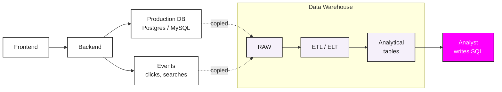

# <span class="pink">SQL</span>

Where data comes from

<div class="absolute bottom-10 left-14" style="font-family:'JetBrains Mono',monospace;font-size:0.75rem;text-transform:uppercase;letter-spacing:0.15em;color:rgba(255,255,255,0.55);">
  Harbour.Space &middot; Barcelona &middot; May 20, 2026
</div>

---

# Today

<div style="display:flex;flex-direction:column;gap:0.7rem;margin-top:1rem;">

  <div style="display:grid;grid-template-columns:60px 1fr;gap:1.5rem;align-items:baseline;">
    <span style="font-family:'JetBrains Mono',monospace;font-size:0.9rem;color:#FF00FF;letter-spacing:0.1em;">01</span>
    <div style="font-size:1.25rem;font-weight:700;color:#1A1A1A;">Where data comes from</div>
  </div>

  <div style="display:grid;grid-template-columns:60px 1fr;gap:1.5rem;align-items:baseline;">
    <span style="font-family:'JetBrains Mono',monospace;font-size:0.9rem;color:#FF00FF;letter-spacing:0.1em;">02</span>
    <div style="font-size:1.25rem;font-weight:700;color:#1A1A1A;">What is a database</div>
  </div>

  <div style="display:grid;grid-template-columns:60px 1fr;gap:1.5rem;align-items:baseline;">
    <span style="font-family:'JetBrains Mono',monospace;font-size:0.9rem;color:#FF00FF;letter-spacing:0.1em;">03</span>
    <div style="font-size:1.25rem;font-weight:700;color:#1A1A1A;">SQL fundamentals</div>
  </div>

  <div style="display:grid;grid-template-columns:60px 1fr;gap:1.5rem;align-items:baseline;">
    <span style="font-family:'JetBrains Mono',monospace;font-size:0.9rem;color:#FF00FF;letter-spacing:0.1em;">04</span>
    <div style="font-size:1.25rem;font-weight:700;color:#1A1A1A;">JOINs</div>
  </div>

  <div style="display:grid;grid-template-columns:60px 1fr;gap:1.5rem;align-items:baseline;">
    <span style="font-family:'JetBrains Mono',monospace;font-size:0.9rem;color:#FF00FF;letter-spacing:0.1em;">05</span>
    <div style="font-size:1.25rem;font-weight:700;color:#1A1A1A;">Subqueries</div>
  </div>

  <div style="display:grid;grid-template-columns:60px 1fr;gap:1.5rem;align-items:baseline;">
    <span style="font-family:'JetBrains Mono',monospace;font-size:0.9rem;color:#FF00FF;letter-spacing:0.1em;">06</span>
    <div style="font-size:1.25rem;font-weight:700;color:#1A1A1A;">CTEs</div>
  </div>

  <div style="display:grid;grid-template-columns:60px 1fr;gap:1.5rem;align-items:baseline;">
    <span style="font-family:'JetBrains Mono',monospace;font-size:0.9rem;color:#FF00FF;letter-spacing:0.1em;">07</span>
    <div style="font-size:1.25rem;font-weight:700;color:#1A1A1A;">Window functions</div>
  </div>

</div>

---
layout: section
class: tint-sky
---

## 01

# Where does this data<br>come from?

---

# User actions become <span class="pink">events</span>

<div style="display:grid;grid-template-columns:1.3fr 1fr;gap:1.5rem;margin-top:0.4rem;align-items:flex-start;">

  <div>
    
    <div style="margin-top:0.4rem;font-size:0.85rem;color:#6B6B6B;">User searches "cerveza" on Amazon</div>
  </div>

  <div>
    <div style="font-family:'JetBrains Mono',monospace;font-size:0.78rem;line-height:1.6;background:#1A1A1A;color:#fff;padding:0.8rem 1rem;border-radius:6px;">
      <div><span style="color:#FF00FF;">user_id:</span>     12345</div>
      <div><span style="color:#FF00FF;">event_name:</span>  search</div>
      <div><span style="color:#FF00FF;">query:</span>       "cerveza"</div>
      <div><span style="color:#FF00FF;">timestamp:</span>   2025-03-25 15:00:23</div>
      <div><span style="color:#FF00FF;">country:</span>     ES</div>
    </div>
    <div style="margin-top:0.4rem;font-size:0.8rem;color:#6B6B6B;text-align:center;">what gets logged</div>
  </div>

</div>

<p style="margin-top:0.8rem;font-size:0.95rem;">Every meaningful user action becomes a row in the warehouse</p>

<!--
This is the behavioral / clickstream side. Don't go into pipelines, Kafka, or any infra. The point is: action → row of data → warehouse. That's it.
-->

---

# We also model business <span class="pink">entities</span>

<div style="display:grid;grid-template-columns:1fr 1fr;gap:2rem;margin-top:1rem;">

  <div>
    <div style="font-family:'JetBrains Mono',monospace;font-size:0.7rem;text-transform:uppercase;letter-spacing:0.12em;color:#FF00FF;margin-bottom:0.4rem;">users_snapshot</div>
    <table style="width:100%;border-collapse:collapse;font-size:0.85rem;">
      <thead>
        <tr style="border-bottom:1px solid #1A1A1A;">
          <th style="text-align:left;padding:0.4rem 0.5rem;font-weight:700;">user_id</th>
          <th style="text-align:left;padding:0.4rem 0.5rem;font-weight:700;">country</th>
          <th style="text-align:left;padding:0.4rem 0.5rem;font-weight:700;">plan</th>
          <th style="text-align:left;padding:0.4rem 0.5rem;font-weight:700;">signup_date</th>
        </tr>
      </thead>
      <tbody>
        <tr style="border-bottom:1px solid #E0E0E0;"><td style="padding:0.4rem 0.5rem;">1</td><td style="padding:0.4rem 0.5rem;">ES</td><td style="padding:0.4rem 0.5rem;">pro</td><td style="padding:0.4rem 0.5rem;">2024-01-15</td></tr>
        <tr style="border-bottom:1px solid #E0E0E0;"><td style="padding:0.4rem 0.5rem;">2</td><td style="padding:0.4rem 0.5rem;">UK</td><td style="padding:0.4rem 0.5rem;">free</td><td style="padding:0.4rem 0.5rem;">2024-02-03</td></tr>
        <tr><td style="padding:0.4rem 0.5rem;">3</td><td style="padding:0.4rem 0.5rem;">DE</td><td style="padding:0.4rem 0.5rem;">free</td><td style="padding:0.4rem 0.5rem;">2024-02-19</td></tr>
      </tbody>
    </table>
  </div>

  <div>
    <div style="font-family:'JetBrains Mono',monospace;font-size:0.7rem;text-transform:uppercase;letter-spacing:0.12em;color:#FF00FF;margin-bottom:0.4rem;">orders</div>
    <table style="width:100%;border-collapse:collapse;font-size:0.85rem;">
      <thead>
        <tr style="border-bottom:1px solid #1A1A1A;">
          <th style="text-align:left;padding:0.4rem 0.5rem;font-weight:700;">order_id</th>
          <th style="text-align:left;padding:0.4rem 0.5rem;font-weight:700;">user_id</th>
          <th style="text-align:left;padding:0.4rem 0.5rem;font-weight:700;">amount</th>
          <th style="text-align:left;padding:0.4rem 0.5rem;font-weight:700;">order_date</th>
        </tr>
      </thead>
      <tbody>
        <tr style="border-bottom:1px solid #E0E0E0;"><td style="padding:0.4rem 0.5rem;">1001</td><td style="padding:0.4rem 0.5rem;">1</td><td style="padding:0.4rem 0.5rem;">24.99</td><td style="padding:0.4rem 0.5rem;">2024-03-10</td></tr>
        <tr style="border-bottom:1px solid #E0E0E0;"><td style="padding:0.4rem 0.5rem;">1002</td><td style="padding:0.4rem 0.5rem;">2</td><td style="padding:0.4rem 0.5rem;">89.50</td><td style="padding:0.4rem 0.5rem;">2024-03-11</td></tr>
        <tr><td style="padding:0.4rem 0.5rem;">1003</td><td style="padding:0.4rem 0.5rem;">1</td><td style="padding:0.4rem 0.5rem;">12.40</td><td style="padding:0.4rem 0.5rem;">2024-03-12</td></tr>
      </tbody>
    </table>
  </div>

</div>

<p style="margin-top:1.5rem;font-size:1.1rem;">The things in the business get modeled as tables with attributes</p>

<!--
Different shape from events. Same warehouse, same SQL. Don't go into normalization, foreign keys, or schema design. The point is: another kind of data the analyst will see.
-->

---

# From sources to <span class="pink">analyst</span>

<div style="display:flex;justify-content:center;margin-top:-0.5rem;">



</div>

<div style="margin-top:1rem;display:grid;grid-template-columns:repeat(3,1fr);gap:1.5rem;font-size:0.9rem;color:#6B6B6B;">
  <div><strong style="color:#1A1A1A;">App</strong> — frontend talks to backend, backend talks to the production database where live data lives</div>
  <div><strong style="color:#1A1A1A;">Data warehouse</strong> — production data and events get copied here, cleaned by data engineers and analysts</div>
  <div><strong style="color:#1A1A1A;">Output</strong> — analytical tables ready for the analyst's SQL</div>
</div>

<!--
Don't dwell. Point at each box for a few seconds. Emphasize that ETL is done by both data engineers AND analysts — this is part of the student's future job description.
-->

---
layout: section
class: tint-mint
---

## 02

# What is<br>a database?

---

# What a database is for

<p style="font-size:1.25rem;margin-top:0.4rem;">A database stores tables of rows and columns, engineered to do two things across millions of rows in seconds</p>

<div style="margin-top:1.5rem;display:flex;flex-direction:column;gap:1rem;">

  <div>
    <div style="font-weight:800;font-size:1.3rem;"><span class="pink">Join</span></div>
    <div style="font-size:1.05rem;color:#1A1A1A;margin-top:0.15rem;">Combine tables on a shared key</div>
  </div>

  <div>
    <div style="font-weight:800;font-size:1.3rem;"><span class="pink">Aggregate</span></div>
    <div style="font-size:1.05rem;color:#1A1A1A;margin-top:0.15rem;">Sum, count, average across many rows</div>
  </div>

</div>

<p style="margin-top:1.5rem;font-size:1.05rem;">You write SQL and the database does the rest</p>

<!--
The framing students should leave with: a database is not magic, it's a system optimized for two operations at scale — joining and aggregating. SQL is the interface to those two things.
-->

---

# Two kinds of database

<p style="margin-top:0.4rem;font-size:1.15rem;">Companies usually run <span class="pink">two</span> of them, for two different jobs</p>

<div style="display:grid;grid-template-columns:1fr 1fr;gap:2rem;margin-top:1rem;">

<div>
  <div style="font-family:'JetBrains Mono',monospace;font-size:0.75rem;text-transform:uppercase;letter-spacing:0.12em;color:#6B6B6B;margin-bottom:0.5rem;">production database</div>
  <p style="font-size:1.05rem;line-height:1.55;margin:0;">Powers the live app. When a user clicks "buy", a row is written here. When the page loads, data is read from here.</p>
  <p style="font-size:0.95rem;line-height:1.5;margin-top:0.8rem;color:#1A1A1A;">Used by developers and the application itself. Examples: Postgres, MySQL.</p>
</div>

<div>
  <div style="font-family:'JetBrains Mono',monospace;font-size:0.75rem;text-transform:uppercase;letter-spacing:0.12em;color:#FF00FF;margin-bottom:0.5rem;">data warehouse</div>
  <p style="font-size:1.05rem;line-height:1.55;margin:0;">A separate database built for analysis. Data is copied here from production so analysts can ask big questions without slowing the app down.</p>
  <p style="font-size:0.95rem;line-height:1.5;margin-top:0.8rem;color:#1A1A1A;">Used by analysts and data teams. Examples: <strong>Snowflake</strong>, BigQuery, Redshift.</p>
</div>

</div>

<p style="margin-top:1.2rem;font-size:1.05rem;">Same SQL works on both, and the analyst lives in the <span class="pink">warehouse</span></p>

<!--
Bachelor students, mostly non-technical. Avoid OLTP/OLAP jargon. The real point: production DB = the app's database, must be fast for individual operations. Warehouse = a separate copy of the data optimized for big analytical scans. We need both because mixing the two workloads on one database is bad for everyone.
-->

---

# Snapshot vs <span class="pink">history</span>

<div style="display:grid;grid-template-columns:1fr 1fr;gap:1.5rem;margin-top:0.4rem;">

<div>
  <div style="font-family:'JetBrains Mono',monospace;font-size:0.7rem;text-transform:uppercase;letter-spacing:0.12em;color:#6B6B6B;margin-bottom:0.4rem;">users_snapshot — current state</div>
  <table style="width:100%;border-collapse:collapse;font-size:0.8rem;">
    <thead><tr style="border-bottom:1px solid #1A1A1A;"><th style="text-align:left;padding:0.35rem;">user_id</th><th style="text-align:left;padding:0.35rem;">plan</th><th style="text-align:left;padding:0.35rem;">signup_date</th></tr></thead>
    <tbody>
      <tr style="border-bottom:1px solid #E0E0E0;"><td style="padding:0.35rem;">42</td><td style="padding:0.35rem;">pro</td><td style="padding:0.35rem;">2024-03-10</td></tr>
      <tr><td style="padding:0.35rem;">43</td><td style="padding:0.35rem;">free</td><td style="padding:0.35rem;">2024-05-21</td></tr>
    </tbody>
  </table>
  <p style="margin-top:0.5rem;font-size:0.9rem;">One row per user with today's value</p>
</div>

<div>
  <div style="font-family:'JetBrains Mono',monospace;font-size:0.7rem;text-transform:uppercase;letter-spacing:0.12em;color:#FF00FF;margin-bottom:0.4rem;">users_history — every value the user ever had</div>
  <table style="width:100%;border-collapse:collapse;font-size:0.8rem;">
    <thead><tr style="border-bottom:1px solid #1A1A1A;"><th style="text-align:left;padding:0.35rem;">user_id</th><th style="text-align:left;padding:0.35rem;">plan</th><th style="text-align:left;padding:0.35rem;">valid_from</th><th style="text-align:left;padding:0.35rem;">valid_to</th></tr></thead>
    <tbody>
      <tr style="border-bottom:1px solid #E0E0E0;"><td style="padding:0.35rem;">42</td><td style="padding:0.35rem;">free</td><td style="padding:0.35rem;">2024-03-10</td><td style="padding:0.35rem;">2024-09-04</td></tr>
      <tr style="border-bottom:1px solid #E0E0E0;"><td style="padding:0.35rem;">42</td><td style="padding:0.35rem;">pro</td><td style="padding:0.35rem;">2024-09-04</td><td style="padding:0.35rem;color:#AAAAAA;">NULL</td></tr>
      <tr><td style="padding:0.35rem;">43</td><td style="padding:0.35rem;">free</td><td style="padding:0.35rem;">2024-05-21</td><td style="padding:0.35rem;color:#AAAAAA;">NULL</td></tr>
    </tbody>
  </table>
  <p style="margin-top:0.5rem;font-size:0.9rem;">Multiple rows per user, where <code>valid_to IS NULL</code> means current</p>
</div>

</div>

<p style="margin-top:1rem;font-size:1.05rem;">Snapshot answers what is true now, history answers what was true on date X</p>

<!--
SCD2 pattern. Both shapes live in DWH. Many product questions need history: "how many Pro users 3 months ago", "what plan was the user on at order time". We'll see the query later.
-->

---

# Our <span class="pink">dataset</span>

<style scoped>
.schema-grid { display:grid; grid-template-columns:repeat(3,1fr); gap:0.9rem 1.1rem; margin-top:0.4rem; }
.schema-table { border:1px solid #1A1A1A; border-radius:2px; overflow:hidden; background:#fff; }
.schema-th { display:flex; justify-content:space-between; align-items:baseline; padding:0.35rem 0.55rem; background:#1A1A1A; color:#fff; font-family:'JetBrains Mono',monospace; font-size:0.72rem; text-transform:uppercase; letter-spacing:0.1em; }
.schema-th .rows { color:rgba(255,255,255,0.55); font-size:0.6rem; letter-spacing:0.05em; text-transform:none; }
.schema-row { display:flex; justify-content:space-between; padding:0.22rem 0.55rem; font-family:'JetBrains Mono',monospace; font-size:0.7rem; border-bottom:1px solid #F0F0F0; line-height:1.4; }
.schema-row:last-child { border-bottom:none; }
.schema-row .key { font-family:'JetBrains Mono',monospace; font-size:0.55rem; letter-spacing:0.08em; padding:0 0.3rem; border-radius:2px; }
.schema-row .pk { background:#FF00FF; color:#fff; }
.schema-row .fk { background:#E8E8E8; color:#6B6B6B; }
.schema-row .type { color:#AAAAAA; font-size:0.65rem; }
.schema-rel { padding:0.4rem 0.55rem; font-family:'Inter',sans-serif; font-size:0.78rem; line-height:1.55; color:#1A1A1A; }
.schema-rel .rel-th { font-family:'JetBrains Mono',monospace; color:#6B6B6B; text-transform:uppercase; letter-spacing:0.1em; font-size:0.62rem; margin-bottom:0.35rem; }
.schema-rel code { font-size:0.7rem; }
.schema-rel .note { color:#6B6B6B; font-size:0.72rem; margin-top:0.5rem; line-height:1.4; }
</style>

<div class="schema-grid">

  <div class="schema-table">
    <div class="schema-th"><span>products</span><span class="rows">20 rows</span></div>
    <div class="schema-row"><span>product_id</span><span class="key pk">PK</span></div>
    <div class="schema-row"><span>name</span><span class="type">string</span></div>
    <div class="schema-row"><span>category</span><span class="type">string</span></div>
    <div class="schema-row"><span>price</span><span class="type">numeric</span></div>
  </div>

  <div class="schema-table">
    <div class="schema-th"><span>users_snapshot</span><span class="rows">200 rows</span></div>
    <div class="schema-row"><span>user_id</span><span class="key pk">PK</span></div>
    <div class="schema-row"><span>email</span><span class="type">string</span></div>
    <div class="schema-row"><span>signup_date</span><span class="type">date</span></div>
    <div class="schema-row"><span>country</span><span class="type">string</span></div>
    <div class="schema-row"><span>plan</span><span class="type">string</span></div>
    <div class="schema-row"><span>is_active</span><span class="type">bool</span></div>
  </div>

  <div class="schema-table">
    <div class="schema-th"><span>users_history</span><span class="rows">~256 rows</span></div>
    <div class="schema-row"><span>user_id</span><span class="key fk">FK</span></div>
    <div class="schema-row"><span>plan</span><span class="type">string</span></div>
    <div class="schema-row"><span>valid_from</span><span class="type">date</span></div>
    <div class="schema-row"><span>valid_to</span><span class="type">date</span></div>
    <div class="schema-row"><span>is_current</span><span class="type">bool</span></div>
  </div>

  <div class="schema-table">
    <div class="schema-th"><span>events</span><span class="rows">~960 rows</span></div>
    <div class="schema-row"><span>event_id</span><span class="key pk">PK</span></div>
    <div class="schema-row"><span>user_id</span><span class="key fk">FK</span></div>
    <div class="schema-row"><span>event_name</span><span class="type">string</span></div>
    <div class="schema-row"><span>event_ts</span><span class="type">timestamp</span></div>
    <div class="schema-row"><span>device, country</span><span class="type">string</span></div>
    <div class="schema-row"><span>product_id</span><span class="key fk">FK</span></div>
    <div class="schema-row"><span>properties</span><span class="type">json</span></div>
  </div>

  <div class="schema-table">
    <div class="schema-th"><span>orders</span><span class="rows">300 rows</span></div>
    <div class="schema-row"><span>order_id</span><span class="key pk">PK</span></div>
    <div class="schema-row"><span>user_id</span><span class="key fk">FK</span></div>
    <div class="schema-row"><span>product_id</span><span class="key fk">FK</span></div>
    <div class="schema-row"><span>amount</span><span class="type">numeric</span></div>
    <div class="schema-row"><span>order_date</span><span class="type">date</span></div>
    <div class="schema-row"><span>status</span><span class="type">string</span></div>
  </div>

  <div class="schema-rel">
    <div class="rel-th">relationships</div>
    <div><code>events.user_id</code> &rarr; <code>users_snapshot</code></div>
    <div><code>events.product_id</code> &rarr; <code>products</code></div>
    <div><code>orders.user_id</code> &rarr; <code>users_snapshot</code></div>
    <div><code>orders.product_id</code> &rarr; <code>products</code></div>
    <div><code>users_history.user_id</code> &rarr; <code>users_snapshot</code></div>
    <div class="note">data is intentionally messy: NULLs, mixed casing, duplicates</div>
  </div>

</div>

<!--
Walk students through each table briefly. Stop on users_history — explain valid_from / valid_to once more since the SCD2 idea was new on the previous slide. Mention that messiness is on purpose so they have something to clean.
-->

---

# Login to Snowflake

<p style="margin-top:0.3rem;font-size:1.1rem;">One shared account for everyone</p>

<table style="width:100%;border-collapse:collapse;margin-top:1.2rem;font-size:1.15rem;">
  <tbody>
    <tr style="border-bottom:1px solid #E0E0E0;">
      <td style="padding:0.7rem 0.5rem;font-family:'JetBrains Mono',monospace;font-size:0.8rem;color:#6B6B6B;text-transform:uppercase;letter-spacing:0.1em;width:18%;">URL</td>
      <td class="copyable-cell" data-copy="https://srjeltv-fi18270.snowflakecomputing.com" style="padding:0.7rem 0.5rem;font-family:'JetBrains Mono',monospace;">https://srjeltv-fi18270.snowflakecomputing.com</td>
    </tr>
    <tr style="border-bottom:1px solid #E0E0E0;">
      <td style="padding:0.7rem 0.5rem;font-family:'JetBrains Mono',monospace;font-size:0.8rem;color:#6B6B6B;text-transform:uppercase;letter-spacing:0.1em;">Username</td>
      <td class="copyable-cell" data-copy="student" style="padding:0.7rem 0.5rem;font-family:'JetBrains Mono',monospace;font-weight:700;">student</td>
    </tr>
    <tr>
      <td style="padding:0.7rem 0.5rem;font-family:'JetBrains Mono',monospace;font-size:0.8rem;color:#6B6B6B;text-transform:uppercase;letter-spacing:0.1em;">Password</td>
      <td class="copyable-cell" data-copy="Harbour2026!" style="padding:0.7rem 0.5rem;font-family:'JetBrains Mono',monospace;font-weight:700;">Harbour2026!</td>
    </tr>
  </tbody>
</table>


<!--
This is the moment where you lose 5–10 min on stragglers if you don't pause. Help anyone stuck before moving on. Keep eye on incognito-vs-current-session conflicts.
-->

---
layout: statement
---

# Our first <span class="pink">query</span>

<div style="display:flex;justify-content:center;margin-top:1.2rem;">
<div style="text-align:left;font-size:1.1rem;">

```sql
USE DATABASE PA_COURSE;
USE SCHEMA PUBLIC;

SELECT * FROM events LIMIT 5;
```

</div>
</div>

<!--
Everyone runs these three statements. USE sets the default database and schema so the rest of the session can use bare table names. Then a quick sanity SELECT. If anyone sees 5 rows, they're set up. Click the block to copy.
-->

---
layout: section
class: tint-rose
---

## 03

# SQL<br>fundamentals

---

# Anatomy of a query

<div style="display:grid;grid-template-columns:1.05fr 1fr;gap:2rem;margin-top:0.5rem;align-items:flex-start;">

<div>

```sql
SELECT  user_id, order_date, amount
FROM    orders
WHERE   status = 'shipped'
ORDER BY order_date DESC
LIMIT   10
```

</div>

<div style="display:flex;flex-direction:column;gap:0.55rem;font-size:0.95rem;line-height:1.45;">
  <div><strong style="font-family:'JetBrains Mono',monospace;color:#FF00FF;">SELECT</strong> &nbsp; which columns to return</div>
  <div><strong style="font-family:'JetBrains Mono',monospace;color:#FF00FF;">FROM</strong> &nbsp; which table to read</div>
  <div><strong style="font-family:'JetBrains Mono',monospace;color:#FF00FF;">WHERE</strong> &nbsp; keep only rows that match</div>
  <div><strong style="font-family:'JetBrains Mono',monospace;color:#FF00FF;">ORDER BY</strong> &nbsp; sort the result</div>
  <div><strong style="font-family:'JetBrains Mono',monospace;color:#FF00FF;">LIMIT</strong> &nbsp; cap the number of rows</div>
</div>

</div>

<p style="margin-top:1.2rem;font-size:1.05rem;">Enough to answer most basic questions, with everything else extending from this</p>

<!--
Read top to bottom — that's how you write it. Don't say anything about execution order yet. That's the next slide.
-->

---

# SQL does not run top to bottom

<div style="display:grid;grid-template-columns:1fr 1fr;gap:2.5rem;margin-top:0.6rem;">

<div>
  <div style="font-family:'JetBrains Mono',monospace;font-size:0.75rem;text-transform:uppercase;letter-spacing:0.12em;color:#6B6B6B;margin-bottom:0.4rem;">Written order</div>
  <div style="font-family:'JetBrains Mono',monospace;font-size:0.95rem;line-height:1.65;color:#1A1A1A;">
    SELECT<br>
    FROM<br>
    JOIN<br>
    WHERE<br>
    GROUP BY<br>
    HAVING<br>
    QUALIFY<br>
    ORDER BY<br>
    LIMIT
  </div>
</div>

<div>
  <div style="font-family:'JetBrains Mono',monospace;font-size:0.75rem;text-transform:uppercase;letter-spacing:0.12em;color:#6B6B6B;margin-bottom:0.4rem;">Execution order</div>
  <div style="font-family:'JetBrains Mono',monospace;font-size:0.95rem;line-height:1.65;color:#1A1A1A;">
    1. FROM<br>
    2. JOIN<br>
    3. WHERE<br>
    4. GROUP BY<br>
    5. HAVING<br>
    6. SELECT <span style="color:#6B6B6B;">(+ window funcs)</span><br>
    7. QUALIFY<br>
    8. ORDER BY<br>
    9. LIMIT
  </div>
</div>

</div>

<p style="margin-top:1.2rem;font-size:1.1rem;">You write <code>SELECT</code> first, but the engine runs it almost <span class="pink">last</span></p>

<p style="margin-top:0.6rem;font-size:0.95rem;">You cannot reference a <code>SELECT</code> alias in <code>WHERE</code>, because the alias does not exist yet when <code>WHERE</code> runs</p>

<!--
This one fact saves students 20 minutes of confusion in the first lab. Make it land.
-->

---

# Let's try it · basic queries

<p style="margin-top:0.2rem;font-size:1rem;color:#1A1A1A;"><strong>Q1.</strong> 10 most recent shipped orders</p>

<v-click>

```sql
SELECT order_id, user_id, amount, order_date
FROM   orders WHERE status = 'shipped'
ORDER BY order_date DESC LIMIT 10
```

</v-click>

<p style="margin-top:0.5rem;font-size:1rem;color:#1A1A1A;"><strong>Q2.</strong> Pro users who signed up from Spain (any spelling)</p>

<v-click>

```sql
SELECT user_id, email, country, signup_date
FROM   users_snapshot
WHERE  plan = 'pro' AND LOWER(country) IN ('es', 'spain')
ORDER BY signup_date DESC
```

</v-click>

<!--
Q2: students often write WHERE country = 'ES' and miss 'es' and 'Spain'. Run both versions and show the row delta.
-->

---

# Aggregations

<table style="width:100%;border-collapse:collapse;margin-top:0.5rem;font-size:0.95rem;">
  <thead>
    <tr style="border-bottom:1px solid #1A1A1A;">
      <th style="text-align:left;padding:0.4rem 0.5rem;font-weight:700;width:30%;">Function</th>
      <th style="text-align:left;padding:0.4rem 0.5rem;font-weight:700;">What it does</th>
    </tr>
  </thead>
  <tbody>
    <tr style="border-bottom:1px solid #E0E0E0;"><td style="padding:0.35rem 0.5rem;font-family:'JetBrains Mono',monospace;">COUNT(*)</td><td style="padding:0.35rem 0.5rem;">number of rows</td></tr>
    <tr style="border-bottom:1px solid #E0E0E0;"><td style="padding:0.35rem 0.5rem;font-family:'JetBrains Mono',monospace;">COUNT(col)</td><td style="padding:0.35rem 0.5rem;">number of non-NULL values</td></tr>
    <tr style="border-bottom:1px solid #E0E0E0;"><td style="padding:0.35rem 0.5rem;font-family:'JetBrains Mono',monospace;">COUNT(<span class="pink">DISTINCT</span> col)</td><td style="padding:0.35rem 0.5rem;">number of unique non-NULL values</td></tr>
    <tr style="border-bottom:1px solid #E0E0E0;"><td style="padding:0.35rem 0.5rem;font-family:'JetBrains Mono',monospace;">SUM(col), AVG(col)</td><td style="padding:0.35rem 0.5rem;">total, mean</td></tr>
    <tr><td style="padding:0.35rem 0.5rem;font-family:'JetBrains Mono',monospace;">MIN(col), MAX(col)</td><td style="padding:0.35rem 0.5rem;">smallest, largest</td></tr>
  </tbody>
</table>

```sql
SELECT COUNT(*) AS total_orders, SUM(amount) AS revenue, AVG(amount) AS avg_order
FROM   orders WHERE status = 'shipped'
```

<p style="margin-top:0.6rem;font-size:1rem;">No <code>GROUP BY</code> here, so this returns exactly <span class="pink">one row</span></p>

<!--
Stress the "one row" result. Students expect a table back. The mental model — many rows in, one row out — is the thing to land before GROUP BY.
-->

---

# GROUP BY

<p style="margin-top:0.4rem;font-size:1.1rem;"><code>GROUP BY</code> splits the table into groups and runs the aggregate separately on each</p>

```sql
SELECT order_date, COUNT(*) AS total_orders, SUM(amount) AS revenue
FROM   orders
WHERE  status = 'shipped'
GROUP BY order_date
ORDER BY order_date DESC
```

<p style="margin-top:0.8rem;font-size:1rem;">Every non-aggregate column in <code>SELECT</code> <span class="pink">must</span> appear in <code>GROUP BY</code></p>

<!--
The last rule is where students make their first error. Show what the error looks like when you forget to add a column to GROUP BY.
-->

---

# Let's try it · aggregations and GROUP BY

<p style="margin-top:0.2rem;font-size:1rem;"><strong>Q1.</strong> Users and average account age by plan</p>

<v-click>

```sql
SELECT plan, COUNT(*) AS n_users,
       AVG(DATEDIFF('day', signup_date, CURRENT_DATE())) AS avg_age_days
FROM   users_snapshot
GROUP BY plan ORDER BY n_users DESC
```

</v-click>

<p style="margin-top:0.5rem;font-size:1rem;"><strong>Q2.</strong> Daily event volume and DAU, last 30 days</p>

<v-click>

```sql
SELECT DATE_TRUNC('day', event_ts) AS day,
       COUNT(*) AS n_events, COUNT(DISTINCT user_id) AS dau
FROM   events
WHERE  event_ts >= DATEADD('day', -30, CURRENT_TIMESTAMP())
GROUP BY day ORDER BY day DESC
```

</v-click>

<!--
Q2 is the canonical DAU pattern. Point out: COUNT(*) counts all rows including anonymous (NULL user_id), COUNT(DISTINCT user_id) ignores NULL.
-->

---

# HAVING

<p style="margin-top:0.4rem;font-size:1.15rem;"><code>WHERE</code> filters rows before grouping, <code>HAVING</code> filters groups after aggregation</p>

<div style="display:grid;grid-template-columns:1fr 1fr;gap:1.5rem;margin-top:0.8rem;">

<div>

  <div style="font-family:'JetBrains Mono',monospace;font-size:0.75rem;text-transform:uppercase;letter-spacing:0.12em;color:#6B6B6B;margin-bottom:0.4rem;">won't work</div>

```sql
SELECT  order_date, COUNT(*) AS n
FROM    orders
WHERE   COUNT(*) > 5
GROUP BY order_date
```

</div>

<div>

  <div style="font-family:'JetBrains Mono',monospace;font-size:0.75rem;text-transform:uppercase;letter-spacing:0.12em;color:#FF00FF;margin-bottom:0.4rem;">correct</div>

```sql
SELECT  order_date, COUNT(*) AS n
FROM    orders
GROUP BY order_date
HAVING  COUNT(*) > 5
```

</div>

</div>

<p style="margin-top:1rem;font-size:1.05rem;">Use <code><span class="pink">HAVING</span></code> for aggregate conditions, <code>WHERE</code> for everything else</p>

<!--
The left example is intentionally broken. Show it erroring live if possible. Rule "aggregate condition → HAVING" is the one thing to leave them with.
-->

---

# Let's try it · HAVING countries

<p style="margin-top:0.2rem;font-size:1rem;"><strong>Q.</strong> Countries with at least 50 events</p>

<v-click>

```sql
SELECT country, COUNT(*) AS n_events
FROM   events
WHERE  country IS NOT NULL
GROUP BY country
HAVING COUNT(*) >= 50
ORDER BY n_events DESC
```

<p style="margin-top:0.8rem;font-size:0.95rem;">WHERE drops NULL country first, HAVING keeps only groups with enough events</p>

</v-click>

<!--
Show what happens if WHERE clause is removed: NULL country becomes its own group.
-->

---

# Let's try it · repeat buyers

<p style="margin-top:0.2rem;font-size:1rem;"><strong>Q.</strong> Users with more than 1 shipped order, by total spent</p>

<v-click>

```sql
SELECT user_id, COUNT(*) AS n_orders, SUM(amount) AS total_spent
FROM   orders
WHERE  status = 'shipped'
GROUP BY user_id
HAVING COUNT(*) > 1
ORDER BY total_spent DESC
LIMIT 10
```

</v-click>

<!--
Standard repeat-buyer pattern. Replace status filter or HAVING threshold to explore.
-->

---

# CASE WHEN

<p style="margin-top:0.3rem;font-size:1.1rem;">Conditional values inside a query. Bucket, label, score without leaving SQL</p>

```sql
SELECT  order_id,
        amount,
        CASE
          WHEN amount < 20  THEN 'small'
          WHEN amount < 100 THEN 'medium'
          ELSE 'large'
        END AS size_bucket
FROM    orders
```

<div style="margin-top:1rem;display:grid;grid-template-columns:1fr 1fr;gap:1.5rem;font-size:0.95rem;line-height:1.5;">
  <div><strong style="color:#1A1A1A;">Bucketing</strong> — turn a numeric column into segments (price tiers, age buckets)</div>
  <div><strong style="color:#1A1A1A;">Conditional aggregation</strong> — <code>SUM(CASE WHEN status = 'shipped' THEN amount ELSE 0 END)</code></div>
</div>

<!--
Conditional aggregation is a common pattern in product analytics. Mention briefly and move on. ELSE is optional; without it, unmatched rows return NULL.
-->

---

# IN / NOT IN

<p style="margin-top:0.3rem;font-size:1.1rem;">Filter against a list of values without a chain of <code>OR</code>s</p>

<div style="display:grid;grid-template-columns:1fr 1fr;gap:1.5rem;margin-top:0.8rem;">

<div>

  <div style="font-family:'JetBrains Mono',monospace;font-size:0.75rem;text-transform:uppercase;letter-spacing:0.12em;color:#6B6B6B;margin-bottom:0.4rem;">long form</div>

```sql
WHERE country = 'ES'
   OR country = 'PT'
   OR country = 'IT'
```

</div>

<div>

  <div style="font-family:'JetBrains Mono',monospace;font-size:0.75rem;text-transform:uppercase;letter-spacing:0.12em;color:#FF00FF;margin-bottom:0.4rem;">IN</div>

```sql
WHERE country IN ('ES', 'PT', 'IT')
```

</div>

</div>

<p style="margin-top:1rem;font-size:1rem;"><code>NOT IN</code> is the inverse, and it returns NULL if any list value is NULL</p>

<!--
NULL behavior with NOT IN is a common source of unexpected empty results. Mention briefly.
-->

---

# Working with dates

<table style="width:100%;border-collapse:collapse;margin-top:0.6rem;font-size:0.95rem;">
  <thead>
    <tr style="border-bottom:1px solid #1A1A1A;">
      <th style="text-align:left;padding:0.45rem 0.5rem;font-weight:700;width:30%;">Function</th>
      <th style="text-align:left;padding:0.45rem 0.5rem;font-weight:700;width:38%;">Example</th>
      <th style="text-align:left;padding:0.45rem 0.5rem;font-weight:700;">Result</th>
    </tr>
  </thead>
  <tbody>
    <tr style="border-bottom:1px solid #E0E0E0;"><td style="padding:0.45rem 0.5rem;font-family:'JetBrains Mono',monospace;">DATE_TRUNC('day', ts)</td><td style="padding:0.45rem 0.5rem;font-family:'JetBrains Mono',monospace;">DATE_TRUNC('day', order_ts)</td><td style="padding:0.45rem 0.5rem;font-family:'JetBrains Mono',monospace;">2025-03-25 00:00:00</td></tr>
    <tr style="border-bottom:1px solid #E0E0E0;"><td style="padding:0.45rem 0.5rem;font-family:'JetBrains Mono',monospace;">DATE_TRUNC('month', ts)</td><td style="padding:0.45rem 0.5rem;font-family:'JetBrains Mono',monospace;">DATE_TRUNC('month', order_ts)</td><td style="padding:0.45rem 0.5rem;font-family:'JetBrains Mono',monospace;">2025-03-01 00:00:00</td></tr>
    <tr style="border-bottom:1px solid #E0E0E0;"><td style="padding:0.45rem 0.5rem;font-family:'JetBrains Mono',monospace;">YEAR / MONTH / HOUR</td><td style="padding:0.45rem 0.5rem;font-family:'JetBrains Mono',monospace;">MONTH('2025-03-25')</td><td style="padding:0.45rem 0.5rem;font-family:'JetBrains Mono',monospace;">3</td></tr>
    <tr><td style="padding:0.45rem 0.5rem;font-family:'JetBrains Mono',monospace;">DATEDIFF(part, a, b)</td><td style="padding:0.45rem 0.5rem;font-family:'JetBrains Mono',monospace;">DATEDIFF('day', signup, order)</td><td style="padding:0.45rem 0.5rem;font-family:'JetBrains Mono',monospace;">days between</td></tr>
  </tbody>
</table>

```sql
SELECT  DATE_TRUNC('day', event_ts) AS day,
        COUNT(DISTINCT user_id)     AS dau
FROM    events
GROUP BY day
```

<p style="margin-top:0.6rem;font-size:1rem;">Most product metrics are aggregations over time, built on the <code>DATE_TRUNC</code> + <code>GROUP BY</code> pattern</p>

<!--
This slide converts SQL syntax into "things you do at work". Daily/weekly/monthly rollups, cohort assignment by signup month.
-->

---

# String functions

<table style="width:100%;border-collapse:collapse;margin-top:0.5rem;font-size:0.95rem;">
  <thead>
    <tr style="border-bottom:1px solid #1A1A1A;">
      <th style="text-align:left;padding:0.45rem 0.5rem;font-weight:700;width:32%;">Function</th>
      <th style="text-align:left;padding:0.45rem 0.5rem;font-weight:700;width:38%;">Example</th>
      <th style="text-align:left;padding:0.45rem 0.5rem;font-weight:700;">Result</th>
    </tr>
  </thead>
  <tbody>
    <tr style="border-bottom:1px solid #E0E0E0;"><td style="padding:0.45rem 0.5rem;font-family:'JetBrains Mono',monospace;">LOWER / UPPER</td><td style="padding:0.45rem 0.5rem;font-family:'JetBrains Mono',monospace;">LOWER('Madrid')</td><td style="padding:0.45rem 0.5rem;font-family:'JetBrains Mono',monospace;">madrid</td></tr>
    <tr style="border-bottom:1px solid #E0E0E0;"><td style="padding:0.45rem 0.5rem;font-family:'JetBrains Mono',monospace;">LENGTH(s)</td><td style="padding:0.45rem 0.5rem;font-family:'JetBrains Mono',monospace;">LENGTH('jose')</td><td style="padding:0.45rem 0.5rem;font-family:'JetBrains Mono',monospace;">4</td></tr>
    <tr style="border-bottom:1px solid #E0E0E0;"><td style="padding:0.45rem 0.5rem;font-family:'JetBrains Mono',monospace;">SUBSTRING(s, start, n)</td><td style="padding:0.45rem 0.5rem;font-family:'JetBrains Mono',monospace;">SUBSTRING('Thomas', 2, 3)</td><td style="padding:0.45rem 0.5rem;font-family:'JetBrains Mono',monospace;">hom</td></tr>
    <tr><td style="padding:0.45rem 0.5rem;font-family:'JetBrains Mono',monospace;">CONCAT / ||</td><td style="padding:0.45rem 0.5rem;font-family:'JetBrains Mono',monospace;">'a' || 'b'</td><td style="padding:0.45rem 0.5rem;font-family:'JetBrains Mono',monospace;">ab</td></tr>
  </tbody>
</table>

<p style="margin-top:1rem;font-size:1.05rem;">Pattern matching with <code><span class="pink">LIKE</span></code></p>

<div style="display:grid;grid-template-columns:1fr 1fr;gap:1rem;margin-top:0.4rem;font-size:0.95rem;">
  <div><code>%</code> — any sequence of characters</div>
  <div><code>_</code> — any single character</div>
</div>

<p style="margin-top:0.6rem;font-size:0.95rem;color:#1A1A1A;"><code>WHERE country LIKE 'U%'</code> matches <code>US</code>, <code>USA</code>, <code>UAE</code>, <code>UK</code></p>

<!--
LIKE patterns are the only thing students need to recognize day one. Everything else is "you can Google it".
-->

---

# UNION

<p style="margin-top:0.3rem;font-size:1.1rem;"><code>JOIN</code> combines tables side by side, <code>UNION</code> stacks them on top of each other</p>

<div style="display:grid;grid-template-columns:1fr 1fr;gap:1.5rem;margin-top:0.8rem;">

<div>

  <div style="font-family:'JetBrains Mono',monospace;font-size:0.75rem;text-transform:uppercase;letter-spacing:0.12em;color:#FF00FF;margin-bottom:0.4rem;">UNION ALL — keeps duplicates</div>

```sql
SELECT user_id, event_ts FROM events WHERE device = 'web'
UNION ALL
SELECT user_id, event_ts FROM events WHERE device = 'ios'
```

</div>

<div>

  <div style="font-family:'JetBrains Mono',monospace;font-size:0.75rem;text-transform:uppercase;letter-spacing:0.12em;color:#6B6B6B;margin-bottom:0.4rem;">UNION — removes duplicates</div>

```sql
SELECT user_id FROM events WHERE device = 'web'
UNION
SELECT user_id FROM events WHERE device = 'ios'
```

</div>

</div>

<div style="margin-top:1rem;display:grid;grid-template-columns:1fr 1fr 1fr;gap:1rem;font-size:0.95rem;line-height:1.5;">
  <div><strong style="color:#1A1A1A;">Same shape</strong> — equal column count, compatible types</div>
  <div><strong style="color:#1A1A1A;">UNION</strong> dedups, slow</div>
  <div><strong style="color:#1A1A1A;">UNION ALL</strong> keeps all rows, fast, your default</div>
</div>

<!--
UNION ALL by default. Dedup pass on UNION is expensive and you usually don't need it. PA use cases: web + app events, old + new table after migration.
-->

---
layout: section
class: tint-cream
---

## 04

# JOINs

---

# Four joins

<div style="display:grid;grid-template-columns:1fr 1.1fr;gap:1.5rem;align-items:center;margin-top:0.4rem;">

<div>
  
</div>

<table style="width:100%;border-collapse:collapse;font-size:0.85rem;">
  <tbody>
    <tr style="border-bottom:1px solid #E0E0E0;">
      <td style="padding:0.4rem 0.4rem;font-family:'JetBrains Mono',monospace;font-weight:700;width:38%;">INNER JOIN</td>
      <td style="padding:0.4rem 0.4rem;">rows that match in both</td>
    </tr>
    <tr style="border-bottom:1px solid #E0E0E0;">
      <td style="padding:0.4rem 0.4rem;font-family:'JetBrains Mono',monospace;font-weight:700;">LEFT JOIN</td>
      <td style="padding:0.4rem 0.4rem;">all from left, matched from right</td>
    </tr>
    <tr style="border-bottom:1px solid #E0E0E0;">
      <td style="padding:0.4rem 0.4rem;font-family:'JetBrains Mono',monospace;font-weight:700;">RIGHT JOIN</td>
      <td style="padding:0.4rem 0.4rem;">all from right, matched from left</td>
    </tr>
    <tr>
      <td style="padding:0.4rem 0.4rem;font-family:'JetBrains Mono',monospace;font-weight:700;">FULL JOIN</td>
      <td style="padding:0.4rem 0.4rem;">all from both, NULL where no match</td>
    </tr>
  </tbody>
</table>

</div>

<!--
LEFT JOIN is the one students will use 90% of the time. INNER second. RIGHT almost never — flip table order and use LEFT instead. FULL is rare.
-->

---

# JOIN syntax

```sql
SELECT  u.user_id,
        u.plan,
        o.order_date,
        o.amount
FROM    users_snapshot u
LEFT JOIN orders o ON o.user_id = u.user_id
ORDER BY o.order_date DESC
```

<div style="display:grid;grid-template-columns:repeat(3,1fr);gap:1.5rem;margin-top:1.2rem;font-size:0.95rem;color:#6B6B6B;line-height:1.5;">
  <div><strong style="color:#1A1A1A;">Aliases</strong> — <code>u</code>, <code>o</code>. Shorter to type. Required when column names clash</div>
  <div><strong style="color:#1A1A1A;">ON clause</strong> — defines what "match" means. Usually a shared ID column</div>
  <div><strong style="color:#1A1A1A;">LEFT JOIN here</strong> — keep all users, even those without orders</div>
</div>

<!--
Walk through the ON clause carefully. Students often write WHERE instead of ON by instinct. Show what breaks if they do.
-->

---

# Let's try it · JOINs

<p style="margin-top:0.2rem;font-size:1rem;"><strong>Q1.</strong> Revenue by product category (INNER JOIN)</p>

<v-click>

```sql
SELECT p.category, COUNT(o.order_id) AS n_orders, SUM(o.amount) AS revenue
FROM   orders o JOIN products p ON p.product_id = o.product_id
WHERE  o.status = 'shipped'
GROUP BY p.category ORDER BY revenue DESC
```

</v-click>

<p style="margin-top:0.5rem;font-size:1rem;"><strong>Q2.</strong> Users who never placed an order (LEFT JOIN + IS NULL)</p>

<v-click>

```sql
SELECT u.user_id, u.plan, u.signup_date
FROM   users_snapshot u
LEFT JOIN orders o ON o.user_id = u.user_id
WHERE  o.order_id IS NULL
ORDER BY u.signup_date DESC LIMIT 20
```

</v-click>

<!--
Q2 is the anti-join pattern. LEFT JOIN brings all users; o.order_id IS NULL keeps only the unmatched ones.
-->

---
layout: section
class: tint-lavender
---

## 05

# Subqueries

---

# Subquery

<p style="margin-top:0.3rem;font-size:1.1rem;">A query inside another query. Use when one question depends on the answer to another</p>

<div style="display:grid;grid-template-columns:1fr 1fr;gap:1.5rem;margin-top:0.8rem;">

<div>

  <div style="font-family:'JetBrains Mono',monospace;font-size:0.75rem;text-transform:uppercase;letter-spacing:0.12em;color:#6B6B6B;margin-bottom:0.4rem;">subquery in WHERE</div>

```sql
SELECT  user_id, email, plan
FROM    users_snapshot
WHERE   user_id IN (
  SELECT user_id
  FROM   orders
  WHERE  amount > 1000
)
```

</div>

<div>

  <div style="font-family:'JetBrains Mono',monospace;font-size:0.75rem;text-transform:uppercase;letter-spacing:0.12em;color:#6B6B6B;margin-bottom:0.4rem;">subquery in FROM</div>

```sql
SELECT segment, COUNT(*) AS n_users
FROM (
  SELECT user_id, CASE WHEN SUM(amount) > 500
                    THEN 'high' ELSE 'low' END AS segment
  FROM   orders WHERE status = 'shipped'
  GROUP BY user_id
) t
GROUP BY segment
```

</div>

</div>

<p style="margin-top:1rem;font-size:1rem;">Subqueries work, but they get unreadable fast, which is exactly what <span class="pink">CTEs</span> fix</p>

<!--
Sets up the pain CTEs resolve. Don't sell subqueries too hard.
-->

---
layout: section
class: tint-sky
---

## 06

# CTEs

---

# CTE

<p style="margin-top:0.3rem;font-size:1.1rem;">A named subquery defined once at the top and used like a table</p>

<div style="display:grid;grid-template-columns:1fr 1fr;gap:1.5rem;margin-top:0.8rem;">

<div>

  <div style="font-family:'JetBrains Mono',monospace;font-size:0.75rem;text-transform:uppercase;letter-spacing:0.12em;color:#6B6B6B;margin-bottom:0.4rem;">nested subquery</div>

```sql
SELECT u.user_id, u.plan, o.total_orders
FROM (
  SELECT user_id, COUNT(*) AS total_orders
  FROM   orders WHERE status = 'shipped'
  GROUP BY user_id
) o
JOIN users_snapshot u ON u.user_id = o.user_id
```

</div>

<div>

  <div style="font-family:'JetBrains Mono',monospace;font-size:0.75rem;text-transform:uppercase;letter-spacing:0.12em;color:#FF00FF;margin-bottom:0.4rem;">with CTE</div>

```sql
WITH shipped AS (
  SELECT user_id, COUNT(*) AS total_orders
  FROM   orders WHERE status = 'shipped'
  GROUP BY user_id
)
SELECT u.user_id, u.plan, s.total_orders
FROM   users_snapshot u
JOIN   shipped s ON u.user_id = s.user_id
```

</div>

</div>

<p style="margin-top:1rem;font-size:1rem;">Same logic, but far more <span class="pink">readable</span></p>

<!--
The nested version is intentionally ugly. Let students feel the pain before showing the CTE. Readability is the whole sell.
-->

---

# Let's try it · CTEs

<p style="margin-top:0.2rem;font-size:1rem;"><strong>Q.</strong> Top 5 categories by revenue and their share of total</p>

<v-click>

```sql
WITH category_rev AS (
  SELECT p.category, SUM(o.amount) AS revenue
  FROM   orders o JOIN products p ON p.product_id = o.product_id
  WHERE  o.status = 'shipped'
  GROUP BY p.category
),
total AS (SELECT SUM(revenue) AS total_rev FROM category_rev)

SELECT cr.category, cr.revenue,
       ROUND(100.0 * cr.revenue / t.total_rev, 1) AS pct_of_total
FROM   category_rev cr CROSS JOIN total t
ORDER BY cr.revenue DESC LIMIT 5
```

</v-click>

<!--
Two CTEs chained. Show how this would look as one nested mess if we tried. Then point at the readability.
-->

---
layout: section
class: tint-mint
---

## 07

# Window<br>functions

---

# Window functions don't collapse rows

<div style="display:grid;grid-template-columns:1fr 1fr;gap:1.5rem;margin-top:0.4rem;">

<div>

  <div style="font-family:'JetBrains Mono',monospace;font-size:0.75rem;text-transform:uppercase;letter-spacing:0.12em;color:#6B6B6B;margin-bottom:0.4rem;">GROUP BY</div>

```sql
SELECT  order_date,
        SUM(amount) AS daily_total
FROM    orders
GROUP BY order_date
```

  <p style="margin-top:0.6rem;font-size:0.95rem;color:#1A1A1A;">one row per date</p>

</div>

<div>

  <div style="font-family:'JetBrains Mono',monospace;font-size:0.75rem;text-transform:uppercase;letter-spacing:0.12em;color:#FF00FF;margin-bottom:0.4rem;">window function</div>

```sql
SELECT  order_id, order_date, amount,
        SUM(amount) OVER (
          PARTITION BY order_date
        ) AS daily_total
FROM    orders
```

  <p style="margin-top:0.6rem;font-size:0.95rem;color:#1A1A1A;">every original row kept, with the daily total attached</p>

</div>

</div>

<p style="margin-top:1rem;font-size:1.05rem;">A window function computes across a set of rows but returns a value <span class="pink">for each row</span></p>

<!--
This is the mental model slide. Show students they get the same daily_total number repeated across all rows of the same date.
-->

---

# Syntax

<div style="margin-top:0.6rem;font-family:'JetBrains Mono',monospace;font-size:1.15rem;color:#1A1A1A;background:#fafafa;padding:1rem 1.4rem;border-radius:6px;">
function() <span style="color:#FF00FF;">OVER</span> (<span style="color:#FF00FF;">PARTITION BY</span> col <span style="color:#FF00FF;">ORDER BY</span> col)
</div>

<table style="width:100%;border-collapse:collapse;margin-top:1.2rem;font-size:0.95rem;">
  <thead>
    <tr style="border-bottom:1px solid #1A1A1A;">
      <th style="text-align:left;padding:0.45rem 0.5rem;font-weight:700;width:30%;">Function</th>
      <th style="text-align:left;padding:0.45rem 0.5rem;font-weight:700;">What it does</th>
    </tr>
  </thead>
  <tbody>
    <tr style="border-bottom:1px solid #E0E0E0;"><td style="padding:0.45rem 0.5rem;font-family:'JetBrains Mono',monospace;">ROW_NUMBER()</td><td style="padding:0.45rem 0.5rem;">sequential row number within the window</td></tr>
    <tr style="border-bottom:1px solid #E0E0E0;"><td style="padding:0.45rem 0.5rem;font-family:'JetBrains Mono',monospace;">RANK()</td><td style="padding:0.45rem 0.5rem;">rank with gaps on ties</td></tr>
    <tr style="border-bottom:1px solid #E0E0E0;"><td style="padding:0.45rem 0.5rem;font-family:'JetBrains Mono',monospace;">SUM(col), AVG(col)</td><td style="padding:0.45rem 0.5rem;">running or partitioned aggregate</td></tr>
    <tr style="border-bottom:1px solid #E0E0E0;"><td style="padding:0.45rem 0.5rem;font-family:'JetBrains Mono',monospace;">LAG(col, n)</td><td style="padding:0.45rem 0.5rem;">value from n rows behind</td></tr>
    <tr><td style="padding:0.45rem 0.5rem;font-family:'JetBrains Mono',monospace;">LEAD(col, n)</td><td style="padding:0.45rem 0.5rem;">value from n rows ahead</td></tr>
  </tbody>
</table>

<p style="margin-top:0.9rem;font-size:0.95rem;"><code>PARTITION BY</code> is optional, and without it the window is the whole table</p>

<!--
LAG and LEAD are where window functions get genuinely powerful for product analytics — week-over-week comparisons, first vs second session, retention gaps.
-->

---

# RANK vs DENSE_RANK

<p style="margin-top:0.2rem;font-size:1rem;"><strong>Q.</strong> Rank users by number of orders three ways, so ties expose the difference</p>

<v-click>

```sql
WITH user_orders AS (
  SELECT user_id, COUNT(*) AS n_orders FROM orders GROUP BY user_id
)
SELECT user_id, n_orders,
       ROW_NUMBER() OVER (ORDER BY n_orders DESC) AS row_num,
       RANK()       OVER (ORDER BY n_orders DESC) AS rnk,
       DENSE_RANK() OVER (ORDER BY n_orders DESC) AS dense_rnk
FROM   user_orders
ORDER BY n_orders DESC, user_id LIMIT 20
```

</v-click>

<v-click>

<p style="margin-top:0.7rem;font-size:0.95rem;">After a tie, <code><span class="pink">ROW_NUMBER</span></code> keeps going (1,2,3,4), <code>RANK</code> skips (1,2,2,4), <code>DENSE_RANK</code> doesn't skip (1,2,2,3)</p>

</v-click>

<!--
Many users share the same order count (1, 2, 3...). Tie behavior is obvious in output. Tim's voice: ROW_NUMBER for "pick one row per group", RANK/DENSE_RANK for "leaderboard with ties".
-->

---

# Point-in-time join

<p style="margin-top:0.2rem;font-size:1rem;"><strong>Q.</strong> For each order, what plan was the user on at order time? (LEFT JOIN to history)</p>

<v-click>

```sql
SELECT o.order_id, o.user_id, o.order_date, o.amount,
       uh.plan AS plan_at_order_time
FROM   orders o
LEFT JOIN users_history uh
  ON  uh.user_id = o.user_id
  AND uh.valid_from <= o.order_date
  AND (uh.valid_to > o.order_date OR uh.valid_to IS NULL)
ORDER BY o.order_date DESC LIMIT 15
```

</v-click>

<p style="margin-top:0.6rem;font-size:1rem;"><strong>Q.</strong> Latest plan per user (QUALIFY + ROW_NUMBER over history)</p>

<v-click>

```sql
SELECT  user_id, plan, valid_from
FROM    users_history
QUALIFY ROW_NUMBER() OVER (PARTITION BY user_id ORDER BY valid_from DESC) = 1
```

</v-click>

<!--
First pattern: range join on history. The (valid_to IS NULL OR valid_to > date) handles "still current" rows. Second: QUALIFY filters on the window function result. Same as putting ROW_NUMBER in a CTE and filtering = 1, but one line.
-->

---

# Let's try it · LAG

<p style="margin-top:0.2rem;font-size:1rem;"><strong>Q.</strong> Day-over-day DAU change using <code>LAG</code></p>

<v-click>

```sql
WITH daily AS (
  SELECT DATE_TRUNC('day', event_ts) AS day,
         COUNT(DISTINCT user_id) AS dau
  FROM   events WHERE user_id IS NOT NULL
  GROUP BY day
)
SELECT day, dau,
       LAG(dau) OVER (ORDER BY day) AS dau_prev,
       dau - LAG(dau) OVER (ORDER BY day) AS delta
FROM   daily
ORDER BY day DESC LIMIT 20
```

</v-click>

<!--
LAG returns NULL on the first row, that's the gap on day 1. Same pattern works for week-over-week, month-over-month.
-->

---

# Let's try it · first event per user

<p style="margin-top:0.2rem;font-size:1rem;"><strong>Q.</strong> First event for each user</p>

<v-click>

```sql
SELECT  user_id, event_name, event_ts
FROM    events
WHERE   user_id IS NOT NULL
QUALIFY ROW_NUMBER() OVER (PARTITION BY user_id ORDER BY event_ts) = 1
ORDER BY user_id
LIMIT 20
```

<p style="margin-top:0.8rem;font-size:0.95rem;">Same pattern builds "first session" or "first purchase" tables for retention work</p>

</v-click>

<!--
QUALIFY filters on the window function. Without QUALIFY students would wrap this in a CTE and add WHERE rn = 1. QUALIFY is cleaner.
-->

---

# Materials

<div style="margin-top:0.5rem;display:flex;flex-direction:column;gap:0.9rem;">

  <div>
    <div style="font-family:'JetBrains Mono',monospace;font-size:0.7rem;text-transform:uppercase;letter-spacing:0.12em;color:#FF00FF;margin-bottom:0.2rem;">Reference</div>
    <div style="font-size:1rem;line-height:1.4;">
      <a href="https://docs.snowflake.com/en/sql-reference/functions-all" target="_blank" rel="noopener" style="color:#1A1A1A;text-decoration:none;border-bottom:1px solid #1A1A1A;">Snowflake SQL function reference</a><br>
      <span style="font-family:'JetBrains Mono',monospace;font-size:0.85rem;color:#6B6B6B;">docs.snowflake.com/en/sql-reference/functions-all</span>
    </div>
  </div>

  <div>
    <div style="font-family:'JetBrains Mono',monospace;font-size:0.7rem;text-transform:uppercase;letter-spacing:0.12em;color:#FF00FF;margin-bottom:0.2rem;">Practice</div>
    <div style="font-size:0.95rem;line-height:1.5;">
      <a href="https://sqlbolt.com" target="_blank" rel="noopener" style="color:#1A1A1A;text-decoration:none;border-bottom:1px solid #1A1A1A;">SQLBolt</a>
      <span style="color:#6B6B6B;"> — interactive SQL tutorial</span><br>
      <a href="https://mode.com/sql-tutorial/" target="_blank" rel="noopener" style="color:#1A1A1A;text-decoration:none;border-bottom:1px solid #1A1A1A;">Mode SQL Tutorial</a>
      <span style="color:#6B6B6B;"> — analyst-oriented walkthrough</span><br>
      <a href="https://platform.stratascratch.com" target="_blank" rel="noopener" style="color:#1A1A1A;text-decoration:none;border-bottom:1px solid #1A1A1A;">StrataScratch</a>
      <span style="color:#6B6B6B;"> — query problems on real datasets</span><br>
      <a href="https://datalemur.com" target="_blank" rel="noopener" style="color:#1A1A1A;text-decoration:none;border-bottom:1px solid #1A1A1A;">DataLemur</a>
      <span style="color:#6B6B6B;"> — guided SQL exercises</span>
    </div>
  </div>

  <div>
    <div style="font-family:'JetBrains Mono',monospace;font-size:0.7rem;text-transform:uppercase;letter-spacing:0.12em;color:#FF00FF;margin-bottom:0.2rem;">Further reading</div>
    <div style="font-size:1rem;line-height:1.4;">
      <a href="https://medium.com/manychat-engineering/snowflake-the-anchor-model-elt-and-how-we-deal-with-it-in-manychat-7ebfa5f11542" target="_blank" rel="noopener" style="color:#1A1A1A;text-decoration:none;border-bottom:1px solid #1A1A1A;">Snowflake, the Anchor Model, ELT, and how Manychat deals with it</a><br>
      <span style="font-family:'JetBrains Mono',monospace;font-size:0.85rem;color:#6B6B6B;">medium.com/manychat-engineering/snowflake-the-anchor-model-elt</span>
    </div>
  </div>

</div>

<!--
Leave on screen during wrap-up. Students will photograph it.
-->

---

# Appendix: NULL is not a value

<p style="margin-top:0.3rem;font-size:1.1rem;"><code>NULL</code> means "unknown". Most operators applied to NULL return NULL</p>

<table style="width:100%;border-collapse:collapse;margin-top:0.8rem;font-size:0.95rem;">
  <thead>
    <tr style="border-bottom:1px solid #1A1A1A;">
      <th style="text-align:left;padding:0.45rem 0.5rem;font-weight:700;width:30%;">Expression</th>
      <th style="text-align:left;padding:0.45rem 0.5rem;font-weight:700;width:25%;">Result</th>
      <th style="text-align:left;padding:0.45rem 0.5rem;font-weight:700;">Why</th>
    </tr>
  </thead>
  <tbody>
    <tr style="border-bottom:1px solid #E0E0E0;"><td style="padding:0.45rem 0.5rem;font-family:'JetBrains Mono',monospace;">NULL = NULL</td><td style="padding:0.45rem 0.5rem;font-family:'JetBrains Mono',monospace;">NULL</td><td style="padding:0.45rem 0.5rem;">unknown compared to unknown</td></tr>
    <tr style="border-bottom:1px solid #E0E0E0;"><td style="padding:0.45rem 0.5rem;font-family:'JetBrains Mono',monospace;">1 + NULL</td><td style="padding:0.45rem 0.5rem;font-family:'JetBrains Mono',monospace;">NULL</td><td style="padding:0.45rem 0.5rem;">unknown plus anything is unknown</td></tr>
    <tr><td style="padding:0.45rem 0.5rem;font-family:'JetBrains Mono',monospace;">COUNT(col)</td><td style="padding:0.45rem 0.5rem;font-family:'JetBrains Mono',monospace;">skips NULLs</td><td style="padding:0.45rem 0.5rem;">aggregates ignore NULL silently</td></tr>
  </tbody>
</table>

<div style="margin-top:1rem;display:grid;grid-template-columns:1fr 1fr;gap:1.5rem;font-size:0.95rem;line-height:1.5;">
  <div><strong style="color:#1A1A1A;">Filter</strong> — <code>WHERE col IS NULL</code> or <code>IS NOT NULL</code>. Never <code>= NULL</code></div>
  <div><strong style="color:#1A1A1A;">Replace</strong> — <code>COALESCE(col, fallback)</code> returns the first non-NULL</div>
</div>

<p style="margin-top:1rem;font-size:1rem;">If a query returns fewer rows than you expect, NULL is the first thing to check</p>

<!--
Touch only if time allows. NULL = NULL is the rule students hit first.
-->
