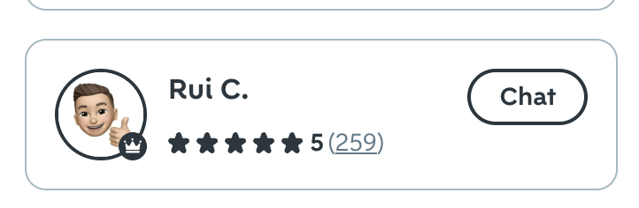
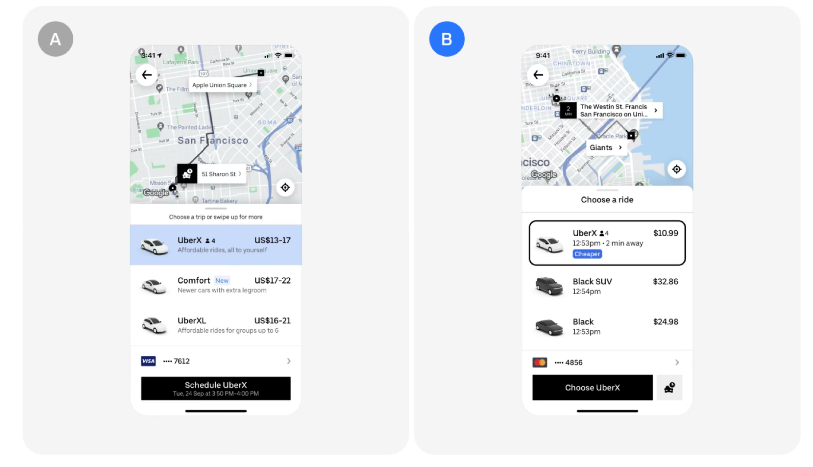
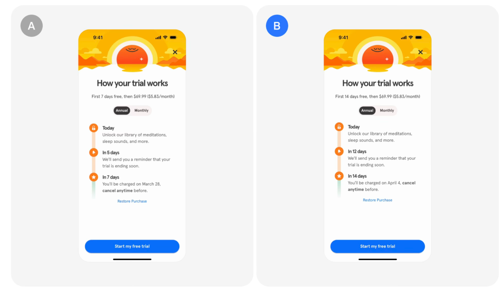
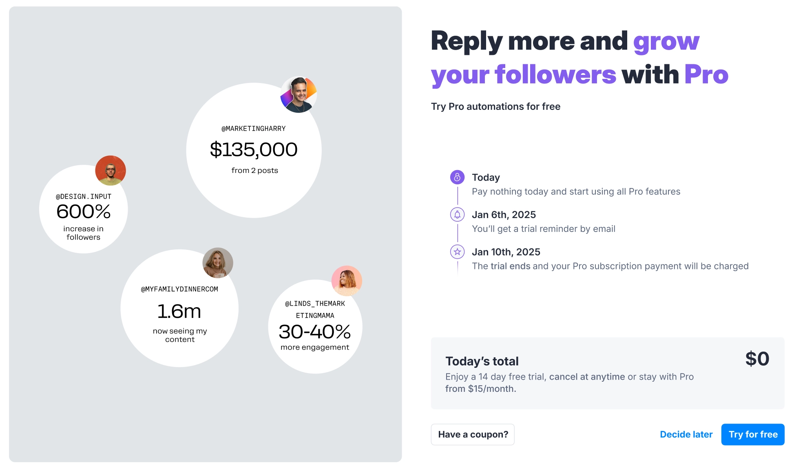

# Experiments 1

  Harbour.Space &middot; Barcelona &middot; May 27, 2026

---

# Today

  

    01
    
From statistics to causality

  

  

    02
    
Randomization and its assumptions

  

  

    03
    
Planning

  

  

    04
    
Design

  

  

    05
    
Run

  

  

    06
    
Decision

  

---
layout: section
class: tint-lavender
---

## 01

# From statistics to causality

---
layout: statement
---

# We know how to test hypotheses and build estimates  The real job is to make the product better

<!--
Open with the take. Statistics is the tool we just spent two sessions on, and the room is naturally fixated on it. Reset the frame: that machinery exists to serve product decisions, not the other way around. The rest of the lecture builds the bridge.
-->

---

# Compare two groups, get fooled

Take Revolut premium users and compare the ones who use Feature A with the ones who do not. LTV is much higher in the Feature-A group.

Uses Feature A

😎 😎 😎 😎 😎

LTV ≈ $$$

No Feature A

😐 😐 😐 😐 😐

LTV ≈ $

Did the feature do it?

<v-click>

Maybe. Or maybe these users were more motivated to begin with, and would have paid more anyway.

</v-click>

<!--
Ask the room first. Let them suggest answers. The 😎 users are the kind that already engage more, log in more, top up more often. They chose to use Feature A because they were curious or motivated. Push Feature A to the 😐 half and the LTV gap will not appear, because the gap was never the feature. Then reveal.
-->

---

# Correlation

We use the **covariance** to measure how two variables move together.

$$\mathrm{Cov}(X, Y) = \mathbb{E}\big[(X - \mu_X)(Y - \mu_Y)\big]$$

Normalising by the standard deviations gives Pearson's correlation, $\rho = \mathrm{Cov}(X,Y)/(\sigma_X \sigma_Y) \in [-1, 1]$. Spearman applies the same idea to ranks and is less sensitive to outliers.

<v-click>

Correlation is not causation.

</v-click>

<!--
Covariance is the bedrock: positive when X and Y move together, negative when they move opposite, zero when they don't move together at all. Pearson is its scale-free version, and Spearman is the same idea on ranks. The headline is the same one we just demonstrated on Revolut: stat sig in a correlation tells us nothing about whether one caused the other.
-->

---

# The world we never see

For one user, we want to know two things: the metric with the feature, and the metric without it. The difference is the causal effect.

🙂

one user

→

world <b>with</b> the feature → outcome A

OBSERVED

<v-click>

→

world <b>without</b> the feature → outcome B

NEVER SEEN

</v-click>

<v-click>

For one user, we always see one side and never the other.

</v-click>

<!--
There is no twin in an alternate universe to give us the second outcome. The user lives one world. Whatever we did to them, the unobserved counterfactual stays unobserved forever. The next slide shows the way out.
-->

---

# Per group, not per user

If we cannot see both worlds for one user, we look at two groups instead.

Treatment group

🙂🙂🙂

→

🌍

world with the feature

average outcome <b>A̅</b>

vs

Control group

🙂🙂🙂

→

🌎

world without the feature

average outcome <b>B̅</b>

<v-click>

The difference of group averages, $\bar A - \bar B$, is our estimate of the causal effect.

</v-click>

---

# To compare fairly, we randomize

In a randomized controlled trial, the only difference between groups is the treatment we picked. Any other difference is random noise.

<v-click>

There is no method in modern science that beats this. If you can run one, run it.

</v-click>

<!--
RCT, randomized controlled trial. The whole rest of the lecture is about how to actually pull it off without breaking the assumptions that make it work.
-->

---
layout: section
class: tint-rose
---

## 02

# Randomization and its assumptions

---

# Why randomization works

Random assignment does not depend on any user trait, known or unknown. Age, country, tier, history, motivation all end up balanced between the two groups, on average. As $n$ grows, "on average" gets closer to "in practice", and even traits we never measured stay balanced.

<!--
The naive comparison failed because users were free to differ in many ways. Honest randomization removes that channel. What is left is sampling noise, and statistics knows how to handle noise.
-->

---
layout: statement
---

# The only systematic difference between groups is the treatment

<v-click>

One change, one stat-sig difference, one conclusion: the change moved the metric. The chance of a false positive stays at α, because that is what the test is built to do.

</v-click>

<!--
This is the payoff of randomization in one line. If we did one thing differently between groups and the metric moves more than chance would explain, we have license to call it the effect of that one thing. Without randomization, this license disappears, regardless of how clean the statistics look.
-->

---

# Balance grows with n, across every covariate

Each user has six traits: age, income, tenure, activity, country, device. With a random splitter, every panel balances as $n$ grows, including traits we did not measure. Switch to a biased splitter that sorts by income, and the income panel splits in two halves. Age drifts too, because age and income are correlated. The rest stay balanced.

<a href="/harbour-product-analytics-2026/08-experiments-1/balance-sim.html" target="_blank" rel="noopener" style="display:inline-block;padding:0.8rem 1.4rem;background:#1A1A1A;color:#fff;font-family:'JetBrains Mono',monospace;font-size:0.95rem;font-weight:700;letter-spacing:0.08em;text-transform:uppercase;text-decoration:none;border:2px solid #1A1A1A;">Open simulation ↗</a>

<!--
Walk the slider. Random at n=50, visible noise everywhere. Random at n=1000, every panel overlaps. Switch to biased at any n: income splits in half cleanly, age drifts with it, the rest stay balanced. The lesson is what randomization handles for free, and what a broken splitter leaks into.
-->

---

# SUTVA

The **Stable Unit Treatment Value Assumption** says experiment units do not interfere with one another.

Each user's behavior depends on their own variant only. It does not depend on what variant other users got.

---

# Where SUTVA breaks

Some settings make the assumption almost impossible to hold.

- **Social networks**, where a feature can spill over to a user's network
- **Communication tools** like Skype, where peer-to-peer calls cross the bucket
- **Co-authoring tools** like Google Docs and Microsoft Office, where two users edit the same document
- **Two-sided marketplaces** like Airbnb, Uber, eBay, ad auctions, where the "other" side carries the effect. Lowering prices for Treatment moves the auction Controls see

Whenever one user can be affected by another user's variant, SUTVA is at risk.

Kohavi, Tang, Xu &middot; Trustworthy Online Controlled Experiments &middot; 2020

---

# Wallapop, new badge for sellers

{width=380px}

We randomize sellers into control and treatment, and ship a new badge to the treatment arm.

Sellers in the control group are also <b>buyers</b> on the same marketplace. When they buy, they see badges on treatment sellers and change their behavior. Badged sellers also get more attention from buyers, so control sellers receive fewer contacts because of the treatment.

<v-click>

Both paths break SUTVA. The control group is no longer the "world without the feature".

</v-click>

---

# Ignorability and positivity

**Ignorability** says assignment is independent of user characteristics, which honest randomization gives us for free. It breaks the moment the bucketing logic correlates with an attribute (the broken splitter from a few slides back is exactly this).

**Positivity** says every unit could land in either group with non-zero probability. It breaks when, say, the treatment is iOS-only while control is Web-only, because then ATE is undefined on the population.

---

# Three conditions

| Assumption | What it says |
|---|---|
| **SUTVA** | One user does not affect another, treatment is uniform within the arm |
| **Ignorability** | Assignment is independent of user characteristics |
| **Positivity** | Every unit can land in either group |

Break any one of them, and confounding is back. We will return to each as a failure mode in the limits session.

---
layout: section
class: tint-mint
---

## 03

# Planning

---

# The pipeline

Planning

Hypothesis 
Metrics 
Alignment 
Sample size

→

Design

Randomization 
Exposure

→

Run

Sanity checks

→

Decision

Results 
Ship / kill / iterate

Strict order. A problem shows up at Decision, but the real cause is earlier.

---

# Hypothesis

If we make <b>X</b>, then metric <b>Y</b> will move by <b>Z</b>, because of mechanism <b>Q</b>.

The form locks the direction, size and mechanism before any data comes in. When we look at the results, there is one thing to check, not many. One change, one causal claim.

<v-click>

<b style="color:#E5142B;">Experiments do not improve hypothesis quality.</b> A bad hypothesis can still give us a statistically significant result, and that result is useless. Writing the hypothesis matters as much as running the test.

</v-click>

---

# You test only what you test

{width=520px}

If conversion moves between A and B, which change drove it?

<v-click>

A and B differ in <b>many</b> things at once: map header, list layout, price format, "Cheaper" badge, arrival time, CTA style.

We tested a bundle, not the change we claimed.

</v-click>

<!--
Ask the room first. Let them try to point at the change that moved the metric. After a moment, click to show the list of things that actually differ.
-->

---

# The hypothesis card

Before launch, write the experiment down in four lines. Each line is locked before any data comes in.

Objective

the business outcome we are chasing

Insight

the data or observation that makes us believe this change will move it

Hypothesis

if we change X, metric Y moves by Z, because of mechanism Q

Expectations

what looks like a win, what looks like a loss

<v-click>

If a row is missing, you will guess it later from the data. That answer is rarely the right one.

</v-click>

---

# Your turn: Airbnb verified host badge

**Feature.** A "Verified host" badge on listings whose host has completed identity verification.

Objective

grow gross bookings

Insight

first-time guests cite host trust as the top blocker

Hypothesis

a badge raises booking conversion on verified listings

Expectations

what looks like a win, what looks like a loss?

<v-click>

<b style="color:#1A8F4F;">Ship if</b> booking conversion on verified listings is up by at least 3pp, with no drop in new host signups and no drop on unverified listings. Anything else, do not ship.

</v-click>

---

# Your turn: Spotify Discover Weekly

**Feature.** A new ranking model for the Discover Weekly playlist.

Objective

grow listening minutes per user

Insight

users who like the first 3 tracks listen 2× longer in the session

Hypothesis

what change, on what metric, by how much, why?

Expectations

what looks like a win, what looks like a loss?

<v-click>

<b>Hypothesis.</b> A better ranking on positions 1 to 3 lifts listening minutes per user by 2% or more, because a strong start keeps users in the session longer.
 
<b style="color:#1A8F4F;">Ship if</b> listening minutes are up by at least 2%, with skip rate flat or lower and save rate flat or up. Anything else, do not ship.

</v-click>

---

# Metrics

Every experiment names three roles before it launches.

Success

The metric the ship-or-kill decision rides on.

Proxy

Faster or more sensitive than success. Stands in when success is too slow or too noisy.

Guardrail

Must not regress, even if success improves.

<v-click>

Pre-declare or lose α. If we choose the success metric after we see the data, we have done multiple testing without admitting it.

</v-click>

---

# You measure only what you measure

The result of the experiment is whatever your metric captures. If the metric does not reflect the hypothesis, the test produces a valid answer to the wrong question.

Common reasons the mismatch shows up: how the change is built into the product, which variants actually shipped, which event the metric counts, and when.

<v-click>

A misaligned metric gives the correct statistical answer to the wrong question.

</v-click>

---

# 7 vs 14 day free trial

{width=500px}

What's happening in A vs B?

<v-click>

They extended the free trial from <b>7 to 14 days</b>.

</v-click>

<v-click>

Which metrics go up?

</v-click>

<v-click>

Which metrics go down?

</v-click>

<!--
Walk the room through it: first ask what changed (reveal: trial length). Then ask the room which metrics they think will go up (trial start CR, time to charge). Then which go down (trial-to-paid, retention after charge, possibly net revenue). Use the next slide to lay out the full chain.
-->

---

# The full chain

01

Free users

02

Trial start

03

Paid

04

Paying users

05

Revenue

trial-start CR

trial-to-paid CR

retention

× ARPU

A change at step 01 has to clear <b>four conversion gates</b> before it touches revenue. A metric on step 02 measures step 02, and it is not a stand-in for step 05.

<v-click>

If the hypothesis is about revenue, the success metric lives on step 05.

</v-click>

<!--
Each arrow is a conversion rate. Each conversion is a chance for the effect to vanish, reverse, or get absorbed. Trial-start CR can grow 30% while paying-user count drops, because the long trial caused more starts but the same people who would have paid anyway are now more likely to cancel before charge. Read the chain forward when designing the metric, do not pick the first thing that looks like it moves.
-->

---

# Manychat, CTA on the trial wall

**Hypothesis.** A more product-oriented CTA copy will increase trial activation.

{width=420px}

{width=420px}

Conversion grew by 25%. What's the problem?

<!--
Ask the room. Let them squint at the two screens before clicking through.
-->

---

# What actually changed

We did not just rewrite the copy.

- The headline became product-oriented ("Reply more and grow your followers with Pro")
- The button label changed from <b>Activate Pro Trial</b> to <b>Try for free</b>
- The button placement and visual weight changed
- A secondary "Decide later" link appeared

<v-click>

The hypothesis was about <b>copy</b>, but the change we shipped was a <b>bundle</b>. The 25% lift could come from "Try for free" sounding less risky to users, not from product-oriented copy.

</v-click>

<v-click>

You tested a bundle, not a hypothesis.

</v-click>

---

# Sample size planning

Lock α, β, the practical effect, and the metric variance before launch. From these we get the weeks we need.

| Metric | α | β | Practical effect | Weeks |
|---|---|---|---|---|
| Revenue per user | 5% | 20% | +2% | 6 |
| Trial-to-paid | 5% | 20% | +1pp | 4 |
| D7 retention | 5% | 20% | +0.5pp | 12 |
| Activation | 5% | 20% | +1pp | 3 |

Read forward (weeks for this effect?) or backward (given the weeks, what effect can we catch?).

---

# What if the wait is too long

Three things we can try when the planned duration is too long.

Pick a different metric

A more sensitive proxy may reach the same business question faster than the slow success metric.

Loosen α or β

Accept more false positives or more false negatives. The trade is explicit and goes in the design doc.

Reduce variance

Variance-reduction methods like CUPED cut σ on the analysis estimator. Detailed in the limits session.

<v-click>

If none of these work, the right answer is to not run the experiment.

</v-click>

---
layout: section
class: tint-cream
---

## 04

# Design

---

# How the platform splits

The unit of randomization can be user, session, device, account or market, and the choice depends on what changes, who is affected, and where effects can leak between units.

Random and reproducible are the two properties we need from the platform. The user lands in the same group every time, and the assignment correlates with nothing about the user. Hashing the user_id gives both at once.

---

# Manychat, user vs account

A user runs several accounts, and an account has several admins. The relationship is many-to-many.

Randomizing <b>by user</b> means two admins of the same account see different treatments, and the workspace becomes a mix that breaks consistency.

Randomizing <b>by account</b> means all admins of an account share one treatment, and the workspace stays consistent.

<v-click>

Randomize at the level where the treatment lands and where the effects build up.

</v-click>

---

# Eligible vs exposed

A user is **eligible** when the experiment conditions match and they were assigned to a bucket. They are **exposed** when they actually saw the change.

Eligible

10,000

in a bucket

→

Treatment

5,000

Control

5,000

→

Exposed in T

2,500

saw the feature

Not exposed

2,500

never reached it

<v-click>

If we count all 5,000 as treatment, half of them never saw the feature, so the signal on the analysis pool is smaller than the true effect. The MDE we actually reach is larger than the one we planned for, and the test can miss a real effect.

</v-click>

---
layout: section
class: tint-sky
---

## 05

# Run

---

# While the experiment runs

Three things to watch, three reasons to stop or wait.

Health

SRM, balance, A/A baseline. The platform should behave the way the design says. If not, we fix it before looking at the results.

Extreme degradation

Hard guardrail breach, kill switch, root-cause diagnostics. Used to stop, never to ship early.

No decisions until volume

No ship-or-kill calls until the planned $n$ is reached. Peeking is a separate failure mode, covered in the limits session.

---
layout: section
class: tint-lavender
---

## 06

# Decision

---

# Stick to the plan

The only way to keep α at the level we picked is to decide on the setup we locked **before** launch. Anything else breaks the guarantee statistics gave us yesterday.

Find any significant metric

Pick the metric that came out significant after we saw the data. With 20 metrics, the chance that at least one crosses α by noise is far above 5%.

Check it every day

Check the results every day and stop when something crosses α. Same problem, just across days instead of metrics.

<v-click>

Decide by the plan that was written before launch.

</v-click>

<!--
Both anti-patterns inflate the effective Type I rate. We discuss multiple testing and sequential analysis in detail tomorrow. Today the rule is simple: the plan is the contract.
-->

---

# When metrics disagree

Two patterns come up often: success is up but a guardrail is down, or two success metrics say opposite things.

Today we just name the problem. Multi-metric decisions come in the next session.

---

# Ship, kill, iterate

Three outcomes, decided by a rule we wrote **before** the experiment ended. **Ship** if success is up, guardrails are OK, and the effect matches the hypothesis. **Kill** if success is flat or down, or a guardrail is broken. **Iterate** if the result is borderline ($p$ near α): rewrite the hypothesis or fix the change, then re-run.

<v-click>

For borderline single-experiment wins, re-running beats shipping. Replication is the practical fix against single-experiment false positives.

</v-click>

If any earlier step was skipped, the problem shows up here as a normal-looking ship decision, but the error guarantee is already gone.

---
layout: statement
---

# Skip a step, lose error control  Without error control, the procedure means nothing

---

# Materials

Book

Trustworthy Online Controlled Experiments

Ron Kohavi, Diane Tang, Ya Xu. Cambridge University Press, 2020

Curriculum

<a href="https://confidence.spotify.com/bootcamp/intro-course/introduction" target="_blank">Spotify Confidence Bootcamp</a>

Intro course on experimentation methodology

