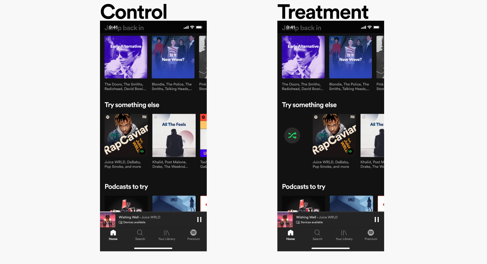
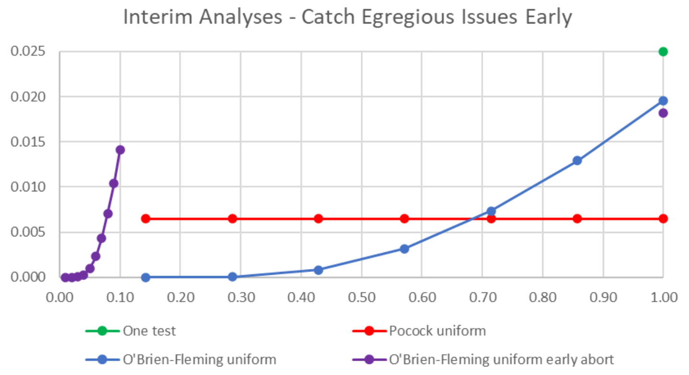

# Experiments 2

  Harbour.Space &middot; Barcelona &middot; May 28, 2026

---

# Today

  

    01
    
Metric design

  

  

    02
    
Peeking

  

  

    03
    
OEC

  

  

    04
    
False positive risk

  

  

    05
    
Controlling errors across many metrics

  

  

    06
    
Variance reduction

  

  

    07
    
Platforms and layered allocation

  

---
layout: section
class: tint-lavender
---

## 01

# Metric design

---
layout: statement
---

# Uber data scientist interview · hiring manager stageBefore: drivers paid weekly Now: daily payouts available, small feeWhat would you measure? How would you design the experiment?

<!--
Read the case and stop. Don't move on until students have started talking. The job of this slide is to put the case in the room and shut up. Most students will want to immediately name metrics (retention, DAU, top-ups). That instinct is the thing we want to interrupt.
-->

---
layout: statement
---

# Don't jump to metrics yet. Think first

<!--
The «не торопись прыгать в metric» pause. We are about to walk back from «metric» to «what are we even trying to do here». Repeat verbally: until the goal is named, every metric you suggest is a guess.
-->

---

# Designing an experiment needs five things, in order

01

Objective

02

Insight

03

Hypothesis

04

Metric

05

Design

**Objective.** The business outcome we ultimately want to move.

**Insight.** The user-side belief that motivates the change.

**Hypothesis.** If we make X, then Y will move by Z, because of Q.

**Metric.** How we measure Y, with guardrails for what must not regress.

**Design.** Randomization unit, sample size, duration, exposure logic.

<!--
The hypothesis form is from yesterday. The two new steps are upstream of it: objective and insight. Without those, you write a hypothesis about a metric that has nothing to do with what the team is trying to do.
-->

---

# Three roles for any metric

Success

The metric the ship-or-kill decision is built on.

Guardrail

Must not regress beyond a margin, even if success improves.

Proxy

Faster or more sensitive than success. Used when success takes too long to measure.

This is the minimum vocabulary. Spotify's full taxonomy adds deterioration and quality on top, [link](https://engineering.atspotify.com/2024/03/risk-aware-product-decisions-in-a-b-tests-with-multiple-metrics).

<!--
Three roles is the working vocabulary. The Spotify four-type framework in section 03 extends this.
-->

---

# Another case: Spotify shuffle button

{width=620px}

**Spotify is testing a new shuffle button on a content shelf. What metric tells you whether it helped users?**

<!--
Same exercise as Uber, run after the framework is in place. Let the room name candidates: «share of plays from that shelf», «clicks on the button», «time on home», «session length». Each has a flaw. The Spotify answer comes on the next slide.
-->

---

# Spotify's answer to the shuffle question

**Two candidate metrics, with very different long-term behaviour.**

Narrow

Share of plays from that shelf. Measures the feature directly, but the team can move it by pulling traffic from other shelves.

Broad proxy

**Minutes played in Week 1.** Measures overall user activity, and correlates with churn and subscription over time.

Source: Spotify Confidence Bootcamp Lesson 4, [link](https://confidence.spotify.com/bootcamp/intro-course/success-metrics).

<!--
The narrow metric is tempting because it directly measures the feature. The broad metric is what Spotify ships on, because minutes played and active users are the standard short-term proxies for long-term outcomes (retention, subscription).
-->

---
layout: section
class: tint-rose
---

## 02

# Peeking

---

# The textbook version: one test, one decision

**Real experiments add three axes that compound the false-positive rate above the $\alpha$ you promised.**

Segments

Country, device, plan, cohort. Each slice is another chance to find significance.

Time

Daily check-ins on the running experiment. Each peek is another chance to stop on noise.

Metrics

Many success and guardrail metrics in one decision. Each one is another chance to false-alarm.

Each axis alone is manageable. Combined, the procedure we thought controlled $\alpha$ at 5% sits **far above 50%**.

<!--
The textbook NHST framework gives one test, one metric, one look. Reality multiplies by three axes. The rest of the section quantifies the damage and shows two families of fixes.
-->

---

# P-value trajectories on A/A experiments

**No real effect. Trajectories that crossed $\alpha$ = 0.05 even once are red.**

<a href="/harbour-product-analytics-2026/09-experiments-2/peeking-trajectories-sim.html" target="_blank" rel="noopener" style="display:inline-block;padding:0.5rem 0.9rem;background:#1A1A1A;color:#fff;font-family:'JetBrains Mono',monospace;font-size:0.78rem;font-weight:700;letter-spacing:0.08em;text-transform:uppercase;text-decoration:none;">Open simulation ↗</a>

A team that stops on first significance would call each red line a real effect, even though there is none.

<!--
Run with 20-50 trajectories over 30 days. The share of red trajectories is the empirical false-positive rate of «stop on first significance». For 30 daily looks it sits around 25-35%. Next slide gives the closed-form Armitage numbers.
-->

---

# False-positive rate by number of looks

| Number of looks | $P$(at least one false positive) |
|---|---|
| 1 | 5.0% |
| 2 | 8.3% |
| 5 | 14.2% |
| 10 | 19.3% |
| 100 | 36.6% |

**With daily checks for two weeks, the procedure's false-positive rate is about three times the $\alpha$ we promised.**

Classical reference: Armitage, McPherson, Rowe 1969 on repeated significance tests, [doi](https://doi.org/10.2307/2984290).

<!--
Numbers assume $\alpha$=0.05 and approximately independent checks. The dependence between sequential looks makes the actual inflation slightly different, but the order of magnitude is right. The headline: by stopping on first significance, the team is spending an $\alpha$ budget many times what it thinks it is.
-->

---

# Compounded across metrics, segments, looks

**With $M$ metrics, $S$ segments, $L$ looks: FP rate $= 1 - 0.95^{M \cdot S \cdot L}$.**

| Metrics | Segments | Looks | P(FP) |
|---|---|---|---|
| 1 | 1 | 1 | 5% |
| 2 | 3 | 1 | 26% |
| 2 | 3 | 4 | 71% |
| 5 | 5 | 5 | 99.8% |

<!--
2 × 3 × 4 = 24 effective tests, so the team is wrong about $\alpha$ by roughly 14×. The independence assumption is conservative-ish but the multiplicative blow-up is real. Correlated segments dampen the actual rate, but order of magnitude holds.
-->

---
layout: statement
---

# $\alpha$ belongs to the procedure not to a single test

<!--
The thesis the rest of the section serves. Every check is a decision. Many checks are many decisions. $\alpha$ must split across them. Two mainstream fixes follow.
-->

---

# Fix 1: $\alpha$-spending (group-sequential)

**Declare the looks in advance, and split $\alpha$ across them so the total stays at the target.**

The Kohavi & Chen recommendation: **a tiny $\alpha$ at the interim look, almost all of it at the final**:

Interim look (week 2)

α1 = 0.001

catches only severe degradation

Final readout (week 4)

α2 ≈ 0.049

the real decision point

Procedure

αtotal = 0.05

stays at the promised level

The general framework is **$\alpha$-spending functions** (Lan & DeMets 1983). Looks can be added dynamically as long as the cumulative budget stays bounded.

<!--
Three families of $\alpha$-spending exist (Pocock, O'Brien-Fleming, Goldilocks). The Kohavi recommendation is closest to O'Brien-Fleming: spend almost nothing on the early peek (just enough to abort on catastrophe), keep almost the full $\alpha$ for the planned final readout. This is the right pattern when interim peeking is opportunistic safety rather than a real decision point.
-->

---

# $\alpha$-spending families compared

**Pocock spreads $\alpha$ evenly, O'Brien-Fleming saves it for the end, and the early-abort variant catches catastrophes at week 1.**

{width=460px}

X-axis: fraction of total information. Y-axis: incremental $\alpha$ at that look. All four sum to the same overall $\alpha$. Source: O'Brien & Fleming 1979.

<!--
One test (green dot): a single endpoint at the planned end. All $\alpha$ at one look.
Pocock (red flat line): same $\alpha$ at every interim look, easy to stop early.
O'Brien-Fleming (blue rising curve): nearly nothing early, almost all $\alpha$ at the final look.
O'Brien-Fleming early abort (purple spike): tiny $\alpha$ at the very start to catch catastrophic regressions, then almost nothing until the end.

The Kohavi recommendation from the previous slide is closest to the early-abort variant.
-->

---

# Fix 2: sequential testing

**Anytime-valid procedures let you look whenever you want, and the false-positive rate still holds.**

In fixed-horizon testing, $N$ is **fixed** and $\alpha$ is allocated to one final check. In sequential testing, $N$ becomes a random variable. The procedure decides when to stop, based on the data.

| Method | Source |
|---|---|
| **SPRT**. Sequential probability ratio test | Wald 1945 |
| **mSPRT**. Mixture SPRT for online experiments | [Johari, Pekelis, Walsh 2017](https://arxiv.org/abs/1512.04922), Optimizely |
| **Confidence sequences** | [Howard, Ramdas, McAuliffe, Sekhon 2021](https://arxiv.org/abs/1810.08240) |

Runs under the hood of Optimizely Stats Engine and Statsig sequential testing. The confidence interval is valid at every check.

<!--
Anytime-valid CIs are wider for the same sample size than fixed-horizon CIs. You pay for the right to peek by losing a bit of precision per look. Most teams accept that trade-off in exchange for not having to plan looks in advance. The «N is random» framing matters: the analyst no longer commits to an n upfront; the stopping rule decides.
-->

---

# Corrections as checkboxes

**Statsig shows three toggles on the results page, one per peeking axis.**

Benjamini-Hochberg per variant

FDR control across many metrics. Metric-axis correction.

Sequential testing

Anytime-valid p-values and CIs. Time-axis correction.

CUPED

Variance reduction at the procedure level. Orthogonal to α.

Segment breakdowns are built into the UI. Without BH, every segment slice is another chance at a false positive, and the toggle keeps the slicing under the same $\alpha$ budget.

Docs: Statsig, [*Read Experiment Results*](https://docs.statsig.com/experiments/interpreting-results/read-results). BH procedure: [Wikipedia](https://en.wikipedia.org/wiki/False_discovery_rate#Benjamini%E2%80%93Hochberg_procedure).

<!--
The corrections from section 03 show up as checkboxes the PM toggles before reading results. Walk the room through the demo page briefly if there is time.
-->

---

# Statsig's own best-practice list

**Four rules from their docs, almost verbatim.**

1. **Hypothesis before results.** What do you expect to move? What would tell you it went wrong?

2. **Small set of key metrics.** More than a handful usually means the hypothesis is ill-defined or the team is testing many things at once.

3. **No cherry-picking.** A statistically significant result needs a plausible explanation, and «false positive» is a plausible explanation.

4. **Expect false positives.** At 95% CI, roughly 1 metric in 20 will look significant by chance.

Source: Statsig, [*Best Practices and Avoiding False Positives*](https://docs.statsig.com/experiments/interpreting-results/best-practices).

<!--
These rules echo the procedural lessons of this whole lecture. Hypothesis before results = the «think first» pause we did on the Uber case. Small set of key metrics = the OEC ≤5 rule. No cherry-picking = the conjunctive decision rule from Spotify. Expect false positives = the FP cascade from yesterday.
-->

---
layout: statement
---

# Interpret every result as a story across all metrics When in doubt, replicate

<!--
The closing thought. Every framework today bounds the error rate of the procedure. None of them tell you whether a particular result is real. That's the analyst's job. Look at the whole metric set together and ask: what single story makes them all behave this way?

Sometimes the playbook says «significant» and your interpretation says «this is a false positive. None of the other metrics support this story». Trust the story. At $\alpha$=5%, roughly one in twenty metrics will look significant by chance, and the rest of the experiment will tell you which one it is.

And when you are not sure, replicate. A borderline win is cheap to re-run and expensive to ship. The strongest A/B tool is your ability to make sense of the whole picture and to come back for a second pass when the first one is ambiguous.
-->

---
layout: section
class: tint-mint
---

## 03

# OEC

---

# Bing: query share and ad revenue both rose, the product was worse

**Query share rose 10%, ad revenue rose 30%. The product was worse.**

A ranker bug returned poor search results, so users issued more queries to find what they wanted, which meant more chances to click ads. Both headline metrics moved up because the product was failing.

If those two metrics had been the OEC, the team would have shipped the bug.

Source: Kohavi, Tang, Xu, *Trustworthy Online Controlled Experiments* (2020).

<!--
The problem: two reasonable metrics in isolation can both rise when the product breaks. Aggregating them into a naive «top-line» reads as a win. The next slide unpacks what OEC has to do to avoid this.
-->

---

# OEC: Overall Evaluation Criterion

**The minimum set of metrics that fully covers the goal of the experiment.**

A working OEC does three things in one decision:

Move

The target metric moves in the direction the team intended.

Detect

Side effects and regressions from the change show up in the data.

Interpret

The pattern across metrics tells a coherent story about why they moved together.

The OEC is what the ship-or-kill decision is built on. Everything else is supporting context.

Source: Kohavi, Tang, Xu, [*Trustworthy Online Controlled Experiments*](https://experimentguide.com/), chapter on metrics.

<!--
OEC is not «one metric». It is the smallest set of metrics that covers the goal, shows side effects, and lets you interpret the result. Bing was the problem; this is the structure that avoids it.
-->

---

# The right OEC for search

**Optimize sessions per user, bound queries per session, cap revenue by ad-pixel constraint.**

$$\text{distinct queries} = \text{users} \times \frac{\text{sessions}}{\text{user}} \times \frac{\text{queries}}{\text{session}}$$

- **Users** is fixed by design and cannot move the OEC
- **Sessions per user** should grow. Returning users are satisfied users
- **Queries per session** should fall, as long as abandonment does not rise

<!--
Revenue per user enters as a guardrail: ads cannot consume more than a capped share of the screen. General rule: when a metric is a product of factors, decompose first and check which factors should rise vs fall.
-->

---

# OEC in practice: a small set plus a rule

**A small set of metrics plus a pre-declared rule that maps their results to a ship-or-kill decision.**

| Result pattern | Decision |
|---|---|
| All flat or positive, at least one positive | **Ship** |
| All flat or negative, at least one negative | **Kill** |
| All flat | **Kill**, raise power, retry |
| Mixed | **Trade-off**, decided by humans |

Keep the OEC to **$\le 5$ metrics**.

<!--
With 5 independent metrics at α=5%, P(at least one false positive) is 23%; with 10 metrics it is 40%. The textbook construction collapses many metrics into a weighted sum and one number; in practice almost no team does that. Working OECs are short lists of metrics with an explicit rule. The «mixed» row is where the team's judgment lives. Spotify's framework in the next section is the formal version.
-->

---
layout: section
class: tint-lavender
---

## 04

# False positive risk

---

# Observed win rate is not the success rate

**The fraction of experiments that show a win is not the fraction of changes that actually work.**

To know how often a change really works, we must back out false positives and false negatives from the observed wins. The two go in opposite directions and only partially cancel.

Optimizely reported **12% wins across 127K experiments**, and the actual share of changes that work is lower.

Source: Kohavi & Chen 2024, [*False Positives in A/B Tests*](https://bit.ly/FalsePositiveInABTests).

<!--
The naive approach happens to be accurate in a narrow band ($\alpha$=0.05 with ~10-15% win rates), where FP and FN roughly cancel. Outside that band it lies in both directions. We will use the law of total probability to invert the observed win rate.
-->

---

# Inverting Optimizely's 12% win rate

**Solve the law of total probability for the unknown success rate $\pi$.**

setup

Optimizely defaults: α = 0.05 in the positive tail (two-tailed 0.10), power = 1 − β = 0.80. Observed win rate 0.12.

result

π ≈ 9.3%. The true success rate is lower than the observed win rate.

$$0.12 = 0.80 \cdot \pi + 0.05 \cdot (1 - \pi) \quad\Rightarrow\quad \pi = \frac{0.07}{0.75} = 0.093$$

<!--
The law of total probability: P(win) = P(win | true effect) × P(true effect) + P(win | no effect) × P(no effect). The first term is power, the second is $\alpha$ in the positive tail. The arithmetic gives $\pi$ = 9.3%. Almost matches the 10% median reported across industry by Kohavi/Deng/Vermeer 2022.
-->

---

# Of the 12% wins, 37.8% are false positives

**Per 100 experiments at Optimizely defaults.**

9.3 with true effect

→ 9.3 × 0.80 = <b>7.4 true positives</b>

90.7 with no effect

→ 90.7 × 0.05 = <b>4.5 false positives</b>

Total «wins»

<b>11.9</b> ≈ observed 12% ✓

$$\text{FDR among wins} = \frac{\text{FP}}{\text{TP} + \text{FP}} = \frac{4.5}{11.9} \approx 37.8\%$$

Roughly 1 in 3 «wins» at $\alpha$ = 0.05 in the positive tail is a false positive.

<!--
This is the Bayes inversion of the classical false-positive rate. Conditioned on observing a win, what fraction are false? With low base rate of true effects (≈10%) and the standard $\alpha$-power combo, the answer is ~38%. Base rate fallacy in action.
-->

---

# Sensitivity to $\alpha$ and power

**Same world ($\pi = 9.3\%$). FDR among wins changes ~10× across reasonable settings.**

| $\alpha$ | power | FDR among wins |
|---|---|---|
| 10% | 50% | **49%** |
| 10% | 80% | 38% |
| 5% | 80% | 23% |
| 1% | 80% | **6%** |

<!--
At α=10% × power 50% the team lives at ~49% FDR; at α=1% with proper power it drops below 6%. Underpowered experiments fail twice: they miss real effects, and among the wins they do catch the false-positive share is higher. The «what α should we use» question is a cost trade-off; Kohavi/Chen Table 3 makes it explicit (TP/FP per 100 experiments).
-->

---

# Type M: winners overstate the effect

**Among studies that barely clear the significance bar, the estimated effect size is systematically inflated.**

Under low power, only the large random fluctuations cross the threshold. The ones that do are not a random sample of the true effects. They are the upper tail of the noise distribution **plus** the signal, so the reported magnitude is bigger than reality.

Named **Type M error** (magnitude error) by Gelman & Carlin 2014. Sits alongside Type S (sign error) and the classical Type I / Type II. At 20% power, the average significant estimate exaggerates the true effect by roughly $2\times$. At 50% power, around $1.3\times$.

The practical takeaway: discount published effect sizes from underpowered studies. Replicate borderline wins before sizing a follow-up plan around the first number.

Reference: Gelman & Carlin 2014, *Beyond Power Calculations*.

<!--
Type M is what makes underpowered experiments doubly bad: they miss real effects (Type II), AND when they do detect, the magnitude is wrong (Type M). The Kohavi/Chen «inflated winners» framing on the previous slide is the FP-fraction story; Type M is the magnitude story on the TP fraction. Both push in the same direction: «do not trust a single borderline win».
-->

---

# Replication crisis

**A pattern across empirical science of published findings that fail to reproduce when the experiment is run again.**

Underpowered designs plus a literature filtered for significance produce wrong conclusions. Two failure modes show up together. False positives that do not survive replication, and real effects whose estimated magnitudes are inflated (Type M).

Reproducibility Project (2015) replicated 100 psychology studies. Roughly **39% reproduced**. Among those that did, the average effect size in the replication was about **half the original**. Both failure modes visible in one dataset.

Best documented in psychology, biomedicine, social sciences. The failure mode is general: every domain where studies are underpowered and the literature is filtered for significance is at risk.

References: [Wikipedia · Replication crisis](https://en.wikipedia.org/wiki/Replication_crisis), [Wikipedia · Reproducibility Project](https://en.wikipedia.org/wiki/Reproducibility_Project).

<!--
Industry parallels with academic replication crisis: pre-registration of decisions (commit to α, MDE, metrics before the run), A/A calibration (estimate effective Type I empirically), MDE-driven sample planning. The «replicate borderline wins» rule we discussed earlier is the industry version of the academic «pre-register and replicate».
-->

---
layout: section
class: tint-cream
---

## 05

# Controlling errors across many metrics

---

# Many metrics means many false positives

**At $\alpha$ = 5% per independent metric, P(at least one FP) = $1 - 0.95^k$.**

| Metrics in the experiment | P(at least one false positive) |
|---|---|
| 1 | 5% |
| 5 | 23% |
| 10 | 40% |
| 20 | 64% |

<!--
The OEC compresses this by deciding on one rule across a few metrics. The alternative: keep the metrics separate and correct α and β at the procedure level. Naive approach on the next slide is the simplest answer; Spotify framework on the slides after that is the structured one.
-->

---

# Bonferroni correction

**With $k$ tests, give each one a threshold $\alpha/k$. The combined false-positive rate stays at $\alpha$.**

Union bound: $P(\text{any FP}) \le \sum_{i=1}^{k} P(\text{FP}_i) = k \cdot \frac{\alpha}{k} = \alpha$.

Works for any dependence between tests, even worst case. The cost is power, since each individual test now needs a larger effect to clear the higher bar.

With 5 metrics at overall α = 5%, each metric tests at α / 5 = 1%. The procedure-level false-positive rate stays ≤ 5% regardless of how the metrics correlate.

<!--
Bonferroni is the workhorse FP correction. Holm, Hochberg, Benjamini-Hochberg all refine it for power, but Bonferroni is the easiest to state and the safest under arbitrary correlation. Every other correction either gives weaker control (BH controls FDR not FWER) or assumes more about the dependence structure.
-->

---

# Naive approach: pick a small $\alpha$

**Set $\alpha$ = 0.001 on every metric, and stop worrying about corrections.**

This is Bonferroni at the limit. Even with 50 metrics the procedure-level false-positive rate stays below 5%. The price is power: at fixed sample size, smaller $\alpha$ needs a larger effect to clear the bar.

<!--
The naive approach is not a strawman. Kohavi & Chen 2024 (Table 3) show that for industry-typical π ≈ 10% and a 3:1 cost ratio of FP to FN, α = 0.01 is cost-minimizing. The Spotify framework on the next slides is more nuanced and worth the maintenance cost when sample size is the bottleneck.
-->

---

# Superiority vs non-inferiority

**In one experiment we apply both tests at the same time. Each metric gets the test that matches its role.**

Superiority

$H_0: \mu_T \le \mu_C$ &nbsp;&nbsp; $H_1: \mu_T \gt \mu_C$

**Prove improvement.** Used for success metrics.

Non-inferiority

$H_0: \mu_T \le \mu_C - \delta$ &nbsp;&nbsp; $H_1: \mu_T \gt \mu_C - \delta$

**Prove no material decline.** Used for guardrails. Margin $\delta$ is the tolerable loss.

Sources: Spotify, [*Risk-Aware Product Decisions*](https://engineering.atspotify.com/2024/03/risk-aware-product-decisions-in-a-b-tests-with-multiple-metrics). Statsig, [*Non-Inferiority Tests*](https://www.statsig.com/blog/understanding-non-inferiority-tests).

<!--
Misuse to flag: a non-significant superiority test does not mean «non-inferior». They are different claims with different rejection regions. Don't conflate.
-->

---

# Same CI, opposite decisions

**A guardrail metric drops by 2.5pp. The 95% CI runs from −6pp to +1pp.**

<!-- horizontal axis -->

<!-- tick marks -->

<!-- tick labels -->

-8 pp

-6

-4

-2

0

+2

+4 pp

<!-- -delta threshold at x=160 (value -5) -->

−δ = −5 pp

<!-- 0 threshold at x=427 -->

0

<!-- CI bar from x=107 (-6) to x=480 (+1) -->

<!-- point estimate at x=293 (-2.5) -->

−2.5 pp

Superiority lens (often misapplied to guardrails)

The CI covers 0. Cannot reject H0: μT = μC. "No statistically significant change." <b>Ship by default.</b>

Non-inferiority lens (correct for guardrails)

The CI covers −δ. Cannot reject H0: μT − μC ≤ −δ. <b>Safety not proven. Don't ship.</b>

<!--
Superiority defaults to ship unless you prove harm, and non-inferiority defaults to kill unless you prove safety. The data are identical, and the procedure decides. For guardrail metrics this distinction matters most, because a naive «not statistically significant» reading is what lets bad regressions through.
-->

---

# Four metric types, four tests (Spotify)

| Type | Test | $H_0$ | $H_1$ |
|---|---|---|---|
| **Success** | Superiority | $T \le C$ | $T \gt C$ |
| **Guardrail** | Non-inferiority | $T \le C - \delta$ | $T \gt C - \delta$ |
| **Deterioration** | Inferiority | $T \ge C$ | $T \lt C$ |
| **Quality** | Validation | experiment invalid | experiment valid |

**Deterioration is a scan applied to every metric in the experiment**, including success and guardrail metrics, for evidence of a material decline. Quality is a sanity check on the experiment itself (SRM, missing data, broken pipelines).

Source: Schultzberg, Ankargren, Frånberg, Spotify Engineering 2024, [link](https://engineering.atspotify.com/2024/03/risk-aware-product-decisions-in-a-b-tests-with-multiple-metrics) and [arxiv 2402.11609](https://arxiv.org/pdf/2402.11609).

<!--
Guardrail and deterioration look similar but cover different failure modes. Guardrail: «we expect this metric not to drop, prove it.» Deterioration: «scan everything; if anything dropped meaningfully, kill.» Guardrail is named and pre-declared. Deterioration sweeps every metric in the experiment.
-->

---

# One decision rule for the whole experiment

**Ship if and only if all four hold.**

1. The treatment is significantly superior on **at least one** success metric
2. The treatment is significantly non-inferior on **all** guardrail metrics
3. **No** metric shows evidence of deterioration
4. **No** quality test flags the experiment as invalid

why this matters

The rule is **conjunctive**: every condition has to hold, so $\alpha$ belongs to the procedure, not to any single metric.

<!--
Without a single decision rule, every team makes ad-hoc ship decisions and the implicit $\alpha$ is invisible. Writing the rule down forces the trade-offs into the open. Spotify's framework just makes that rule explicit and corrects $\alpha$ and $\beta$ to match.
-->

---

# How $\alpha$ and $\beta$ get corrected

**Different metric types get different corrections, because the procedure is conjunctive.**

- **Success.** $\alpha$ is split across success metrics (Bonferroni-style). Power is corrected too because shipping requires success *and* all guardrails together.

- **Guardrail.** $\alpha$ is **not** corrected. With conjunctive ship-conditions there is no «multiple chances» problem. Every guardrail must clear, so the false-positive rate on shipping does not inflate with more guardrails. Power **is** corrected: 3 guardrails at 80% individual power give 80%³ ≈ 51% simultaneous.

- **Deterioration and quality.** $\alpha$ is split across all metrics in the experiment (Bonferroni over success + guardrails + deterioration + quality). A false alarm here blocks a ship that should have gone through.

With $\alpha$ = 0.05, $\beta$ = 0.20, and 3 guardrails, individual guardrail power has to be lifted to ~96% to keep simultaneous power at 80%. That costs sample size.

<!--
Avito anchor. Say verbally: «we set $\alpha$ very low, ran with many segments and daily looks, and the effective Type I rate held because the procedure was designed end-to-end. The framework is the safety net that makes aggressive slicing safe.»
-->

---

# $\alpha$ and $\beta$ are budgets of the procedure

The standard 5% / 20% defaults belong to one test, on one metric, looked at once. Real experiments have **many tests** (multiple metrics), **many looks** (daily check-ins), and **many slices** (segments). Each axis multiplies the chance of a false call if you do nothing.

The Spotify framework, the naive low-$\alpha$ approach, and the OEC compression are three different answers to the same question: **how do we hold the procedure's overall error rate to what we promised?**

<!--
Closing thesis of the section. The three approaches differ in flavor but agree on the diagnosis. Sections 04 and 06 will return to this. CUPED for variance, sequential testing for the time axis, all in service of the same procedure-level guarantee.
-->

---
layout: section
class: tint-sky
---

## 06

# Variance reduction

---

# Sensitivity = variance × influenceability

**Two independent factors. Both have to be in our favour for the metric to detect the effect.**

Variance

How much noise the metric has across users. What matters is **effective** variance, after variance reduction techniques like CUPED.

Influenceability

How much our change can actually move the metric: exposure (share of users who see the change), mechanism (does the metric capture the behaviour the change targets), and effect size.

Source: Spotify Confidence Bootcamp, [Lesson 7](https://confidence.spotify.com/bootcamp/intro-to-metrics/feasibility-and-sensitivity).

<!--
Variance and influenceability multiply. A low-variance metric the change cannot move is useless; a high-variance metric the change moves a lot is also useless unless variance reduction brings effective variance down. The «effective variance» framing matters: a metric with high raw variance but strong temporal correlation can end up more sensitive than one with low raw variance after CUPED is applied.
-->

---

# Why we care about variance

**Heavy-tailed product metrics need large samples to detect small effects.**

Revenue per user, time in app, sessions per user. These distributions have a long right tail. A 1% relative lift in revenue can require millions of users to detect at $\alpha$ = 5% and 80% power.

Anything that reduces the variance of the estimator without biasing it reduces the required sample size in proportion. A 50% variance reduction means roughly half the duration for the same MDE.

<!--
Set up CUPED. The motivation is purely practical: experiments are slow, and variance is what makes them slow. CUPED is the standard industry trick to shorten them.
-->

---

# CUPED: same expectation, lower variance

**Subtract a predictable component from each user's outcome, using pre-experiment data.**

For pre-experiment value $X$ and in-experiment value $Y$:

$$Y_\text{cuped} = Y - \theta (X - \mathbb{E}[X]), \quad \theta = \frac{\mathrm{Cov}(Y, X)}{\mathrm{Var}(X)}, \quad \mathrm{Var}(Y_\text{cuped}) = \mathrm{Var}(Y)(1 - \rho^2)$$

Expectation is preserved, so the ATE estimate is the same. Variance shrinks by $1 - \rho^2$.

Original paper: Deng, Xu, Kohavi, Walker 2013 WSDM, [link](https://exp-platform.com/Documents/2013-02-CUPED-ImprovingSensitivityOfControlledExperiments.pdf).

<!--
The key claim: same E[·], lower Var(·). The product interpretation does not change, the estimator gets sharper. $\rho$ is the correlation between the in-experiment Y and the pre-period X. The next slide shows the geometric picture: residuals from an OLS regression on the pre-period.
-->

---

# CUPED is just linear regression

**$\theta$ is the OLS coefficient of $Y$ on $X$. $Y_\text{cuped}$ is the residual.**

{width=460px}

The connection is in the author's own notes: Alex Deng, [*Sensitivity*](https://alexdeng.github.io/causal/sensitivity.html).

<!--
Each user is a point. The dashed line is the regression of the in-experiment metric on the pre-experiment covariate. The CUPED-adjusted value is the vertical distance from the line. The residual. Variance reduction comes from removing the part of Y that the pre-period already predicts.
-->

---

# Simulation: variance shrinks by 1 − $\rho$²

**A/A experiment. Compare the estimator $\bar Y_T - \bar Y_C$ with and without CUPED.**

<a href="/harbour-product-analytics-2026/09-experiments-2/cuped-variance-sim.html" target="_blank" rel="noopener" style="display:inline-block;padding:0.7rem 1.2rem;background:#1A1A1A;color:#fff;font-family:'JetBrains Mono',monospace;font-size:0.9rem;font-weight:700;letter-spacing:0.08em;text-transform:uppercase;text-decoration:none;border:2px solid #1A1A1A;">Open simulation ↗</a>

Both histograms centre at zero because the treatment effect is zero by construction. As $\rho$ rises, the CUPED histogram gets narrower. At $\rho = 0.7$ the variance drops by $1 - 0.49 = 51\%$, equivalent to roughly $2\times$ effective sample size.

<!--
Run the sim in class with rho = 0.0, 0.3, 0.7, 0.9. Tell the room what to watch: both distributions are centered at zero (so CUPED is unbiased), the pink one shrinks (so CUPED is sharper). The «effective sample × » tracker shows the savings: at rho=0.7 it should display roughly 2.0, at rho=0.9 around 5.3.
-->

---

# The gain scales with what history explains

**The variance reduction depends entirely on how predictive the pre-experiment data is.**

Variance reduction is exactly $1 - \rho^2$. Production reports converge around 30 to 60% reduction on revenue-style metrics, roughly 2 to 3× speed-up. See [Booking.com](https://booking.ai/how-booking-com-increases-the-power-of-online-experiments-with-cuped-995d186fff1d), [Nubank](https://building.nubank.com/3-lessons-from-implementing-controlled-experiment-using-pre-experiment-data-cuped-at-nubank/), [Statsig](https://www.statsig.com/blog/cuped).

On new users, the gain is zero. No pre-period, no covariate, no variance to remove.

<!--
Variance reduction is bounded by $\rho$². For metrics where the pre-period is highly predictive (revenue from heavy users, time-in-app from active users), $\rho$ is large and gains are dramatic. For new users with no history, $\rho$ = 0 and CUPED collapses to the plain estimator.
-->

---

# Covariate must be pre-exposure

**$X$ has to be measured before the user enters the experiment, and unaffected by treatment.**

If $X$ is computed on data that overlaps the exposure window, or on any quantity the treatment can move, CUPED biases the treatment effect estimator. The variance reduction depends on $X$ being independent of treatment.

If $X$ depends on treatment, $\mathbb{E}[Y_\text{cuped}]$ shifts and the difference of means stops estimating the ATE.

<!--
Hard rule: pre-experiment value, pre-experiment window. Some teams want to use «trailing 30 days including the experiment period» as the covariate because it has more data. That breaks CUPED.
-->

---
layout: section
class: tint-lavender
---

## 07

# Platforms and layered allocation

---

# One user, many experiments at once

**Independent experiments share users through layers. Exclusive within a layer, overlapping across.**

{width=380px}

<!--
The diagram shows the same population split into exclusive experiments (1, 2, 3) and nonexclusive experiments (4, 5). Spotify reports roughly 1M buckets company-wide with hundreds of experiments running concurrently. Platforms exist to solve a real coordination problem.
-->

---

# What if changes interact?

**When users see many experiments at once, the combined effect can amplify, cancel, or reverse the individual lifts.**

Mutex-everything kills throughput, so semantic layers are the practical fix.

<!--
Examples to give verbally: two onboarding nudges that together exceed the sum of each alone; a discount banner and a price-anchoring nudge that individually lift conversion and together do nothing; an aggressive upsell and a new pricing page each fine alone but together drive users away. Mutex-everything is conservative but expensive: few experiments can run at once and the team waits in line. Semantic layers on the next slide.
-->

---

# Interaction in a 2 × 2

**Run experiment A and B on the same users. Conversion rates per cell.**

B: Control

B: Treatment

A: Control

10.0%

baseline

10.8%

B alone, +0.8 pp

A: Treatment

11.0%

A alone, +1.0 pp

9.5%

A and B together, <b>−0.5 pp</b>

Each test alone looks like a win, and the combination is a regression. Without layer-aware analysis the platform ships both.

Statsig, [*Interaction Detection*](https://docs.statsig.com/experiments/exploring-results/interaction-detection). Zhavzharov, [*Interactions in Overlapping A/B Tests*](https://medium.com/@zhavzharovmikhail/interactions-in-overlapping-a-b-tests-meta-review-of-industry-practices-b4dd99ea75b8).

<!--
Numbers are illustrative. A=+1pp, B=+0.8pp, A+B=-0.5pp. The single-arm effects look fine; the joint effect tells the real story. Interaction detection is what platforms do to flag cells like this before someone reads the single-arm readout and ships.
-->

---

# Solution: semantic layers

**Group experiments by where in the product they touch the user. Only mutex within the group.**

Two experiments both editing the checkout page sit in the same **checkout layer** and are mutex. A checkout experiment and a chat-widget experiment sit in different layers, where overlap is fine. Layers are defined by the **surface and audience** they touch.

This avoids two failure modes at once:

Code-level conflict

Two tests change the same button to different colours. Without layers, a user sees a glitched UI and the experiments contaminate each other.

Statistical interaction

Two tests in the same flow combine non-additively. The reported effect of each is wrong because the populations are not comparable.

<!--
The semantic-layer idea: «overlap is allowed by default, mutex is the exception». You declare layers around surfaces where conflicts are realistic. Everything else can overlap freely. Throughput scales while protecting the experiments that need it.
-->

<!--
Numbers are illustrative. The pattern matters: A=+1pp, B=+0.8pp, A+B=−0.5pp. The single-arm effects look fine; the joint effect tells the real story. Interaction detection is what platforms do to flag cells like this before someone reads the single-arm readout and ships.
-->

---

# Salt and rotation

| Problem | Fix |
|---|---|
| Same user → same bucket across experiments | Per-experiment **salt** in the hash |
| Same user → same bucket forever on one layer | **Rotate the salt** monthly |

<!--
Two failure modes. (1) Without salt: user_id hash → same bucket in every experiment → cross-experiment correlation. (2) With salt but no rotation: (user_id + salt) → same bucket forever on that layer → cohort bias accumulates. Verbal walkthrough during class.
-->

---

# Platforms

**Three widely used experimentation platforms.**

<a href="https://confidence.spotify.com/" target="_blank" style="display:block;padding:1.6rem 1rem;background:#FAFAFA;border-left:3px solid #1A1A1A;text-align:center;text-decoration:none;color:#1A1A1A;">

Spotify Confidence

confidence.spotify.com

</a>

<a href="https://www.geteppo.com/" target="_blank" style="display:block;padding:1.6rem 1rem;background:#FAFAFA;border-left:3px solid #1A1A1A;text-align:center;text-decoration:none;color:#1A1A1A;">

Eppo

geteppo.com

</a>

<a href="https://www.statsig.com/" target="_blank" style="display:block;padding:1.6rem 1rem;background:#FAFAFA;border-left:3px solid #FF00FF;text-align:center;text-decoration:none;color:#1A1A1A;">

Statsig

statsig.com

</a>

<!--
The platforms are the implementation of the principles in this lecture. Pre-experiment data → CUPED toggle. Time peeking → sequential toggle. Multiple metrics → BH toggle. Section 06 returns to the Statsig results UI to make the mapping explicit.
-->

---

# Demo

**Walk through the Statsig console live.**

<a href="https://console.statsig.com/demo" target="_blank" rel="noopener" style="display:inline-block;padding:0.9rem 1.6rem;background:#1A1A1A;color:#fff;font-family:'JetBrains Mono',monospace;font-size:0.95rem;font-weight:700;letter-spacing:0.08em;text-transform:uppercase;text-decoration:none;border:2px solid #1A1A1A;">Open Statsig demo ↗</a>

On the experiment results page: the **scorecard** with per-metric lifts and CIs, the three correction toggles (**BH per variant**, **sequential testing**, **CUPED**), and **user-dimension** and **event-dimension** breakdowns for segment slicing.

<a href="https://console.statsig.com/demo" target="_blank" style="position:absolute;bottom:1.4rem;left:1.4rem;font-family:'JetBrains Mono',monospace;font-size:0.72rem;color:#AAAAAA;letter-spacing:0.1em;">console.statsig.com/demo</a>

<!--
Open the Statsig demo console in a tab before class. Walk through one experiment's results page. Point out where each concept from sections 03 and 06 lives in the UI: BH toggle, sequential toggle, CUPED toggle, dimension breakdowns. The point is not to teach Statsig. It is to make the abstract corrections concrete by showing them as checkboxes a PM toggles before reading results.
-->

---

# Materials (1 of 2)

False positive risk

<ul style="margin:0 0 1.4rem;padding-left:1.1rem;">
<li><a href="https://bit.ly/FalsePositiveInABTests" target="_blank">Kohavi & Chen 2024. False Positives in A/B Tests</a></li>
</ul>

Multi-metric framework

<ul style="margin:0;padding-left:1.1rem;">
<li><a href="https://engineering.atspotify.com/2024/03/risk-aware-product-decisions-in-a-b-tests-with-multiple-metrics" target="_blank">Spotify. Risk-Aware Product Decisions</a></li>
<li><a href="https://arxiv.org/pdf/2402.11609" target="_blank">arxiv 2402.11609</a> (formal version)</li>
<li><a href="https://www.statsig.com/blog/understanding-non-inferiority-tests" target="_blank">Statsig. Understanding Non-Inferiority Tests</a></li>
</ul>

CUPED

<ul style="margin:0;padding-left:1.1rem;">
<li><a href="https://exp-platform.com/Documents/2013-02-CUPED-ImprovingSensitivityOfControlledExperiments.pdf" target="_blank">Deng et al. 2013. Original paper</a></li>
<li><a href="https://alexdeng.github.io/causal/sensitivity.html" target="_blank">Alex Deng. Sensitivity notes</a></li>
<li><a href="https://www.statsig.com/blog/cuped" target="_blank">Statsig. CUPED explainer</a></li>
<li><a href="https://www.statsig.com/blog/announcing-cure" target="_blank">Statsig. Announcing CURE</a></li>
<li><a href="https://booking.ai/how-booking-com-increases-the-power-of-online-experiments-with-cuped-995d186fff1d" target="_blank">Booking.com. CUPED in production</a></li>
<li><a href="https://building.nubank.com/3-lessons-from-implementing-controlled-experiment-using-pre-experiment-data-cuped-at-nubank/" target="_blank">Nubank. 3 Lessons from CUPED</a></li>
</ul>

---

# Materials (2 of 2)

Platforms & interactions

<ul style="margin:0;padding-left:1.1rem;">
<li><a href="https://docs.statsig.com/experiments/exploring-results/interaction-detection" target="_blank">Statsig. Interaction Detection</a></li>
<li><a href="https://medium.com/@zhavzharovmikhail/interactions-in-overlapping-a-b-tests-meta-review-of-industry-practices-b4dd99ea75b8" target="_blank">Zhavzharov. Interactions in Overlapping A/B Tests</a></li>
<li><a href="https://console.statsig.com/demo" target="_blank">Statsig demo console</a></li>
</ul>

Peeking & best practices

<ul style="margin:0 0 1.4rem;padding-left:1.1rem;">
<li><a href="https://bit.ly/FalsePositiveInABTests" target="_blank">Kohavi & Chen 2024. Section 6 on group-sequential extension</a></li>
<li><a href="https://docs.statsig.com/experiments/interpreting-results/read-results" target="_blank">Statsig. Read Experiment Results</a></li>
</ul>

Reference book

<ul style="margin:0;padding-left:1.1rem;">
<li>Kohavi, Tang, Xu. <em>Trustworthy Online Controlled Experiments</em>, 2020</li>
</ul>

