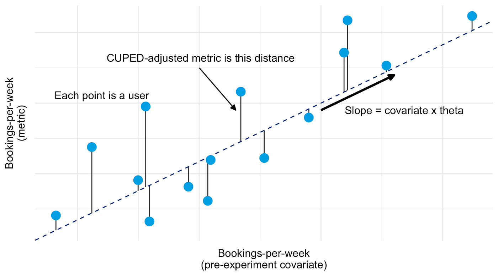
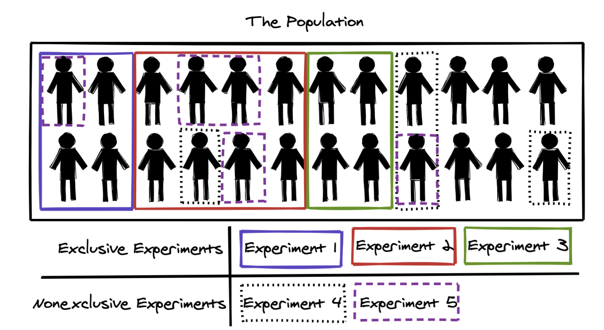

# Experiments 3

  Harbour.Space &middot; Barcelona &middot; May 29, 2026

---

# Today

  

    01
    
Type M and replication

  

  

    02
    
Variance reduction

  

  

    03
    
Platforms and layered allocation

  

  

    04
    
Holdout tests

  

---
layout: section
class: tint-lavender
---

## 01

# Type M and replication

---

# Type M: winners overstate the effect

**In underpowered experiments, significant results systematically overstate the true effect.**

Named **Type M error** (magnitude error) by Gelman & Carlin 2014, alongside Type S (sign error).

At 20% power a significant estimate exaggerates by roughly $2\times$, at 50% power around $1.3\times$.

<!--
Mechanism: under low power only the large random fluctuations cross the threshold, so the winners are the upper tail of the noise plus the signal, bigger than reality. Selection on significance: conditioning on |estimate| > 1.96·SE keeps the draws where noise pushed the estimate up. Type M makes underpowered experiments doubly bad: they miss real effects (Type II) and inflate the ones they catch. Takeaway: discount effect sizes from underpowered experiments, replicate the win before sizing a follow-up plan around the first number.
-->

---

# Simulation: the winning tail of H₁

**Two distributions of the estimate. The threshold comes from $H_0$, the true effect sits under $H_1$.**

<a href="/harbour-product-analytics-2026/10-experiments-3/type-m-distributions.html" target="_blank" rel="noopener" style="display:inline-block;padding:0.7rem 1.2rem;background:#1A1A1A;color:#fff;font-family:'JetBrains Mono',monospace;font-size:0.9rem;font-weight:700;letter-spacing:0.08em;text-transform:uppercase;text-decoration:none;border:2px solid #1A1A1A;">Open simulation ↗</a>

<!--
Power is the share of the H₁ curve past the threshold, the pink tail. The mean estimate inside that tail sits to the right of Δ, so the reported effect of a win is bigger than the truth. Run with Δ = 1.0 (power ~17%), then 2.0 (~52%), then 2.8 (~80%). Grey curve is H₀, it sets the ±1.96 threshold. Black curve is H₁ at the true Δ. At low power H₁ overlaps H₀ heavily, so only its inflated upper tail clears the line; the dashed pink mean of that tail is far right of the solid Δ line. As Δ grows the curves separate, the whole H₁ crosses, and the dashed line collapses onto Δ. The bottom histogram is the Monte Carlo version of the same H₁ draw.
-->

---

# Simulation: exaggeration vs power

**The inflation is a function of power, the same in any field.**

<a href="/harbour-product-analytics-2026/10-experiments-3/type-m-exaggeration.html" target="_blank" rel="noopener" style="display:inline-block;padding:0.7rem 1.2rem;background:#1A1A1A;color:#fff;font-family:'JetBrains Mono',monospace;font-size:0.9rem;font-weight:700;letter-spacing:0.08em;text-transform:uppercase;text-decoration:none;border:2px solid #1A1A1A;">Open simulation ↗</a>

Closed form for the expected Type M error: Lu, Qiu, Deng 2019, [*A note on Type S/M errors*](https://www.microsoft.com/en-us/research/wp-content/uploads/2020/09/LuQiuDeng-BJMSP2019.pdf).

<!--
The exaggeration ratio depends only on power: near 80% it sits close to 1, below 20% it climbs past 2×. Drag Δ and watch the dot move along the curve. The haircut on the next slide is reading this curve backward: know your power, know how much to discount the win.
-->

---

# Post-hoc MDE does not rescue a null

**MDE is fixed at design time. Recomputing it from the data that produced the result is circular.**

Retrospective power

With the observed effect as the target, post-hoc power only restates the p-value and says nothing about the design.

Proof of absence

A point MDE of 1% does not prove the true effect is below 1%, because the variance estimate is itself random.

<!--
Retrospective power fallacy: people run a neutral test (p > 0.05) and ask «could we even have detected an effect». If they use the observed effect as the target, post-hoc power is a strictly monotone function of the p-value. Small observed effect → low power and large MDE; large significant effect → high power. Hoenig & Heisey 2001: it carries no information beyond the p-value, it judges the result rather than the design. Proof-of-absence illusion: «MDE is 1%, so there is no effect above 1%» treats a point estimate as a hard bound, but the variance estimate has its own error. The legitimate use of observed σ is forward, sizing the next experiment, never backward to retro-justify this null.
-->

---

# Retrospective power fallacy

**The verdict is fixed by the p-value before the calculation starts.**

Step 1

Neutral result

p &gt; 0.05

&rarr;

Step 2

Estimate MDE from the observed effect

overfit to the effect estimate

&rarr;

Step 3

False verdict on power

«the test was / was not powered»

<!--
Walk the chain left to right. The red middle step is where the error enters: the target effect is read off the same data, so the calculation overfits to the observed estimate. Step 3 then only echoes the p-value from step 1. A small observed effect forces «underpowered»; a large one forces «well powered». Neither is a statement about the design that was chosen before the run.
-->

---

# Haircut every winner, not only underpowered ones

**Conditioning on significance inflates the estimate at every power below 100%.**

The exaggeration curve approaches $1$ but never reaches it. Even an 80% power win overstates by a few percent. Make the haircut default.

Practitioner note: Kohavi, [*on discounting the observed effect*](https://www.linkedin.com/posts/ronnyk_abtesting-experimentguide-pvalue-activity-7137182337276014592-Pw3K).

<!--
Reinforces the haircut as standing discipline. A clean win at 80% power still overstates because you only ever act on estimates that cleared the bar, and clearing the bar is correlated with an upward fluctuation. Discount the observed lift by what the power curve implies before it becomes a forecast or roadmap number, even when the test was well powered. Drag the exaggeration sim toward 80% power: the dot sits just above 1, small but not zero. The asymmetry never fully vanishes because the only effects that reach a roadmap are the ones that passed the bar, and passing the bar is correlated with an upward fluctuation. The cleaner the power, the smaller the haircut, but it is rarely exactly zero.
-->

---

# Replication crisis

**Published findings across empirical science that fail to reproduce when the experiment is run again.**

Reproducibility Project (2015): of 100 psychology studies, roughly **39% reproduced**, and the replicated effects averaged about **half the original**.

References: [Wikipedia · Replication crisis](https://en.wikipedia.org/wiki/Replication_crisis), [Wikipedia · Reproducibility Project](https://en.wikipedia.org/wiki/Reproducibility_Project).

<!--
Underpowered designs plus a literature filtered for significance produce wrong conclusions. Two failure modes together: false positives that do not survive replication, and real effects whose magnitudes are inflated (Type M), both visible in the Reproducibility Project. Best documented in psychology, biomedicine, social sciences, but general to any field where studies are underpowered and the literature is filtered for significance. Industry parallels with the academic replication crisis: pre-registration of decisions (commit to α, MDE, metrics before the run), A/A calibration (estimate effective Type I empirically), MDE-driven sample planning. The «replicate wins from underpowered tests» rule is the industry version of the academic «pre-register and replicate».
-->

---
layout: section
class: tint-rose
---

## 02

# Variance reduction

---

# Sensitivity = variance × influenceability

**Two independent factors, and both have to be in our favour for the metric to detect the effect.**

Variance

How much noise the metric has across users. What matters is **effective** variance, after variance reduction techniques like CUPED.

Influenceability

How much our change can actually move the metric: exposure (share of users who see the change), mechanism (does the metric capture the behaviour the change targets), and effect size.

Source: Spotify Confidence Bootcamp, [Lesson 7](https://confidence.spotify.com/bootcamp/intro-to-metrics/feasibility-and-sensitivity).

<!--
Variance and influenceability multiply. A low-variance metric the change cannot move is useless; a high-variance metric the change moves a lot is also useless unless variance reduction brings effective variance down. The «effective variance» framing matters: a metric with high raw variance but strong temporal correlation can end up more sensitive than one with low raw variance after CUPED is applied.
-->

---

# Why we care about variance

**Heavy-tailed product metrics need large samples to detect small effects.**

Revenue per user, time in app, sessions per user. These distributions have a long right tail. A 1% relative lift in revenue can require millions of users to detect at $\alpha$ = 5% and 80% power.

Anything that reduces the variance of the estimator without biasing it reduces the required sample size in proportion. A 50% variance reduction means roughly half the duration for the same MDE.

<!--
Set up CUPED. The motivation is purely practical: experiments are slow, and variance is what makes them slow. CUPED is the standard industry method to shorten them.
-->

---

# CUPED: same expectation, lower variance

**Subtract a predictable component from each user's outcome, using pre-experiment data.**

For pre-experiment value $X$ and in-experiment value $Y$:

$$Y_\text{cuped} = Y - \theta (X - \mathbb{E}[X]), \quad \theta = \frac{\mathrm{Cov}(Y, X)}{\mathrm{Var}(X)}, \quad \mathrm{Var}(Y_\text{cuped}) = \mathrm{Var}(Y)(1 - \rho^2)$$

Expectation is preserved, so the ATE estimate is the same. Variance shrinks by $1 - \rho^2$.

Original paper: Deng, Xu, Kohavi, Walker 2013 WSDM, [link](https://exp-platform.com/Documents/2013-02-CUPED-ImprovingSensitivityOfControlledExperiments.pdf).

<!--
The key claim: same E[·], lower Var(·). The product interpretation does not change, the estimator gets sharper. $\rho$ is the correlation between the in-experiment Y and the pre-period X. The next slide shows the geometric picture: residuals from an OLS regression on the pre-period.
-->

---

# CUPED is just linear regression

**$\theta$ is the OLS coefficient of $Y$ on $X$. $Y_\text{cuped}$ is the residual.**

{width=460px}

The connection is in the author's own notes: Alex Deng, [*Sensitivity*](https://alexdeng.github.io/causal/sensitivity.html).

<!--
Each user is a point. The dashed line is the regression of the in-experiment metric on the pre-experiment covariate. The CUPED-adjusted value is the vertical distance from the line. The residual. Variance reduction comes from removing the part of Y that the pre-period already predicts.
-->

---

# Simulation: variance shrinks by 1 − $\rho$²

**A/A experiment. Compare the estimator $\bar Y_T - \bar Y_C$ with and without CUPED.**

<a href="/harbour-product-analytics-2026/10-experiments-3/cuped-variance-sim.html" target="_blank" rel="noopener" style="display:inline-block;padding:0.7rem 1.2rem;background:#1A1A1A;color:#fff;font-family:'JetBrains Mono',monospace;font-size:0.9rem;font-weight:700;letter-spacing:0.08em;text-transform:uppercase;text-decoration:none;border:2px solid #1A1A1A;">Open simulation ↗</a>

Both histograms centre at zero because the treatment effect is zero by construction. As $\rho$ rises, the CUPED histogram gets narrower. At $\rho = 0.7$ the variance drops by $1 - 0.49 = 51\%$, equivalent to roughly $2\times$ effective sample size.

<!--
Run the sim in class with rho = 0.0, 0.3, 0.7, 0.9. Tell the room what to watch: both distributions are centered at zero (so CUPED is unbiased), the pink one shrinks (so CUPED is sharper). The «effective sample × » tracker shows the savings: at rho=0.7 it should display roughly 2.0, at rho=0.9 around 5.3.
-->

---

# The gain scales with what history explains

**The variance reduction depends entirely on how predictive the pre-experiment data is.**

Variance reduction is exactly $1 - \rho^2$. Production reports converge around 30 to 60% reduction on revenue-style metrics, roughly 2 to 3× speed-up. See [Booking.com](https://booking.ai/how-booking-com-increases-the-power-of-online-experiments-with-cuped-995d186fff1d), [Nubank](https://building.nubank.com/3-lessons-from-implementing-controlled-experiment-using-pre-experiment-data-cuped-at-nubank/), [Statsig](https://www.statsig.com/blog/cuped).

On new users the gain is zero. There is no pre-period to build a covariate from.

<!--
Variance reduction is bounded by $\rho$². For metrics where the pre-period is highly predictive (revenue from heavy users, time-in-app from active users), $\rho$ is large and gains are dramatic. For new users with no history, $\rho$ = 0 and CUPED collapses to the plain estimator.
-->

---

# Covariate must be pre-exposure

**$X$ has to be measured before the user enters the experiment, and unaffected by treatment.**

If $X$ is computed on data that overlaps the exposure window, or on any quantity the treatment can move, CUPED biases the treatment effect estimator. The variance reduction depends on $X$ being independent of treatment.

If $X$ depends on treatment, $\mathbb{E}[Y_\text{cuped}]$ shifts and the difference of means stops estimating the ATE.

<!--
Hard rule: pre-experiment value, pre-experiment window. Some teams want to use «trailing 30 days including the experiment period» as the covariate because it has more data. That breaks CUPED.
-->

---
layout: section
class: tint-mint
---

## 03

# Platforms and layered allocation

---

# One user, many experiments at once

**Independent experiments share users through layers, exclusive within a layer and overlapping across them.**

{width=380px}

<!--
The diagram shows the same population split into exclusive experiments (1, 2, 3) and nonexclusive experiments (4, 5). Spotify reports roughly 1M buckets company-wide with hundreds of experiments running concurrently. Platforms exist to solve a real coordination problem.
-->

---

# Overlapping changes can interact

**When users see many experiments at once, the combined effect can amplify, cancel, or reverse the individual lifts.**

Mutex-everything kills throughput, so semantic layers are the practical fix.

<!--
Examples to give verbally: two onboarding nudges that together exceed the sum of each alone; a discount banner and a price-anchoring nudge that individually lift conversion and together do nothing; an aggressive upsell and a new pricing page each fine alone but together drive users away. Mutex-everything is conservative but expensive: few experiments can run at once and the team waits in line. Semantic layers on the next slide.
-->

---

# Interaction in a 2 × 2

**Run experiment A and B on the same users. Conversion rates per cell.**

B: Control

B: Treatment

A: Control

10.0%

baseline

10.8%

B alone, +0.8 pp

A: Treatment

11.0%

A alone, +1.0 pp

9.5%

A and B together, <b>−0.5 pp</b>

Each test alone looks like a win, and the combination is a regression. Without layer-aware analysis the platform ships both.

Statsig, [*Interaction Detection*](https://docs.statsig.com/experiments/exploring-results/interaction-detection). Zhavzharov, [*Interactions in Overlapping A/B Tests*](https://medium.com/@zhavzharovmikhail/interactions-in-overlapping-a-b-tests-meta-review-of-industry-practices-b4dd99ea75b8).

<!--
Numbers are illustrative. A=+1pp, B=+0.8pp, A+B=-0.5pp. The single-arm effects look fine; the joint effect tells the real story. Interaction detection is what platforms do to flag cells like this before someone reads the single-arm readout and ships.
-->

---

# Solution: semantic layers

**Group experiments by where in the product they touch the user. Only mutex within the group.**

Two experiments both editing the checkout page sit in the same **checkout layer** and are mutex. A checkout experiment and a chat-widget experiment sit in different layers, where overlap is fine. Layers are defined by the **surface and audience** they touch.

This avoids two failure modes at once:

Code-level conflict

Two tests change the same button to different colours. Without layers, a user sees a glitched UI and the experiments contaminate each other.

Statistical interaction

Two tests in the same flow combine non-additively. The reported effect of each is wrong because the populations are not comparable.

<!--
The semantic-layer idea: «overlap is allowed by default, mutex is the exception». You declare layers around surfaces where conflicts are realistic. Everything else can overlap freely. Throughput scales while protecting the experiments that need it.
-->

---

# Salt and rotation

| Problem | Fix |
|---|---|
| Same user → same bucket across experiments | Per-experiment **salt** in the hash |
| Same user → same bucket forever on one layer | **Rotate the salt** monthly |

<!--
Two failure modes. (1) Without salt: user_id hash → same bucket in every experiment → cross-experiment correlation. (2) With salt but no rotation: (user_id + salt) → same bucket forever on that layer → cohort bias accumulates. Verbal walkthrough during class.
-->

---

# Platforms

**Three widely used experimentation platforms.**

<a href="https://confidence.spotify.com/" target="_blank" style="display:block;padding:1.6rem 1rem;background:#FAFAFA;border-left:3px solid #1A1A1A;text-align:center;text-decoration:none;color:#1A1A1A;">

Spotify Confidence

confidence.spotify.com

</a>

<a href="https://www.geteppo.com/" target="_blank" style="display:block;padding:1.6rem 1rem;background:#FAFAFA;border-left:3px solid #1A1A1A;text-align:center;text-decoration:none;color:#1A1A1A;">

Eppo

geteppo.com

</a>

<a href="https://www.statsig.com/" target="_blank" style="display:block;padding:1.6rem 1rem;background:#FAFAFA;border-left:3px solid #FF00FF;text-align:center;text-decoration:none;color:#1A1A1A;">

Statsig

statsig.com

</a>

<!--
The platforms are the implementation of the principles in this lecture. Pre-experiment data → CUPED toggle. Time peeking → sequential toggle. Multiple metrics → BH toggle. The demo at the end of the deck returns to the Statsig results UI to make the mapping explicit.
-->

---
layout: section
class: tint-cream
---

## 04

# Holdout tests

---

# Holdout: the cumulative effect of many ships

**When a single change is too small to detect on its own, freeze a slice of users and give them nothing.**

A holdout group is excluded from **every** treatment in a domain. Everyone else receives the stacked set of changes that shipped over time. The gap between the two is the combined effect that no single A/B test could measure.

A/B test

Isolates one change. Measures the <b>atomic</b> effect of a single treatment.

Holdout

Excludes a slice from all treatments. Measures the <b>cumulative</b> effect of everything shipped.

Source: Statsig, [*Holdout vs A/B testing*](https://www.statsig.com/perspectives/holdout-vs-ab-testing).

<!--
The motivation: in a mature surface, each individual change moves the metric by a fraction of a percent, below the noise floor of a single test. You still want to know what the whole program is worth. A global holdout receives none of the treatments in scope; everyone else gets the stacked shipped changes. The difference is the aggregate effect, including interactions and effects that only show up over time. CRM notifications are the canonical case.
-->

---

# Two ways to use a holdout

**Withhold a treatment to read an effect a normal test cannot.**

Across experiments

A slice held out of every launch over the whole distance measures the **cumulative** impact of everything shipped.

Within one experiment

Keep one experiment's control running for months to read its **long-term** effect, technically a long A/B.

<!--
Two scopes. Across experiments: an uber or global holdout, a slice withheld from every feature launch over a quarter, gives the combined impact across all experiments (Bing's 10% global holdout measures the platform's overhead). Within one experiment: a long-term holdout or holdback keeps the control arm for a single change for months, to answer «what happens to revenue at six months» for that feature. The second is technically just a long-running A/B. Caution from Kohavi: a long holdout is not a default ramp step, it has a real cost and can be unethical when you knowingly delay a better experience from paying users, so run it only when the long-term effect can genuinely differ from the short-term one.
-->

---

# Example: CRM notifications

**Each message is too small to measure alone, but the whole program is not.**

One push notification or email moves retention by a fraction of a percent, lost in the noise of a single experiment. Across dozens of notifications shipped over months, the combined effect is large but invisible to any one A/B test.

The holdout slice receives **no** CRM at all. Comparing it against users on the full notification program measures what the entire program is worth, and whether it is still positive after fatigue and overlap.

<!--
Why CRM is the textbook case: high volume of small, individually-underpowered changes, strong interaction and saturation effects (too many messages backfire), and a real risk that the program's net effect drifts negative over time. A permanent or long-running holdout is the only way to keep an honest read on the aggregate. Tie back to Type M: individual notification wins are exactly the underpowered, inflated estimates from section 01.
-->

---

# Demo

**Walk through the Statsig console live.**

<a href="https://console.statsig.com/demo" target="_blank" rel="noopener" style="display:inline-block;padding:0.9rem 1.6rem;background:#1A1A1A;color:#fff;font-family:'JetBrains Mono',monospace;font-size:0.95rem;font-weight:700;letter-spacing:0.08em;text-transform:uppercase;text-decoration:none;border:2px solid #1A1A1A;">Open Statsig demo ↗</a>

On the experiment results page: the **scorecard** with per-metric lifts and CIs, the three correction toggles (**BH per variant**, **sequential testing**, **CUPED**), and **user-dimension** and **event-dimension** breakdowns for segment slicing.

<a href="https://console.statsig.com/demo" target="_blank" style="position:absolute;bottom:1.4rem;left:1.4rem;font-family:'JetBrains Mono',monospace;font-size:0.72rem;color:#AAAAAA;letter-spacing:0.1em;">console.statsig.com/demo</a>

<!--
Open the Statsig demo console in a tab before class. Walk through one experiment's results page. Point out where each concept from the lecture lives in the UI: BH toggle, sequential toggle, CUPED toggle, dimension breakdowns. The point is not to teach Statsig. It is to make the abstract corrections concrete by showing them as checkboxes a PM toggles before reading results.
-->

---

# Materials (1 of 2)

Type M & replication

<ul style="margin:0;padding-left:1.1rem;">
<li><a href="https://sites.stat.columbia.edu/gelman/research/published/retropower_final.pdf" target="_blank">Gelman & Carlin 2014. Beyond Power Calculations</a></li>
<li><a href="https://www.microsoft.com/en-us/research/wp-content/uploads/2020/09/LuQiuDeng-BJMSP2019.pdf" target="_blank">Lu, Qiu, Deng 2019. A note on Type S/M errors</a></li>
<li><a href="https://www.linkedin.com/posts/ronnyk_abtesting-experimentguide-pvalue-activity-7137182337276014592-Pw3K" target="_blank">Kohavi. Discounting the observed effect (haircut)</a></li>
<li><a href="https://en.wikipedia.org/wiki/Replication_crisis" target="_blank">Wikipedia. Replication crisis</a></li>
<li><a href="https://en.wikipedia.org/wiki/Reproducibility_Project" target="_blank">Wikipedia. Reproducibility Project</a></li>
</ul>

CUPED

<ul style="margin:0;padding-left:1.1rem;">
<li><a href="https://exp-platform.com/Documents/2013-02-CUPED-ImprovingSensitivityOfControlledExperiments.pdf" target="_blank">Deng et al. 2013. Original paper</a></li>
<li><a href="https://alexdeng.github.io/causal/sensitivity.html" target="_blank">Alex Deng. Sensitivity notes</a></li>
<li><a href="https://www.statsig.com/blog/cuped" target="_blank">Statsig. CUPED explainer</a></li>
<li><a href="https://booking.ai/how-booking-com-increases-the-power-of-online-experiments-with-cuped-995d186fff1d" target="_blank">Booking.com. CUPED in production</a></li>
<li><a href="https://building.nubank.com/3-lessons-from-implementing-controlled-experiment-using-pre-experiment-data-cuped-at-nubank/" target="_blank">Nubank. 3 Lessons from CUPED</a></li>
</ul>

---

# Materials (2 of 2)

Holdouts

<ul style="margin:0 0 1.4rem;padding-left:1.1rem;">
<li><a href="https://www.statsig.com/perspectives/holdout-vs-ab-testing" target="_blank">Statsig. Holdout vs A/B testing</a></li>
<li><a href="https://cxl.com/blog/hold-out-groups/" target="_blank">CXL. Hold-out groups</a></li>
</ul>

Reference book

<ul style="margin:0;padding-left:1.1rem;">
<li>Kohavi, Tang, Xu. <em>Trustworthy Online Controlled Experiments</em>, 2020</li>
</ul>

Platforms & interactions

<ul style="margin:0;padding-left:1.1rem;">
<li><a href="https://docs.statsig.com/experiments/exploring-results/interaction-detection" target="_blank">Statsig. Interaction Detection</a></li>
<li><a href="https://medium.com/@zhavzharovmikhail/interactions-in-overlapping-a-b-tests-meta-review-of-industry-practices-b4dd99ea75b8" target="_blank">Zhavzharov. Interactions in Overlapping A/B Tests</a></li>
<li><a href="https://console.statsig.com/demo" target="_blank">Statsig demo console</a></li>
</ul>

