# Causal Inference

  Harbour.Space &middot; Barcelona &middot; June 01, 2026

---

# Today

  

    01
    
From RCT to causal inference

  

  

    02
    
The shared idea

  

  

    03
    
Difference in differences

  

  

    04
    
Matching

  

  

    05
    
Propensity score matching

  

  

    06
    
Synthetic control and geo

  

  

    07
    
Linear regression

  

---
layout: section
class: tint-lavender
---

## 01

# From RCT to causal inference

---
layout: statement
---

# RCT is the gold standard

<!--
Nothing better exists for identifying cause and effect. When you can run a randomized trial, you do. The rest of today is what we do when we can't.
-->

---

# Causal inference

A causal conclusion from data we did not randomize

  

    
Legal &amp; ethics

    
Trials disallowed by law or an ethics review

  

  

    
No traffic to split

    
Out-of-home and broadcast campaigns have no per-user assignment

  

  

    
Design infeasible

    
RCT exists in principle but breaks on cost, latency, or operations

  

<!--
Start by naming what we promise. We are not promising the same evidence quality as an RCT, we are promising a structured attempt at the same question with extra assumptions on top. Then walk the three reasons we end up here. Legal and ethics are the hard limit. Out-of-home and broadcast campaigns have no per-user assignment by construction. The third bullet is the soft one: sometimes the design exists in principle but breaks on cost, latency, or operational reality.
-->

---

# Potential outcomes

- $Y_i(0)$: outcome unit *i* would show under control
- $Y_i(1)$: outcome unit *i* would show under treatment
- $\text{ITE}_i = Y_i(1) - Y_i(0)$: the individual treatment effect

We only observe one of the two for each unit, so the ITE is never directly measurable.

<!--
This is the whole reason the causal question is harder than a descriptive one. We are asking about a quantity that cannot be observed at the unit level. Everything that follows is a way to recover something on average.
-->

---

# Average treatment effect

- $\text{ATE} = \mathbb{E}[Y(1) - Y(0)]$, the population-average effect
- Under randomization, $T$ is independent of $(Y(0), Y(1))$
- So the difference in observed means is unbiased for ATE

This is why an RCT works: randomization makes the observed difference equal to ATE in expectation.

<!--
Emphasize that RCT does not give us ITE either. It gives us ATE. The shift from individual to average is the price we already pay even in the gold standard.
-->

---

# ATT and ATE

It is the same effect, averaged over two different populations.

- $\text{ATE} = \mathbb{E}[Y(1) - Y(0)]$, averaged over everyone
- $\text{ATT} = \mathbb{E}[Y(1) - Y(0) \mid T = 1]$, averaged over the treated

Under randomization, $T$ is independent of the potential outcomes, so $\text{ATT} = \text{ATE}$.

Without randomization the two can differ. Observational methods most often target ATT because the counterfactual we can hope to recover is $\mathbb{E}[Y(0) \mid T = 1]$, the treated group's untreated outcome.

<!--
The gap between ATT and ATE comes from effect heterogeneity combined with selection. If the people who got the treatment are also the ones for whom the treatment works best, or worst, the average effect on the treated population differs from the average effect on everyone. In an RCT we assign randomly, so the treated population is a representative sample of everyone, and the two averages collapse. The reason ATT keeps showing up in observational methods is operational: by consistency we already know E[Y(1) | T=1] from data. The hard half is the counterfactual untreated outcome for the same treated group, E[Y(0) | T=1], which is exactly the missing ingredient in the decomposition on the next slide.
-->

---

# Without randomization

$$
\begin{aligned}
\mathbb{E}[Y \mid T=1] - \mathbb{E}[Y \mid T=0] \;=\;& \underbrace{\mathbb{E}[Y(1) - Y(0) \mid T=1]}_{\text{ATT}} \\[0.4em]
&+ \underbrace{\mathbb{E}[Y(0) \mid T=1] - \mathbb{E}[Y(0) \mid T=0]}_{\text{selection bias}}
\end{aligned}
$$

The first term is the average effect on the treated. The second is selection bias, the baseline difference between the two groups.

<!--
This is the slide the rest of the lecture pivots on. Walk through both terms slowly. ATT is the thing we want, the causal effect for the population that actually got the treatment. Selection bias is what randomization removed for us, and what every observational method now has to handle by hand. Confounders and self-selection sit inside that second term.
-->

---
layout: section
class: tint-rose
---

## 02

# The shared idea

---
layout: statement
---

# Every method targets the same bias

<!--
Every technique we'll see today, DiD, matching, propensity score, synthetic control, regression, is a different way to subtract the selection-bias term from the observed difference. Each one pays for that subtraction with a different assumption about what stays unobserved.
-->

---

# Observational studies and quasi-experiments

The same methods serve both settings.

- **Observational study**: existing data we did not intervene on, with the effect recovered after the fact
- **Quasi-experiment**: we run or exploit an intervention with a treatment and a control group, but assignment is not random, it follows a rule, a cutoff, timing, or geography

<!--
Two contexts, one toolbox. Observational is the pure after-the-fact case: the treatment already happened in the world and we never touched the assignment, so all we have is the data. A quasi-experiment is the middle ground between that and a clean RCT: there is a real treatment and a real control group, but we did not flip a coin to assign them. Assignment comes from something structural, a policy that rolled out in one country first, a price change shipped to one region, a cutoff in a rule, the timing of a launch. The same five methods today apply to both. Difference in differences and synthetic control are the natural fit for the geography-and-timing quasi-experiments, matching and propensity scores for the observational case, and regression for either.
-->

---

# Case: lowering rates at a lender

- The customer base was borrowers other banks had declined, approved here instead
- High interest rates covered the higher default risk of a lower-income segment
- The ambition was to win middle-class borrowers, who mostly went elsewhere for cheaper credit

<!--
Tim's case from consumer lending. The book was built on borrowers other banks would not approve, carried at high rates because the segment defaults more often. The standing ambition was to move upmarket to the middle class, who could get cheaper credit elsewhere and rarely showed up here.
-->

---

# The rate-cut experiment

Two treatment groups against the standard rate, measured on default rate and profitability.

- Group B: rate cut by 3 percentage points
- Group C: rate cut by 6 percentage points

Hypothesis:

  lower rate&rarr;
  higher-quality borrowers&rarr;
  lower default rate&rarr;
  profitability holds or rises

Result: profitability fell and the default rate did not move.

What could be wrong with this experiment?

<!--
Tim's case. The design: a control on the standard rate, group B three points lower, group C six points lower, read out on default rate and profitability. The hypothesis we believed: a lower rate pulls in better borrowers, defaults drop, and profitability holds or even rises despite the thinner margin. What actually happened: profitability fell and the default rate did not budge. Open question to the room, let students propose what could be wrong before we resolve it.
-->

---

# Further reading

- [**Causal Inference for the Brave and True**](https://matheusfacure.github.io/python-causality-handbook/landing-page.html), Facure, free online textbook
- [**Causal Inference in Python**](https://www.amazon.es/Causal-Inference-Python-Applying-Industry/dp/1098140257), Facure, O'Reilly

Tell us if this area interests you and we'll point you further.

---
layout: section
class: tint-mint
---

## 03

# Difference in differences

---

# Compare two units

Two units similar enough to compare: users from different countries, two platforms, or two user segments. One unit gets the intervention, the other does not, and we observe both in a pre period and a post period.

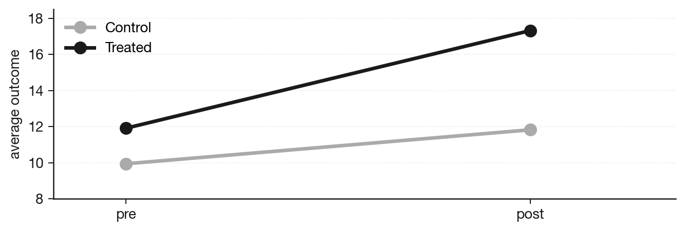{width=620px class="mx-auto block"}

<!--
This is the design DiD lives in. Russia vs UK rollout, iOS vs Android, two cohorts of customers, two cities. Whatever the units are, the structure is the same: one of them changed, the other did not, and we have a pre period and a post period for both. The naive thing to do is read the four numbers as a single difference. The honest thing is one more subtraction.
-->

---

# DiD estimator

$$
\widehat{\text{DiD}} = (\bar Y^{T}_{post} - \bar Y^{T}_{pre}) - (\bar Y^{C}_{post} - \bar Y^{C}_{pre})
$$

It is the treated group's pre-to-post change minus the control group's, and the remainder is the estimated treatment effect.

Four iid cells with finite variance give us, by CLT, an asymptotic z-test against $H_0: \text{DiD} = 0$ and a confidence interval from the same standard error.

<!--
This is why DiD is popular. One subtraction of two subtractions, and the whole standard inference toolbox applies. SE, CI, p-value, all from the four cell means and four sample variances. No special machinery and no new test. The regression view gives the same number as the interaction coefficient and lets us add covariates and robust standard errors when needed.
-->

---

# Parallel trends

The estimator is unbiased only if the two groups would have moved together without the intervention.

$$
\mathbb{E}[Y_{post}(0) - Y_{pre}(0) \mid T] = \mathbb{E}[Y_{post}(0) - Y_{pre}(0) \mid C]
$$

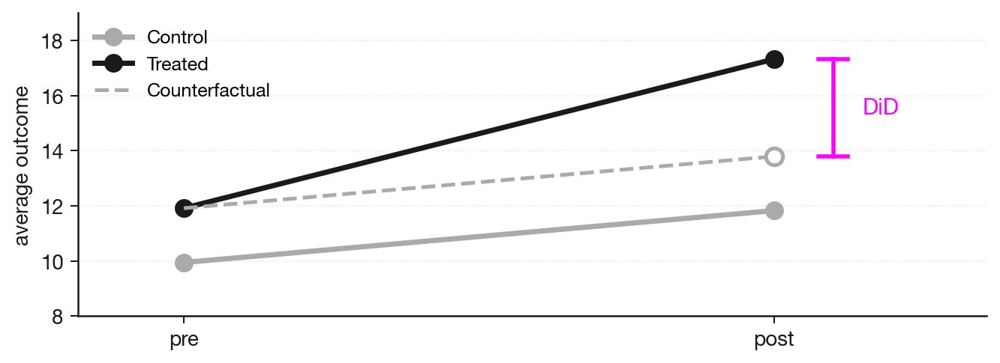{width=620px class="mx-auto block"}

<!--
The single load-bearing assumption of the method. With one pre period we cannot test it directly. With multiple pre periods we can at least eyeball the pre-trends and make a credibility argument. Most DiD applications in industry quietly assume parallel trends without checking, which is fine when nothing better is available, but is also exactly where the method gets called sloppy.
-->

---
layout: section
class: tint-cream
---

## 04

# Matching

---

# Find a twin for every treated unit

For each treated unit, find the closest untreated unit on the observable features. The matched units together form the comparison group, so we compare the treated to their twins instead of to the full untreated pool.

<!--
The simplest version of matching. For each user who saw the new feature, look in the untreated pool for someone who looks the same on the covariates we measured, and pair them up. The set of pairs becomes the comparison. The intuition is that if two users are observationally identical, the only systematic difference left between them is the treatment itself.
-->

---

# Observables only

We can only align units on what we measured, so anything we did not measure stays in the residual and biases the comparison.

The credibility of matching turns on which covariates were in the data.

<!--
The hard constraint of matching. Reducing bias from observed confounders is the whole game, and the method is silent about everything else. If a confounder was not measured, no matching strategy on the measured features can rescue the estimate. The right reaction when this happens is to either find better covariates or admit the method does not apply. We will see one such case at the end of the section.
-->

---
layout: section
class: tint-sky
---

## 05

# Propensity score matching

---

# Train a classifier on T vs C

Take every feature we have and train a model to predict $T = 1$ vs $T = 0$ from them.

- High ROC-AUC means the groups are distinguishable on the observables, so the selection-bias term is real
- Under randomization the same model gives ROC-AUC $\approx 0.5$, because treatment is unpredictable from any covariate

<!--
This is the diagnostic version. Before we even commit to PSM, we want to know whether the groups differ on what we observe. A classifier that can tell T apart from C is telling us bias exists. A classifier that cannot is telling us either randomization or excellent natural balance. Use this on every observational dataset before claiming causality.
-->

---

# Match on the score

The propensity score is the classifier's predicted $\mathbb{P}(T = 1 \mid X)$.

If $X$ captures everything that drives both treatment and outcome, matching on the score gives the same balance as matching on all of $X$, collapsing many dimensions to one.

<!--
This is the propensity-score theorem in operational form. Formally, if the potential outcomes are independent of T given X (unconfoundedness, or strong ignorability), then they are also independent of T given e(X), the propensity score. So a high-dimensional matching problem collapses to a one-dimensional one, which is what makes the method usable in practice when X is wide. Two assumptions sit under the method: unconfoundedness (X captures all confounders) and positivity (every unit has some chance of being treated and untreated, so the score distributions actually overlap). Without positivity there is nowhere to match.
-->

---

# Check balance after matching

After matching, the treated and control distributions on every covariate should overlap. If they do not, the matching did not buy us what we wanted.

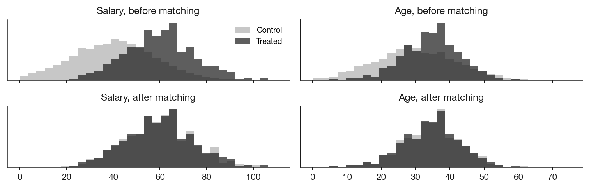{width=720px class="mx-auto block"}

<!--
The diagnostic. Before declaring a treatment effect, plot each covariate's distribution for the treated group and for the matched control group. Salary, age, tenure, whatever you matched on. They should overlap. If a covariate still shows a visible gap after matching, the comparison is still biased on that covariate.
-->

---

# Placebo test

This is the analog of an A/A test: run the full matching and estimation pipeline on data where no effect can exist, and the estimate should come out near zero. If it does not, the procedure is biased.

  

    
Dynamics check

    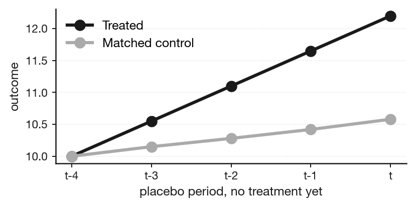
  

  

    
Bootstrap of the estimator

    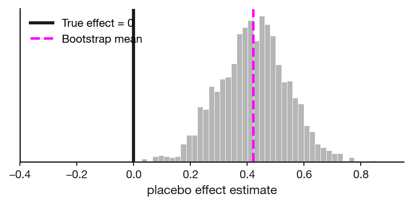
  

<!--
Two flavors of the same check. Left: pick a pre-treatment period, plot the treated and matched-control over time. They should track each other because no treatment has happened yet. If they diverge, the matching missed something that drove the difference. Right: bootstrap the estimator over many resamples of the placebo data. The distribution of the placebo effect should sit on zero. If the bootstrap mean is far from zero, the pipeline has a systematic bias. Matching with replacement is fine and rarely changes conclusions, no slide needed for that, but worth mentioning verbally.
-->

---

# Case: subscription at Avito

Treatment is buying a paid subscription, control is not buying it.

Subscribers get vehicle check reports included, so they stop buying them one by one.

**Goal**: estimate the subscription's effect on revenue, and whether it pays off for the company

<!--
Tim's case, narrated live. Walk the setup: treatment is buying the paid subscription, control is not buying it, and subscribers get the vehicle check reports included so they stop buying them one by one. The goal is the net effect on revenue: does the subscription revenue cover the per-report revenue we give up. Then how we would estimate it, what the matching pipeline looks like end to end, and how the decision gets made off the result.
-->

---

# Case: value conversations at Manychat

A value conversation is one automated conversation, our internal value metric.

**Goal**: estimate whether receiving value from the platform raises retention, and by how much, at months 3, 6, and 12

If average conversation volume rises 5% to 10%, what is the effect on retention.

We estimated it with propensity score matching.

<!--
Tim's case. The value metric is the count of automated conversations, each one a value conversation. The goal is whether getting value from the platform raises retention, and by how much, measured at months 3, 6, and 12. Narrate how the propensity score matching was set up, on which covariates, and what came out. Result narrated live.
-->

---

# Case: matching at N26

We used PSM to estimate a feature's effect on engagement, matching users on app usage frequency.

Missing from the matching features: salary, financial needs, activity type. The matched pairs looked identical on usage and very different on everything else that drove behavior.

Hypothesis: a pre-treatment placebo check would have failed. The matched control would have diverged from the treated in a window where no effect could exist, exposing the residual bias.

* Want this as a hands-on assignment? Come find me and I'll hand it over and review your solution

<!--
Tim's own story. Narrate the context briefly: which feature, why PSM looked like the right call, what data was actually available. The point of putting this slide here, at the very end of the section, is to tie the placebo test from the previous slide to a real attempt. The structure of the failure is the standard one for matching: rich behavioral telemetry but missing the demographic and financial covariates that actually drove the outcome. The lesson is operational: when the covariate set is thin, run the placebo test before trusting the estimate, and be ready to drop the method.
-->

---

# Further reading on PSM

- [**An ultimate guide to matching and propensity score matching**](https://medium.com/data-science/an-ultimate-guide-to-matching-and-propensity-score-matching-644395c46616), practical write-up
- [**An introduction to propensity score methods**](https://pmc.ncbi.nlm.nih.gov/articles/PMC3144483/), Austin 2011, medical-stats review
- [**Causal Inference for the Brave and True, Ch. 11 Propensity Score**](https://matheusfacure.github.io/python-causality-handbook/11-Propensity-Score.html), Facure

<!--
The Facure chapter has the full Python workflow and the assumption discussion. The Austin review is the standard medical-stats reference and has the cleanest write-up of positivity, common support, and balance diagnostics. The Medium piece is the most hands-on.
-->

---
layout: section
class: tint-lavender
---

## 06

# Synthetic control and geo

---

# Randomize at the region level

When per-unit randomization is not feasible, we can randomize at the region or city level instead.

The problem is sample size. With five or six regions the law of large numbers does not save us, and regions differ on everything so the differences do not average out.

We have to actively pick regions that match.

<!--
Where this comes from. Marketing campaigns that hit a whole city, marketplace changes that affect both sides at once, billboards, broadcast TV. The unit of treatment is a region, not a user. The standard RCT machinery is the same machinery, the problem is that n=5 or n=6 is not enough for randomization to balance the groups on its own. So we replace random assignment with a deliberate matching step on pre-treatment behavior.
-->

---

# Naive geo: pick treatment and matched controls

- Pick the regions where we will run the treatment
- From the remaining pool, find regions whose pre-treatment metric trajectories track the treatment regions
- The similarity criterion is a choice: correlation, MSE of trajectories, or a calibrated distance
- Historical-period simulations give CI, MDE, and power for the chosen pair before launch

Once the pair is fixed, inference proceeds the standard way.

<!--
This is the baseline geo-experiment workflow. The optimization step is the only new piece on top of the usual A/B inference. The standard practice is to pre-register the matching criterion before looking at the post-treatment period, the same way we pre-register an A/B test. Historical simulation is then just bootstrap on the matched pair before treatment, which gives a calibrated power and MDE.
-->

---

# Weight the donor regions

Some control regions are only partial matches, so instead of a binary subset we weight them.

Find $w_i \geq 0$ with $\sum_i w_i = 1$ such that

$$
\sum_i w_i \, Y_i(t) \;\approx\; Y_{\text{treat}}(t) \quad \text{for all pre-treatment } t
$$

The constraint keeps the fit inside the convex hull of the donor regions, so it stays within the range of behavior we have actually observed. A two-sided variant (synthetic design) jointly optimizes the treatment subset and the control weights.

Walk through<a href="https://matheusfacure.github.io/python-causality-handbook/15-Synthetic-Control.html" target="_blank">Causal Inference for the Brave and True, Ch. 15 Synthetic Control</a>, Facure

<!--
The original Abadie-Gardeazabal idea. Convexity constraint is what makes this method safer than plain regression on the donor pool: regression can place negative weights or weights above one, producing "fake" donor combinations that lie outside the observed range, like a region with negative sales. With $w_i \geq 0$ and $\sum_i w_i = 1$, the synthetic control is by construction a convex combination of real donor regions, so we interpolate inside their range. The pre-treatment trajectory fit is the credibility check, similar to balance diagnostics in PSM. Synthetic design extends the same idea to picking both sides; in marketplace contexts it is sometimes the only realistic framing.
-->

---

# Effect = post-treatment gap

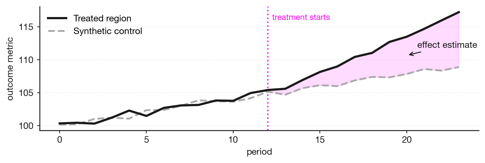{width=720px class="mx-auto block"}

The causal estimate is the gap between the treated trajectory and the synthetic control after the treatment starts. Pre-treatment overlap is the credibility check.

Validation follows the PSM pattern: placebo tests on no-treatment windows and on donor regions that never received the intervention.

<!--
Walk the chart slowly. Pre-treatment: the synthetic control is constructed to track the treated region's outcome on the pre-treatment window, so the two lines overlap there by construction. That overlap is not a result, it is a fit check. Post-treatment: the synthetic control continues to evolve as if treatment had not happened, and the treated region diverges. The shaded area is the cumulative effect estimate. The same caveats apply as for PSM. We assume no other interventions hit the treated region in the post window, and we assume the donor regions are not themselves affected by the treatment.
-->

---

# Case: pricing change at Manychat

  
01Constraints

  
02Legal solution

  
03Geo experiment method

  
04Synthetic control

* Define the target metric with care 
* Nominal α is not the actual α: a user bootstrap captures sampling noise, not city-level time shocks

<!--
Tim's case, narrated live. A pricing change at Manychat where a standard per-user randomized test was not on the table. Walk the four beats in order: the constraints that ruled out an A/B test, the feasible design we could actually run, the geo experiment approach, and the synthetic control on top of it.

Two cautions at the end. Target metric: be careful how it is defined, Tim covers the log here. Nominal versus actual α: bootstrapping users inside a city on quiet historical data measures only user-sampling error, but the real post-period error is user noise plus a city-level time shock, and with five or six regions the law of large numbers does not damp it. A zero-effect city shock, say a local ISP outage that drops the test city 12% against a plus-or-minus 7% interval built from user noise alone, reads as a significant effect, so the actual α runs well above 5%. The fix is a block bootstrap over time or a time placebo: refit the synthetic control on past windows of the experiment's length, pretend each was a test, and measure the counterfactual error under real historical city shocks, so the interval reflects both the small user count and the city macro shocks.
-->

---
layout: section
class: tint-rose
---

## 07

# Linear regression

---

# Regression as a randomization substitute

We include the confounders as columns and ask OLS to hold them fixed statistically, where randomization would have held them fixed physically.

$$
Y = \alpha + \tau D + X\beta + \varepsilon
$$

If $X$ captures everything that drives both treatment $D$ and outcome $Y$, then $\tau$ targets the causal effect.

<!--
This is the same idea as matching, in regression form. Where matching aligns covariate distributions by selecting twins, regression aligns by including the covariates as columns and asking OLS to partial them out. The Frisch-Waugh-Lovell theorem makes this exact: the coefficient on D in the multivariate regression equals the coefficient from regressing Y on the residual of D after regressing D on X. So D-tilde is the part of D that is not predicted by X, and tau is its effect on Y.
-->

---

# Reading a coefficient

- $\beta_j$ is the expected change in $Y$ for a one-unit increase in $X_j$, holding the other covariates fixed
- By Frisch-Waugh-Lovell, that is the slope of $Y$ on the part of $X_j$ the other columns do not explain

We read $\beta_j$ as the strength of dependence between $X_j$ and $Y$, with the rest of $X$ controlled for.

<!--
The intuition before the inference. A regression with many columns does not give us the raw correlation between X_j and Y, it gives us the partial slope: how Y moves with X_j once the other columns are held fixed. Frisch-Waugh-Lovell makes that exact. Regress X_j on the other covariates, take the residual, and beta_j is the slope of Y on that residual. So the coefficient is the strength of dependence of Y on the unique part of X_j, the part the other variables do not already explain. This is why we can read tau as a treatment effect once the confounders are in the model: holding fixed statistically is what randomization does physically.
-->

---

# When OLS is unbiased and consistent

Suppose the true relationship is linear and the errors have mean zero given the regressors.

- **Unbiased**. $\mathbb{E}[\hat\beta] = \beta$, the estimate is right on average
- **Efficient**. By Gauss-Markov, with constant error variance OLS is the minimum-variance linear unbiased estimator, and no normality is assumed
- **Consistent**. As $n$ grows $\hat\beta \xrightarrow{P} \beta$ by the law of large numbers, and the CLT gives the normal limit the standard error, CI, and p-value rely on

<!--
Now the guarantee. The framing students should keep: if the real dependence in the world is linear in our regressors and the errors have mean zero given X, then we are not just fitting a line, we are estimating the true coefficients. Three results stack up. Unbiased: averaged over repeated samples beta-hat equals beta, and this needs only linearity and mean-zero errors. Gauss-Markov adds constant error variance and gives the smallest variance among all linear unbiased estimators, and notice normality is nowhere in the assumptions. Consistency and the central limit theorem are the large-sample half: as n grows the estimate converges to the truth and its sampling distribution becomes normal, the same CLT argument from the statistics block, and that is what makes the standard error, confidence interval, and p-value valid. So when the model is right, every number in the regression table means what we want it to mean.
-->

---

# What regression returns

A single OLS fit returns the point estimate $\hat\tau$, a standard error, a confidence interval, and a p-value, all from one call.

Worked example: schooling and wages, observational data.

- Plain regression of log-wage on schooling: $\hat\tau \approx 0.054$
- Add IQ, experience, tenure, marriage, race: $\hat\tau \approx 0.041$

The long-model estimate is the more credible causal return, roughly 4% per year of schooling, once observable confounders are partialled out.

<!--
Why regression is everywhere. The cheapest causal estimator that comes with full inference machinery. No bootstrap, no special test, no extra code. Run the fit and read the table. This is also why the standard observational workflow defaults to regression for the final inference step even after matching or DiD: regression is the inference layer the other methods borrow. Example is from Facure chapter 5 (NLSY wage data). The short-vs-long contrast shows the work the controls actually do: every additional confounder we partial out moves the estimate, and the direction of that movement is information about which way bias was running in the simpler model.
-->

---

# Assumptions

For $\hat\tau$ to be the causal effect:

- **Correctly specified**. Linear in parameters with the right functional form for $X$
- **No omitted confounders**. $X$ captures everything that drives both $D$ and $Y$, so $\mathbb{E}[\varepsilon \mid X, D] = 0$
- **No bad controls**. No post-treatment variables, no colliders inside $X$

<!--
Three layers of assumption. Specification is about the math: we are fitting a line, the truth might be a curve, an interaction, a step function. Bias here is functional-form bias and shows up in the fitted residuals. Exogeneity is about the causal world: did we measure every confounder. This is the assumption that almost never holds cleanly in observational data and the one we usually have to defend in writing. Bad controls is about the causal graph: just because a variable is correlated with both D and Y does not mean it belongs in X. Some variables, when added, hurt the estimate. This is the surprising one for students who default to "more controls is safer".
-->

---

# Risks

**Omitted variable bias**. Miss a confounder and the coefficient is wrong. Education on wages: if family wealth or ambition is not in the model, the schooling coefficient takes on their effect.

**Bad controls**. Adding a post-treatment variable to $X$ lets the treatment effect leak into the residual. Adding a collider opens a spurious path from $D$ to $Y$.

<!--
Angrist's mnemonic for OVB: "short equals long plus the effect of omitted times the regression of omitted on included." Read it as: the simple-model coefficient equals the long-model coefficient plus a bias term proportional to (a) how much the omitted variable affects Y and (b) how correlated the omitted variable is with D. Both must be zero for the bias to vanish, which is exactly what randomization guarantees.
-->

---

# Confounder and predictor of T

Confounder (omitted)

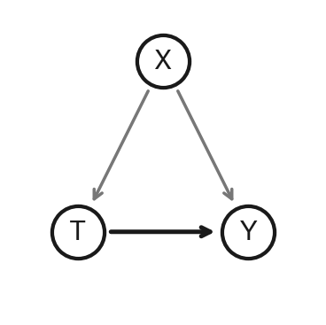

$T$ = price promos and sales  
$Y$ = revenue  
$X$ = holiday season, Black Friday and New Year  
**Breaks:** holiday-driven revenue gets attributed to promos, $\hat\tau$ inflates  
**Risk:** the team doubles promos in February, margin gone with no holiday tailwind to lift sales

Predictor of T only

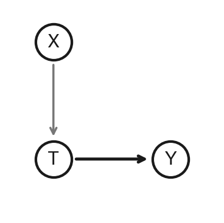

$T$ = push notification with offer sent  
$Y$ = purchase  
$X$ = routing bug, push only reached users whose ID ends in 7  
**Breaks:** $X$ explains the variation in $T$, the standard error inflates and the test loses power  
**Risk:** false negative, a working channel gets shut down because the regression choked on a useless covariate

<!--
Two left-hand cases. Confounder is the classic omitted-variable problem: holidays drive both promotions and revenue, so if we leave holidays out, the coefficient on promotions takes on the holiday lift. The danger is acting on the inflated estimate outside the high-traffic season. Predictor of T only is the case where X has no causal arrow into Y. It does not bias the estimate, but it explains away variance in T that we needed to identify the effect, so the standard error grows. The push-routing-bug story is contrived on purpose: an arbitrary technical artefact correlates perfectly with T but nothing in the world believes it affects purchases. Including it only costs us power.
-->

---

# Collider and mediator

Collider

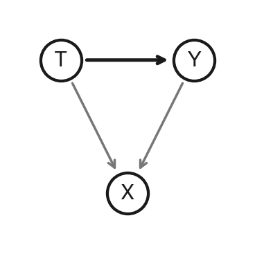

$T$ = app speed  
$Y$ = heavy cool features in the app  
$X$ = 5-star App Store rating  
**Breaks:** both $T$ and $Y$ drive a 5-star rating, conditioning on $X$ opens a spurious negative link  
**Risk:** the team cuts features chasing speed, users leave because features were the thing they actually loved

Mediator (post-treatment)

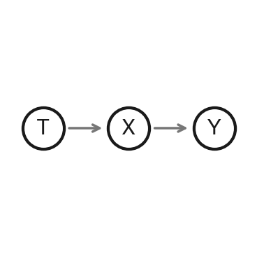

$T$ = ad campaign on a top YouTube creator  
$Y$ = purchases  
$X$ = clicks and site visits  
**Breaks:** the whole $T \to Y$ effect flows through $X$, controlling for it blocks the channel and $\hat\tau$ shrinks to zero  
**Risk:** the marketer kills the campaign on a zero coefficient, clicks dry up, sales collapse with them

<!--
Two right-hand cases. Collider: X is a common effect of T and Y. The app-rating example is concrete: both fast apps and feature-rich apps end up with 5-star ratings, but for different reasons. If we filter the dataset to 5-star apps only, we see a spurious negative correlation between speed and features. A regression with rating as a control does the same thing mathematically.

Mediator: T causes X causes Y. The YouTube-ad example is the standard funnel case. The ad drives clicks, clicks drive purchases. Adding both to one regression hands the entire effect to clicks and the ad coefficient drops to zero. The danger is operational: a literal reading of the model recommends turning the ad off, which would cut the clicks the model just credited.
-->

---

# When the confounder is missing

A simulated wage example with true effect $\tau = 0.04$, where ability is a confounder of schooling and wage.

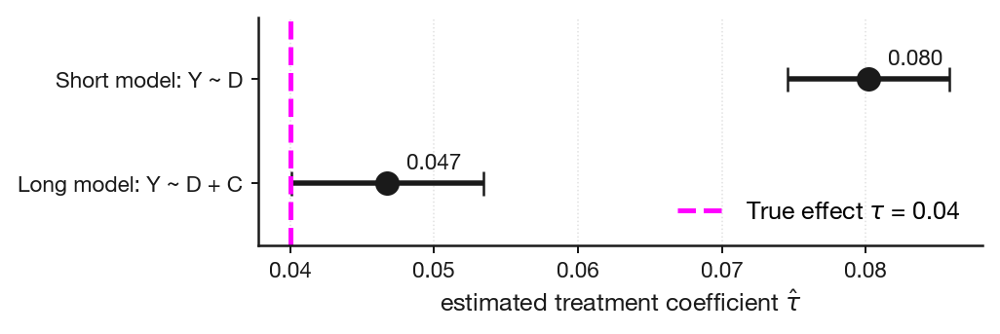{width=680px class="mx-auto block"}

Omitting ability inflates $\hat\tau$ by roughly two times, and the short-model 95% interval misses the true effect entirely.

<!--
Walkthrough. Simulated 2000 students. Each has unobserved ability, which raises both years of schooling and log wage. The true causal return on schooling is 4% per year. Run two regressions. Short model is log_wage on schooling only. Long model adds ability. The short estimate comes out at 8% per year, double the truth, and its 95% interval sits entirely above the true value. The long estimate comes out near 4% and covers it. This is OVB visible to the eye, and it is the exact mechanism the Angrist mnemonic predicts: bias equals (effect of ability on wage) times (coefficient of ability when regressing ability on schooling).
-->

