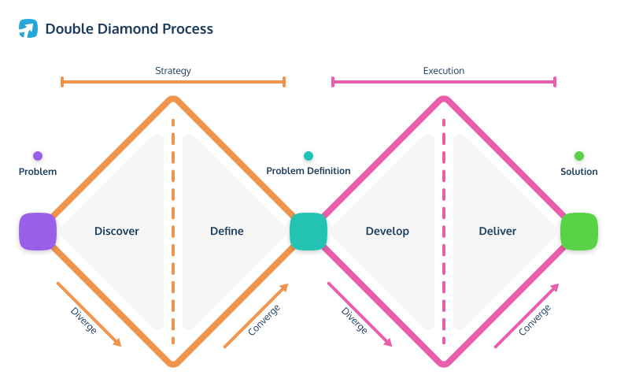
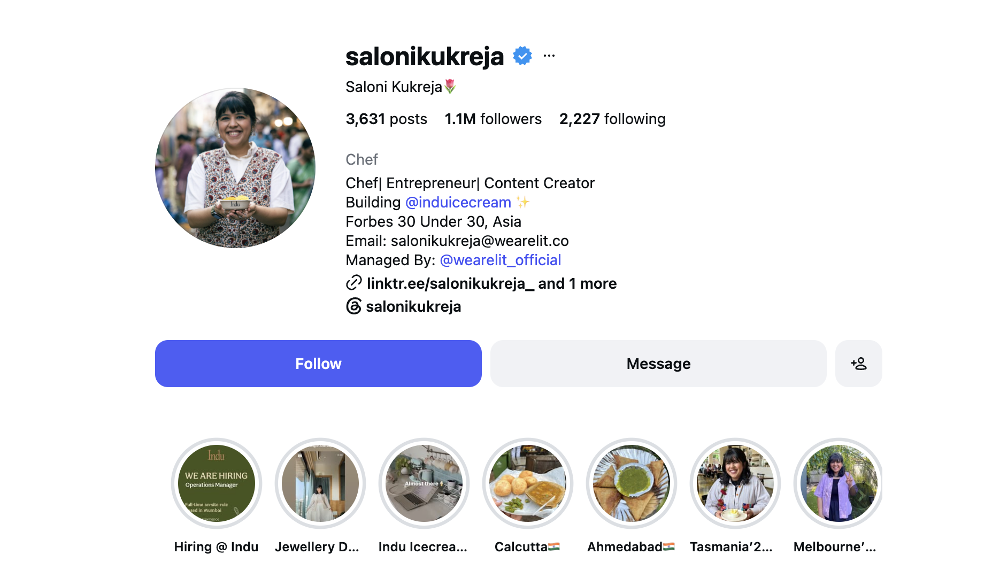
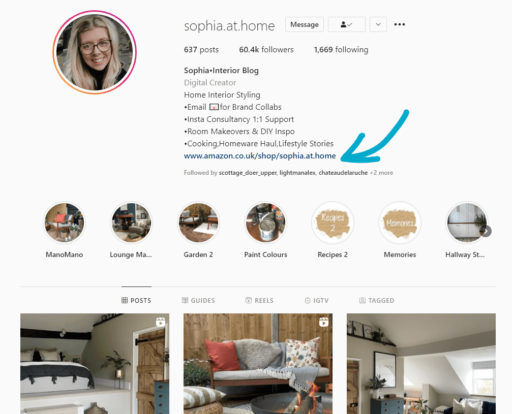
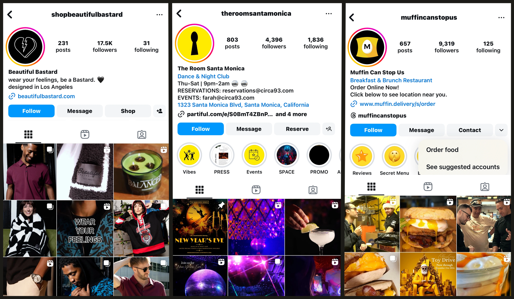
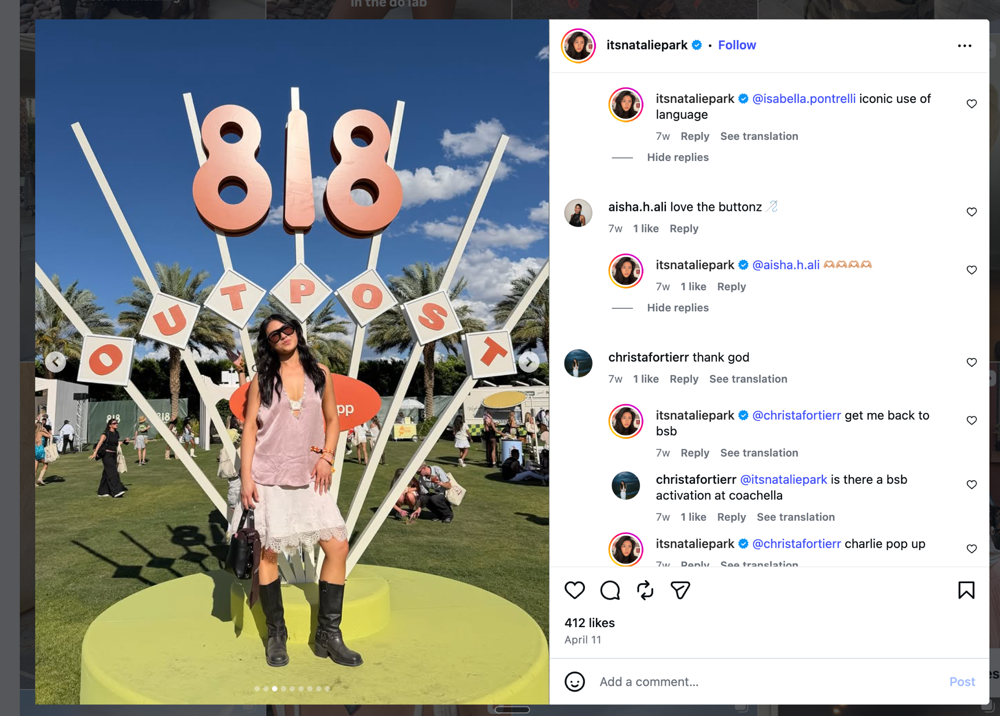

# User Segmentation

  Harbour.Space &middot; Barcelona &middot; June 02, 2026

---

# Today

  

    01
    
Why we segment

  

  

    02
    
Segmenting from a user need

  

  

    03
    
Segmenting from a business rule

  

  

    04
    
Segmenting from the data

  

  

    05
    
A universal method

  

  

    06
    
Bringing it together

  

  

    07
    
What's expected of an analyst

  

<!--
This is the provisional spine: the opener plus the three cases Tim dictated. RFM, behavioral, and the clustering methodology block will slot in once locked.
-->

---
layout: section
class: tint-lavender
---

## 01

# Why we segment

---
layout: statement
---

# Analytics is not only about delivery

<!--
The usual picture of analytics is delivery: we shipped something, here is the evidence it worked or it did not. That is half the job. The other half is discovery.
-->

---

# Two loops

Product analytics is fuel for both loops of product development

{width=470px}

<!--
Teaser for tomorrow. The double diamond holds a discipline: do not move to a solution before the hypothesis has been explored and opened up. In discovery, analytics shapes the quality of hypotheses, gives a rough estimate of how much a hypothesis can move, and shows which problems users actually have.
-->

---

# Discovery changes the decision

Before anything is built, the data can tell us an initiative is not worth it

<ul style="font-size:1.15rem;line-height:1.95;color:#1A1A1A;margin:0;">
<li>the problem touches only a small slice, maybe 0.5% of users</li>
<li>the initiative will likely return less than it costs to build</li>
<li>the real problem turns out deeper and different, and more expensive to solve</li>
</ul>

<!--
These are the findings that send an idea back to the shelf instead of into delivery. Sizing the reachable population, weighing the return against the cost, and finding the true shape of the problem are all the analyst's job before the team commits.
-->

---

# We optimize for the whole population

We ship a change and read its average treatment effect across all users

Improving the product and making users happier on average is a good thing

🙂 🙂 🙂 🙂 🙂 🙂 🙂 🙂 🙂 🙂

😡 😡 😡 😡 😡 😡 😡 😡 😡 😡

<!--
Picture the whole population reacting to one change: ten happier, ten angrier. The average barely moves, so on paper the change did nothing. But it clearly helped one group and hurt another.
-->

---

# Different users, different pains

In practice, different users carry different pains and different problems

Focusing on specific segments, and solving the concrete jobs of specific user types, is a more effective strategy

🙂 🙂 🙂 🙂 🙂 🙂 🙂 🙂 🙂 🙂

<!--
Now keep only the group the change helped. If we can target just them, we ship a clear win instead of a flat average. The angry segment is left out of this rollout.
-->

---

# So we split the population

We break the population into sets, overlapping or not, for sharper discovery and delivery

When users share a goal, a problem, or a characteristic, we focus on them instead of the whole population:

<ul style="margin-top:0.8rem;font-size:1.1rem;line-height:1.8;color:#1A1A1A;">
<li>metrics get more sensitive</li>
<li>effects get brighter</li>
<li>problems get more visible</li>
</ul>

This is where the need for segmentation comes from

<!--
The whole-population average hides the groups inside it. Once we want a real effect on users, splitting becomes necessary.
-->

---

# What segmentation is

Segmentation is splitting users into groups we can treat differently

It can run on:

Behavior

what they do, static or changing over time

External attributes

traits we know from outside the product

Problems or use-cases

the job they came to do

How you define "similar" is a business choice, and different choices give different results

What does "close" mean, why do you want it, and how will it change your decisions?

<!--
This is the key idea. Similarity can be defined in endless ways, and each input gives a different grouping. So the choice is not technical, it is a business one: decide what close means, why you want it, and how it will move your decisions. The rest of today walks these from a user need to the data.
-->

---

# Classification and clustering

Classification

The business knows what it wants and the segments are known. The job is to learn to assign each user to them.

Like an email spam filter: the labels already exist, you just sort new items into them

Clustering

A discovery goal: the problem and the classes are not defined yet. We use the data to establish the groups.

You do not know the segments in advance, the data proposes them

When one user can belong to several segments at once, that is <b>multi-label</b>

<!--
Loose definitions, not rigorous ones. Classification is the supervised case: you already know the segments and learn to place users in them, exactly like a spam filter. Clustering is the unsupervised, discovery case: you do not know the groups and let the data suggest them. Multi-label is just classification where a user can carry several segment tags at once, which is fine.
-->

---
layout: section
class: tint-rose
---

## 02

# Segmenting from a user need

---

# Manychat

The product automates conversations with subscribers on social media

From interviews we knew the users came for very different jobs:

<ul style="font-size:1.15rem;line-height:1.9;color:#1A1A1A;margin-top:0.2rem;">
<li>infopreneurs</li>
<li>affiliates</li>
<li>e-commerce brands</li>
<li>offline businesses</li>
<li>restaurants</li>
</ul>

<!--
Infopreneurs sell courses, consulting, or content. Affiliates post product links and earn a commission when someone buys. Then e-commerce brands, offline businesses, and restaurants. We had a qualitative picture of the types, but no way to count them or assign any single account to one.
-->

---

# The same product, very different users

Infopreneur

{width=300px}

Affiliate

{width=300px}

<!--
Saloni is an infopreneur: chef, entrepreneur, building a brand, links out via linktr.ee. Sophia is an affiliate: an interior blog that links to an Amazon shop. The bio and the links already tell you the job.
-->

---

# Different jobs, same bio fields

E-commerce

Offline business

Restaurant

{width=520px}

<!--
Beautiful Bastard is an apparel brand with a Shop button. The Room is a Santa Monica nightclub that takes reservations and runs events. Muffin Can Stop Us is a brunch restaurant with an order-and-delivery link. Same product, completely different jobs, all readable from the bio and the buttons.
-->

---

# From knowing to measuring

We understood the types qualitatively, but could not quantify them at scale

Signals per account

What they post, how, and how often; the bio; links to the products they sell

Two steps, both via an LLM

Define the classes, then label every account against them

We had a prior about the types, so this was a classification task

<!--
Unstructured inputs, bio and posts and links, were exactly what the LLM could read. Every account now carries a segment label.
-->

---

# A segmentation earns its place when it changes decisions

With every account labeled, the segments changed what we actually do:

Custom onboarding

Different in-product recommendations

A different definition of success

<!--
This is the test for any segmentation. If nothing downstream changes, the segmentation is a dashboard, not a decision.
-->

---

# Different goals, different tools

Success is not one metric. It depends on the job:

For some

selling courses

For some

conversations in DMs

For some

reach through Stories

Different goals lead to different tools, the product strategy gets more flexible, and more users are served well

<!--
The payoff is on both sides: more users served well, and more revenue.
-->

---
layout: section
class: tint-mint
---

## 03

# Segmenting from a business rule

---

# The marketplace flywheel

More supply brings more demand, and more demand brings more supply

<svg viewBox="0 0 720 360" width="560" style="font-family:'Inter',sans-serif;">
  <defs>
    <marker id="ah" markerWidth="9" markerHeight="9" refX="7" refY="4.5" orient="auto" markerUnits="userSpaceOnUse">
      <path d="M0,0 L9,4.5 L0,9 z" fill="#1A1A1A"></path>
    </marker>
  </defs>
  <text x="360" y="187" text-anchor="middle" fill="#6B6B6B" style="font-size:18px;font-weight:700;">More liquidity</text>
  <line x1="278" y1="58" x2="442" y2="58" stroke="#1A1A1A" stroke-width="2.5" marker-end="url(#ah)"></line>
  <line x1="550" y1="94" x2="550" y2="266" stroke="#1A1A1A" stroke-width="2.5" marker-end="url(#ah)"></line>
  <line x1="442" y1="302" x2="278" y2="302" stroke="#1A1A1A" stroke-width="2.5" marker-end="url(#ah)"></line>
  <line x1="170" y1="266" x2="170" y2="94" stroke="#1A1A1A" stroke-width="2.5" marker-end="url(#ah)"></line>
  <rect x="70" y="30" width="200" height="56" rx="10" fill="#FAFAFA" stroke="#E0E0E0"></rect>
  <text x="170" y="63" text-anchor="middle" fill="#1A1A1A" style="font-size:15px;font-weight:600;">More sellers</text>
  <rect x="450" y="30" width="200" height="56" rx="10" fill="#FAFAFA" stroke="#E0E0E0"></rect>
  <text x="550" y="63" text-anchor="middle" fill="#1A1A1A" style="font-size:15px;font-weight:600;">More listings</text>
  <rect x="450" y="274" width="200" height="56" rx="10" fill="#FAFAFA" stroke="#E0E0E0"></rect>
  <text x="550" y="307" text-anchor="middle" fill="#1A1A1A" style="font-size:15px;font-weight:600;">More buyers</text>
  <rect x="70" y="274" width="200" height="56" rx="10" fill="#FAFAFA" stroke="#E0E0E0"></rect>
  <text x="170" y="307" text-anchor="middle" fill="#1A1A1A" style="font-size:15px;font-weight:600;">Buyers become sellers</text>
</svg>

<!--
This is how a marketplace is built, and it is about all sellers, not only private ones. More sellers means more listings, listings bring buyers, and buyers turn into sellers. Supply feeds demand and demand feeds supply.
-->

---

# Where the money comes from

Avito earns on sellers

The philosophy has always been that private sellers list for free

The non-obvious reason: private listings are the most interesting content, and they are what brings buyers in

So we balance it and monetize only professional sellers

<!--
Charge everyone as hard as possible and users leave, taking their listings with them. The private content is the draw, so we protect it by keeping private sellers free and earning only on the professionals.
-->

---

# The task

Label each seller professional or private

Private

lists for free

Professional

pays a commission to sell

We earn on sellers, charge only the professionals, and leave everyone else free

<!--
The split decides who pays, which is why getting the label right matters commercially. Now we need a way to assign it.
-->

---

# Signals and the rule

We read it off behavior, with some outside help:

<ul style="font-size:1.1rem;line-height:1.7;color:#1A1A1A;margin:0 0 0.8rem;">
<li>how often they sell cars</li>
<li>how many listings they post</li>
<li>how recently the last car was sold, and when it was re-registered</li>
</ul>

Fewer than one car a year, we assume long ownership and label the seller <b>private</b>. Otherwise <b>professional</b>, and a commission applies

<!--
Number of listings and re-registration date are extra clues: a recently re-registered car points to a fresh acquisition, which looks professional. The threshold is deliberately simple, and simple is fine as long as we know it is a choice we made.
-->

---

# Validating the rule

How do we know the rule is good? Count the errors it makes

False positive

a private seller charged as professional, and they may leave

False negative

a professional left free, and we miss the revenue

With stakeholders, hand-label a few hundred sellers to get the true classes, then check the rule against them. A simple rule or a model both work. If a simple rule keeps the errors low enough, that is already good.

<!--
This is the confusion matrix we have used before, applied to a business label. The labeled set is ground truth: it is how you measure false positives and false negatives and decide whether the rule is good enough to ship.
-->

---

# The boundary is gameable

Charge only professionals, and some create several accounts to stay on the free side

So the segmentation has to carry:

<ul style="font-size:1.1rem;line-height:1.9;color:#1A1A1A;margin-top:0.4rem;">
<li>fraud handling</li>
<li>deduplication</li>
<li>a meta-profile that ties one person's profiles together</li>
</ul>

Defining the policy is most of the work

<!--
A value segment is a policy with a fuzzy, contested boundary that people have an incentive to game. The interesting part is robustness, not the threshold itself.
-->

---
layout: section
class: tint-sky
---

## 04

# Segmenting from the data

---

# What we expected

Discovery on a live product: what should we build next?

Our vision, from interviews

users need the complex use-cases automated: an agent answers questions and runs the funnel to a deal

What we built

agents for those flows, and we ran into quality problems

<!--
A live product, looking for the next bet. The vision, shaped by qualitative interviews, pointed at sophisticated automation.
-->

---

# What the data showed

Most of the volume was something far simpler

<ul style="font-size:1.15rem;line-height:1.9;color:#1A1A1A;margin:0;">
<li>a huge number of accounts and conversations</li>
<li>per user, many short conversations</li>
<li>one-word replies, especially in comments</li>
<li>the goal: make posts go viral</li>
</ul>

<!--
We dug into the conversations and found the opposite of the vision: enormous volume of tiny, repetitive exchanges, mostly comment replies, all aimed at virality. Simpler than expected, and far bigger.
-->

---

# Answering comments by hand

{width=470px}

<!--
A real post: the creator replies to comment after comment by hand, the same kind of short reply every time. This is the pattern the data surfaced, repeated on every post.
-->

---

# Why they do it

Posts with comment activity get more views

In the first hours after a post or reel goes out, they stay maximally active in the comments so it takes off

It is a recurring need, done constantly to keep posts viral

<!--
The motivation is reach. Early engagement feeds distribution, so the manual work happens again on every single post.
-->

---

# The method

<b>Goal</b>&nbsp;&nbsp;discover what users actually do

↓

<b>Data</b>&nbsp;&nbsp;one conversation as the unit, summarized by its goal

↓

<b>Task</b>&nbsp;&nbsp;no prior to classify against, so it is a clustering task

↓

<b>Output</b>&nbsp;&nbsp;groups form, but with no readable description yet

<!--
No prior, so we cluster rather than classify. Choosing the conversation as the unit, instead of the user, is what made the pattern visible. The clustering output is raw: groups without meaning until we read them.
-->

---

# Interpreting the clusters

Clusters are only labels until a human reads them

Read each cluster with business and product judgment

Does it match our vision and the real picture? Are these really similar users? Did we cover everything?

Find where the potential is, re-verify on qualitative interviews

Then decide what to build

<!--
Interpretation is the real work after clustering. We sanity-check the groups against our vision and reality, confirm they hang together as similar users, look for the highest-potential one, and re-verify with interviews before committing.
-->

---

# Why it won, and what changed

A simple feature, yet the stronger bet

wider segment

wider market

more users

recurring need

Strategy

changed strategy and roadmap

Ship

shipped the feature

Invest

invested more resources

Result

strong results

<!--
Breadth and recurrence decided it, not sophistication. This is the upside argument from section 01 in practice.
-->

---
layout: section
class: tint-lavender
---

## 05

# A universal method

---

# Winning users back

A common goal: bring back users who stopped using the product

The usual levers are discounts, notifications, and other perks

<!--
Win-back is a universal product problem. Someone went quiet, and we want them active and paying again.
-->

---

# But not everyone

Treating everyone is wasteful, and sometimes harmful

<ul style="font-size:1.1rem;line-height:1.8;color:#1A1A1A;margin:0 0 1rem;">
<li>discounts and perks are a direct financial cost</li>
<li>notifications annoy the users who do not need them</li>
<li>rewarding users who would have returned anyway buys nothing</li>
</ul>

Spend only on the users whose behavior the treatment would change

So we segment by churn risk: at risk, likely to return, sleeping

<!--
This is the core of win-back targeting: do not pay the users who would come back on their own, and do not waste a discount on those who never will. Use all the data you have to act only on the ones a nudge actually moves.
-->

---

# RFM

One method works on almost any product, regardless of domain

It rests on a strong assumption: three cheap, near-universal signals capture how users differ

Recency

how recently they last acted

flags who is slipping away

Frequency

how often they act

shows engagement and habit

Monetary

how much they spend

shows where the value sits

<!--
Almost every product records when a user last acted, how often, and how much they spend. RFM bets these three are enough to tell user types apart, which is why it ports across domains. Recency ties straight back to win-back: a long gap is a user slipping away.
-->

---

# Demo: RFM in code

A short notebook builds a synthetic shop, scores every customer, and lands on the win-back list

<a href="/harbour-product-analytics-2026/12-segmentation/rfm-segmentation.html" target="_blank" rel="noopener" style="display:inline-block;padding:0.9rem 1.6rem;background:#1A1A1A;color:#fff;font-family:'JetBrains Mono',monospace;font-size:1rem;font-weight:700;letter-spacing:0.08em;text-transform:uppercase;text-decoration:none;border:2px solid #1A1A1A;">Open the notebook ↗</a>

<!--
Open this live in JupyterLab and walk through it with the class: synthetic coffee-shop orders, R/F/M scoring, the segment map, and the win-back list. Swap the file link for your local Jupyter URL if you run the server.
-->

---
layout: section
class: tint-cream
---

## 06

# Bringing it together

---
layout: statement
---

# What works for some does not work for others

<!--
This is the bookend to the opening. The whole-population average is one number, and it hides the groups underneath it.
-->

---

# A flat average can hide two segments

A flat average does not mean the change did nothing

One segment

clearly improved

Another segment

was dropped, and the two cancel out

<!--
A zero average effect can be a real win for one group plus a real loss for another. Without segments you never see it, and you may ship something that quietly hurts people.
-->

---

# How to approach it

Always start from a clearly formulated business problem

What do we actually want to get? The problem then becomes a concrete task:

Prior known

classification

No prior

clustering

Several at once

multi-label

<!--
The task type follows from the problem, not the other way around. We saw all three across the cases today.
-->

---
layout: section
class: tint-rose
---

## 07

# What's expected of an analyst

---

# What changes as you level up

<table style="width:100%;border-collapse:collapse;font-family:'Inter',sans-serif;margin-top:0.3rem;">
<thead>
<tr>
<th style="width:15%;border-bottom:1px solid #E0E0E0;"></th>
<th style="width:26%;text-align:left;vertical-align:bottom;padding:0 0.6rem 0.5rem;border-bottom:1px solid #E0E0E0;font-family:'JetBrains Mono',monospace;font-size:0.66rem;color:#AAAAAA;text-transform:uppercase;letter-spacing:0.1em;">Junior &middot; IC3 / L3</th>
<th style="width:27%;text-align:left;vertical-align:bottom;padding:0 0.6rem 0.5rem;border-bottom:1px solid #E0E0E0;font-family:'JetBrains Mono',monospace;font-size:0.66rem;color:#AAAAAA;text-transform:uppercase;letter-spacing:0.1em;">Senior &middot; IC5 / L5</th>
<th style="width:32%;text-align:left;vertical-align:bottom;padding:0 0.6rem 0.5rem;border-bottom:1px solid #E0E0E0;font-family:'JetBrains Mono',monospace;font-size:0.66rem;color:#AAAAAA;text-transform:uppercase;letter-spacing:0.1em;">Lead / Staff / Manager &middot; IC6+ / M1+</th>
</tr>
</thead>
<tbody>
<tr>
<td style="vertical-align:top;padding:0.6rem;border-bottom:1px solid #E0E0E0;font-weight:700;font-size:0.92rem;color:#1A1A1A;">Ambiguity</td>
<td style="vertical-align:top;padding:0.6rem;border-bottom:1px solid #E0E0E0;font-size:0.82rem;line-height:1.35;color:#1A1A1A;"><b>Low.</b> A clear, scoped task: «Compute this button's conversion for last week»</td>
<td style="vertical-align:top;padding:0.6rem;border-bottom:1px solid #E0E0E0;font-size:0.82rem;line-height:1.35;color:#1A1A1A;"><b>High.</b> «Cart retention is dropping. Find out why and propose a fix»</td>
<td style="vertical-align:top;padding:0.6rem;border-bottom:1px solid #E0E0E0;font-size:0.82rem;line-height:1.35;color:#1A1A1A;"><b>Maximal.</b> «We are entering Latin America. What should our data strategy and success metrics be?»</td>
</tr>
<tr>
<td style="vertical-align:top;padding:0.6rem;border-bottom:1px solid #E0E0E0;font-weight:700;font-size:0.92rem;color:#1A1A1A;">Scope of impact</td>
<td style="vertical-align:top;padding:0.6rem;border-bottom:1px solid #E0E0E0;font-size:0.82rem;line-height:1.35;color:#1A1A1A;"><b>Own task.</b> Answers only for the quality of the code and the numbers in that task</td>
<td style="vertical-align:top;padding:0.6rem;border-bottom:1px solid #E0E0E0;font-size:0.82rem;line-height:1.35;color:#1A1A1A;"><b>Product feature or team.</b> Shapes the decisions of a whole product unit: PM, designers, engineers</td>
<td style="vertical-align:top;padding:0.6rem;border-bottom:1px solid #E0E0E0;font-size:0.82rem;line-height:1.35;color:#1A1A1A;"><b>Whole company or industry.</b> Decisions reshape the company's data architecture or set long-term OKRs</td>
</tr>
<tr>
<td style="vertical-align:top;padding:0.6rem;font-weight:700;font-size:0.92rem;color:#1A1A1A;">Focus</td>
<td style="vertical-align:top;padding:0.6rem;font-size:0.82rem;line-height:1.35;color:#1A1A1A;"><b>Process.</b> How to do what was asked</td>
<td style="vertical-align:top;padding:0.6rem;font-size:0.82rem;line-height:1.35;color:#1A1A1A;"><b>Problem.</b> Which business problem the data is solving</td>
<td style="vertical-align:top;padding:0.6rem;font-size:0.82rem;line-height:1.35;color:#1A1A1A;"><b>Systems and people.</b> Build processes so decisions happen faster, or grow the team</td>
</tr>
</tbody>
</table>

<!--
The titles differ by company, but the axes are nearly universal: as you go up, the ambiguity you absorb grows, your radius of impact widens from your own task to the whole company, and your focus shifts from process to problem to systems and people. Levels (IC3/IC5/IC6+) and the manager split are the common shape.
-->

---

# Competency matrices to read

Published matrices

<ul style="margin:0 0 1.2rem;padding-left:1.1rem;">
<li><a href="https://cleo-ai.progressionapp.com/teams/product-analytics-m5ea4e3nufps/framework" target="_blank">Cleo</a>, product analytics progression framework</li>
<li><a href="https://monzo.com/documents/data-progression-framework-v2-0.pdf" target="_blank">Monzo</a>, data discipline framework (MIT-licensed)</li>
<li><a href="https://handbook.gitlab.com/job-families/marketing/enterprise-data/data-science/" target="_blank">GitLab</a>, data science job family in the open handbook</li>
<li><a href="https://engineering.atspotify.com/2016/02/spotify-technology-career-steps" target="_blank">Spotify</a>, technology career steps</li>
</ul>

Frameworks and role types

<ul style="margin:0 0 1.2rem;padding-left:1.1rem;">
<li><a href="https://ddat-capability-framework.service.gov.uk/role/data-scientist" target="_blank">UK Gov capability framework</a>, skills by level for analyst and data scientist</li>
<li><a href="https://progression.fyi/" target="_blank">progression.fyi</a>, open collection of career ladders</li>
<li><a href="https://www.linkedin.com/pulse/one-data-science-job-doesnt-fit-all-elena-grewal" target="_blank">Airbnb</a>, three types of data scientist</li>
<li><a href="https://towardsdatascience.com/what-10-years-at-uber-meta-and-startups-taught-me-about-data-analytics-fd948b912556/" target="_blank">10 years at Uber, Meta, and startups</a>, lessons on the analytics role</li>
</ul>

<!--
Cleo and Avito are the ones I have ready. Monzo, GitLab, Spotify, and the UK Gov framework are fully public and detailed. Airbnb's three-types piece explains why analyst expectations differ by track.
-->

