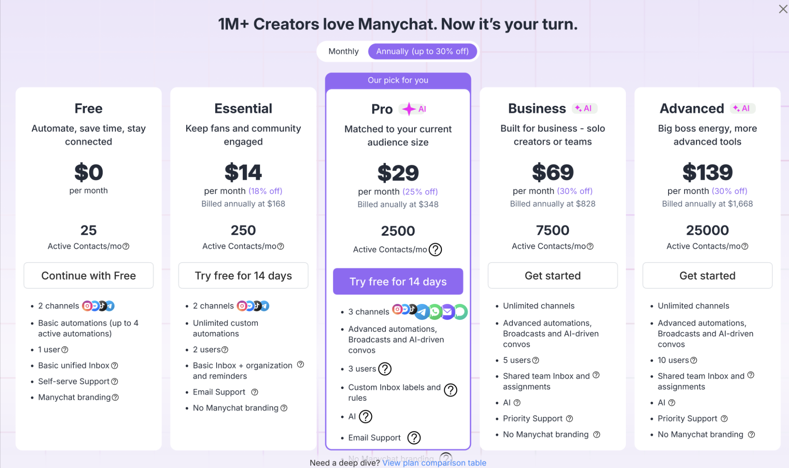
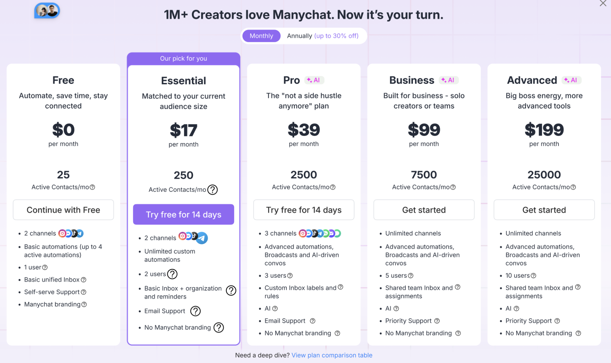
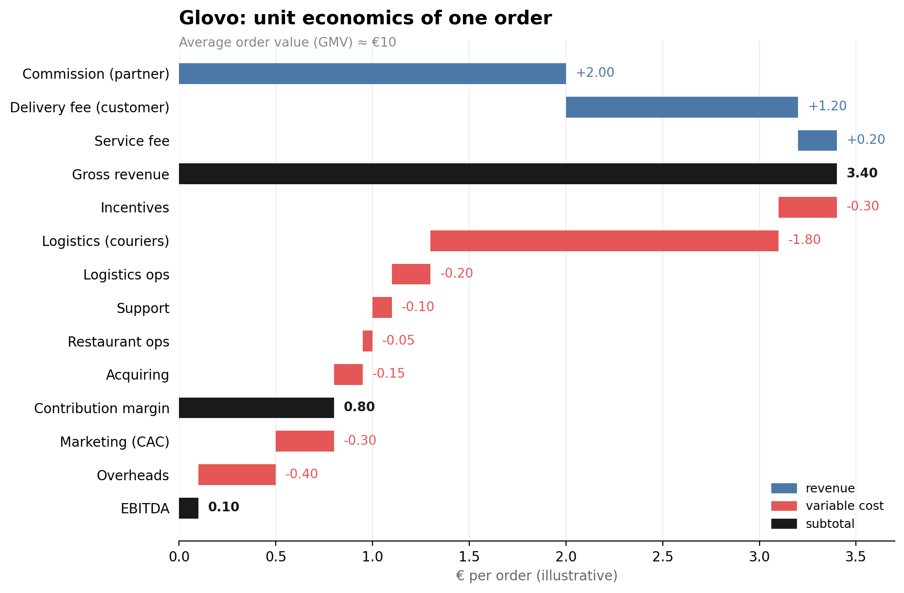
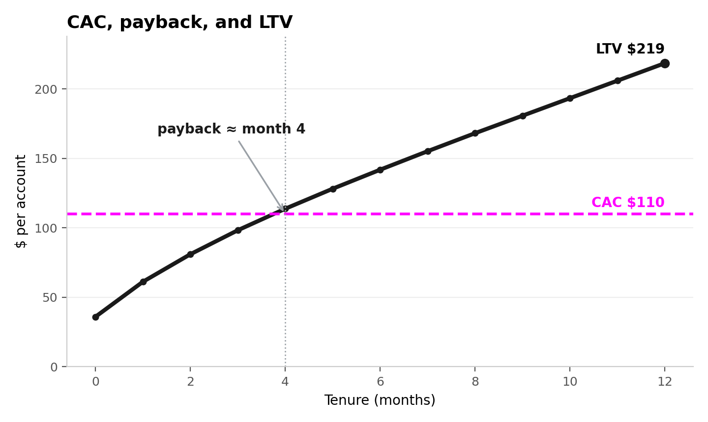
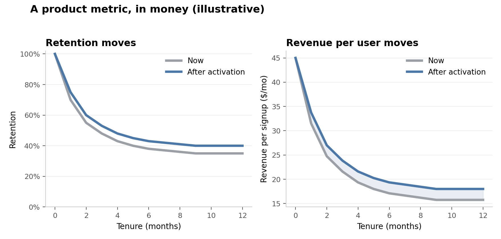
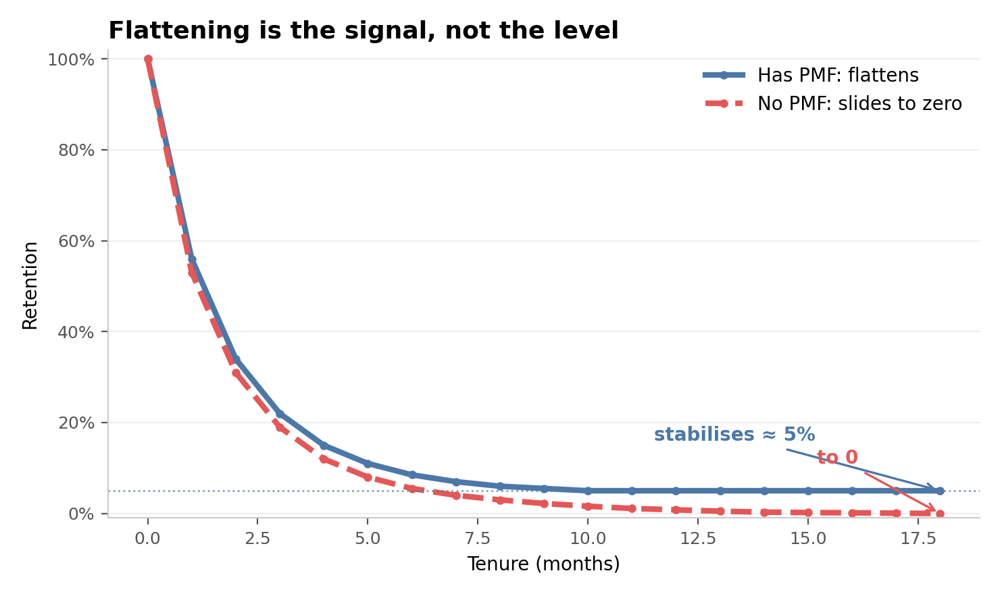
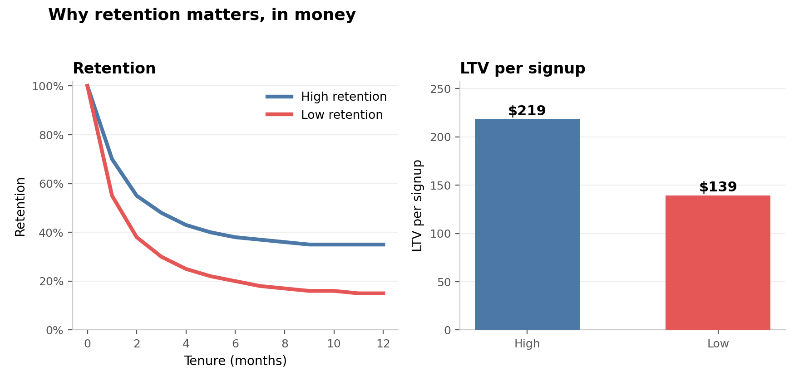
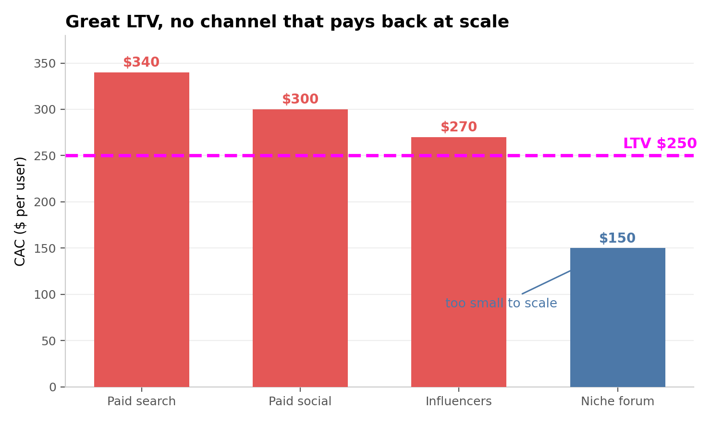

# Unit Economics

  Harbour.Space &middot; Barcelona &middot; June 4, 2026

---

# Today

  

    01
    
Why business metrics

  

  

    02
    
Unit economics

  

  

    03
    
Product-market fit

  

---
layout: section
class: tint-lavender
---

## 01

# Why business metrics

---
layout: statement
---

# Every product bet is a bet about the business

---

# Duality of business and product

You cannot think only about users

Earn money

&rarr;

Build a great product

&uarr;

flywheel

&darr;

More money

&larr;

Happier, more users

Money funds a better product, which makes more users happier, which earns more

<!--
You need money to build a great product, and that product makes more users happier and earns even more. Business and product are one loop, not a trade-off. This is why a product person has to care about the money.
-->

---

# Control vs test

The Manychat pricing test moves two levers at once: billing default and recommended plan

Control &middot; annual default

{width=320px}

Test &middot; monthly default

{width=320px}

<!--
Control defaults to annual and recommends Pro. Test defaults to monthly and recommends Essential to small-audience users. Two changes at once, so not a clean causal test, but for the money question we want the aggregate. A monthly default lowers the barrier: more conversions, less annual commitment.
-->

---

# One change, many outcomes

The same product change can help or hurt the business, depending on the chain

Monthly default &rarr; higher conversion &rarr; more paying accounts

retention holds
&rarr;
LTV &uarr;
&rarr;
revenue &uarr;
WIN

lower ARPPU
&rarr;
LTV flat
&rarr;
revenue flat
WASH

lower retention
&rarr;
LTV &darr;
&rarr;
revenue &darr;
LOSS

You cannot read it off the change alone, you have to model it

<!--
Same starting move: a monthly default lifts conversion and brings more paying accounts. From there the chain branches. If retention holds, LTV and revenue rise, a win. If the cheaper plan drags ARPPU down, LTV is flat, a wash. If retention drops, LTV and revenue fall, a loss. The product change alone does not tell you which branch you are on, so you have to model it. This is exactly why we built the calculator.
-->

---
layout: section
class: tint-rose
---

## 02

# Unit economics

---

# The calculator

We work all of this inside one shared model

<a href="https://docs.google.com/spreadsheets/d/1K_KC9SL-n5AnfTY5zAWooVN0h9cVpGn5AhDiv8ApaPU/edit?usp=sharing" target="_blank" rel="noopener" style="display:inline-block;padding:0.8rem 1.4rem;background:#1A1A1A;color:#fff;font-family:'JetBrains Mono',monospace;font-size:0.95rem;font-weight:700;letter-spacing:0.08em;text-transform:uppercase;text-decoration:none;border:2px solid #1A1A1A;">Open the calculator ↗</a>

<!--
This is the handout. Funnel and CAC, plan mix and ARPU, retention, LTV and payback, cohorts all live here. We drive the pricing decision through it together. Tell them to edit the yellow cells.
-->

---

# Unit economics, plainly

A method of economic analysis that measures a business's profitability per one unit, the base unit being a customer, a deal, or an item

Main goal: understand whether acquiring and serving one unit pays off, and whether the business is worth scaling

<!--
Plain language first: weigh what one unit brings against what it costs. Choosing the unit well is half the work, it has to be something the model rests on and something the team can move.
-->

---

# One business, several units

Order

what to optimize on each order

Customer

what they bring vs cost to acquire

Restaurant

cost to acquire and subsidize vs what we earn later

Glovo is several unit economies stacked, each pointing at a different lever

<!--
A two-sided business has units on both sides: the order, the demand-side customer, the supply-side restaurant. Each answers a different question.
-->

---

# The order, line by line

{width=470px}

<!--
Average check builds gross revenue. Variable costs bring it to contribution margin. Below that sit marketing and overheads. Key point: a negative EBITDA is not a bad business if per-order contribution margin is positive, that gap is reinvested growth.
-->

---

# CAC, payback, and LTV

{width=560px}

<!--
Spend the CAC up front, earn it back over time. Payback is when cumulative gross profit per account crosses the CAC line. LTV is where the curve lands by the horizon. Compute on gross profit, after variable costs, never on revenue.
-->

---

# A product metric, in money

{width=680px}

<!--
This is the bridge. Activation lifts retention, retention lifts revenue per signup, and that compounds into LTV. Bake the effect into the calculator and read the impact in money. Crank the uplift, start month, or cohort size live.
-->

---
layout: section
class: tint-sky
---

## 03

# Product-market fit

---

# Read it in retention

A product a clear segment keeps coming back to

You read it in the retention curve: a flat tail is a retained base, even a low one

{width=470px}

Benchmark: B2C around 30 to 40% at three months, B2B around 50%

<!--
PMF means a segment that chooses you over the alternatives and returns. The measurable version is the retention curve: a flat tail is a retained base, a curve that decays to zero is not.
-->

---

# Why retention matters

Higher retention is a bigger base and more lifetime value

{width=660px}

Does a single average churn rate tell you enough?

<!--
LTV is proportional to the area under the retention curve, so the same acquisition pays back very differently. The average-churn question sets up cohorts: one average hides very different groups.
-->

---

# Product-channel fit

A great product still dies without a channel where acquisition pays back

{width=440px}

LTV is $250 and the product is loved, but every channel you can scale costs more to acquire

<!--
Product-market fit is necessary but not sufficient. You also need product-channel fit: at least one channel where the cost to acquire a user is below what that user earns you over their life. A brilliant product with no profitable, scalable acquisition channel does not survive. This is unit economics again, now at the channel level.
-->

---

# Materials

Unit economics

<ul style="margin:0 0 1.2rem;padding-left:1.1rem;">
<li><a href="https://www.forentrepreneurs.com/saas-metrics-2/" target="_blank">SaaS Metrics 2.0</a>, David Skok, the canonical CAC, LTV, payback reference</li>
</ul>

Retention and PMF

<ul style="margin:0 0 1.2rem;padding-left:1.1rem;">
<li><a href="https://www.failory.com/blog/retention-rate-metrics" target="_blank">Retention rate and PMF</a>, Failory, flattening curve as the signal</li>
<li><a href="https://www.reforge.com/blog/retention-engagement-growth-silent-killer" target="_blank">Retention is the silent killer</a>, Reforge, why retention compounds</li>
<li><a href="https://gopractice.io/product/what-is-product-market-fit-and-how-to-measure-pmf/" target="_blank">What is PMF and how to measure it</a>, GoPractice</li>
</ul>

<!--
The calculator handout carries the worked numbers; these are the readings behind it.
-->
